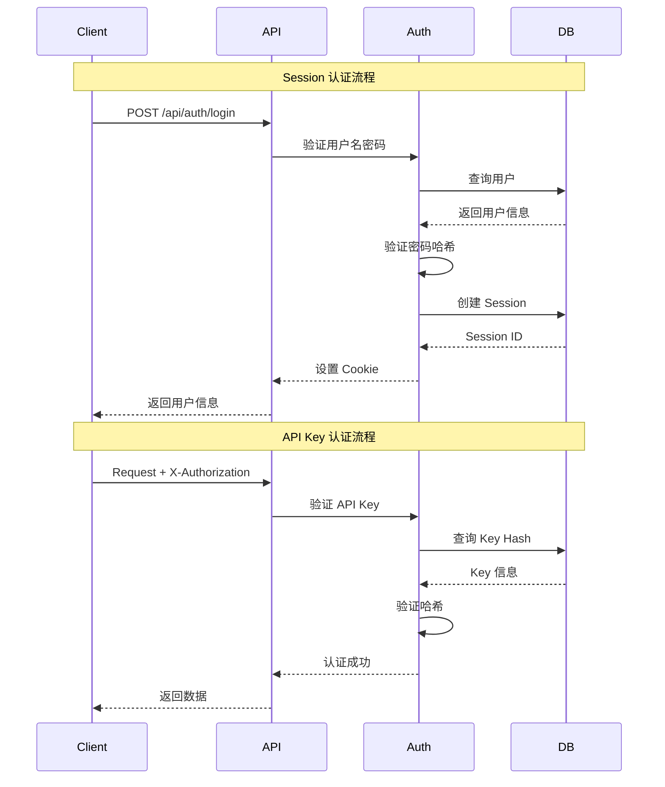

# API 接口参考

## 概述

本文档涵盖 AGIME Team Server 和本地 agime-server 的所有 HTTP API 端点。

## 认证方式

**支持的认证方法：**
1. **Session Cookie** (HttpOnly, SameSite=Lax, 7 天 TTL)
2. **API Key** (X-Authorization header)
3. **Bearer Token** (Authorization: Bearer {token})

**认证流程图**：



## Team Server API

### 认证 API

**POST /api/auth/register** (public, rate: 5/3600s)
- 描述: 用户注册
- 请求: `{user_id, email, password, display_name}`
- 响应: `{user: {user_id, email, display_name, role, created_at}}`
- 注意: REGISTRATION_MODE 控制 (open/approval/disabled)

**POST /api/auth/login** (public)
- 描述: Session 登录
- 请求: `{user_id, password}`
- 响应: 设置 session cookie，返回 `{user}`

**POST /api/auth/login/password** (public)
- 描述: 仅密码认证
- 请求: `{password}`
- 响应: `{user}`

**GET /api/auth/session** (public)
- 描述: 获取当前会话信息
- 响应: `{user, isAuthenticated: bool}`

**POST /api/auth/logout** (public)
- 描述: 注销，使会话失效
- 响应: `{success: true}`

**GET /api/auth/me** (protected)
- 描述: 获取当前用户信息
- 响应: `{user: {user_id, email, display_name, role, is_active}}`

**GET /api/auth/keys** (protected)
- 描述: 列出用户的 API keys
- 响应: `{keys: [{key_id, key_prefix, created_at, expires_at, last_used_at}]}`

**POST /api/auth/keys** (protected)
- 描述: 创建新 API key
- 请求: `{name?, expires_in_days?}`
- 响应: `{key_id, key: "agime_xxx...", key_prefix}`
- 注意: 完整 key 仅显示一次

**DELETE /api/auth/keys/{key_id}** (protected)
- 描述: 撤销 API key
- 响应: `{success: true}`

**POST /api/auth/change-password** (protected)
- 描述: 修改密码
- 请求: `{old_password, new_password}`
- 响应: `{success: true}`

**POST /api/auth/deactivate** (protected)
- 描述: 停用账户
- 响应: `{success: true}`

### 品牌与许可证 API

**GET /api/brand/config** (public)
- 描述: 获取品牌配置
- 响应: `{brand: {name, logo_url, primary_color, ...}}`

**POST /api/brand/activate** (public)
- 描述: 激活许可证密钥
- 请求: `{license_key}`
- 响应: `{brand, activated: true}`

**GET /api/brand/overrides** (protected, admin)
- 描述: 获取品牌覆盖配置
- 响应: `{overrides: {...}}`

**PUT /api/brand/overrides** (protected, admin)
- 描述: 保存品牌覆盖
- 请求: `{overrides: {...}}`
- 响应: `{success: true}`

### 代理 API

**POST /api/team/agent/agents** (protected)
- 描述: 创建代理
- 请求:
```json
{
  "name": "My Agent",
  "model": "claude-3-5-sonnet-20241022",
  "provider": "anthropic",
  "api_key": "sk-ant-...",
  "extensions": ["developer", "memory"],
  "skills": ["skill-id-1"],
  "max_turns": 100,
  "temperature": 0.7
}
```
- 响应: `{agent: {agent_id, name, model, ...}}`

**GET /api/team/agent/agents** (protected)
- 描述: 列出代理 (分页)
- Query: `?page=1&limit=20&team_id={team_id}`
- 响应: `{agents: [...], total, page, limit}`

**GET /api/team/agent/agents/{id}** (protected)
- 描述: 获取代理详情
- 响应: `{agent: {...}}`

**PUT /api/team/agent/agents/{id}** (protected)
- 描述: 更新代理
- 请求: `{name?, model?, extensions?, ...}`
- 响应: `{agent: {...}}`

**DELETE /api/team/agent/agents/{id}** (protected)
- 描述: 删除代理
- 响应: `{success: true}`

### 任务 API

**POST /api/team/agent/tasks** (protected)
- 描述: 提交任务
- 请求:
```json
{
  "agent_id": "agent-123",
  "type": "chat",
  "content": "Help me write a function"
}
```
- 响应: `{task: {task_id, status: "pending", ...}}`

**GET /api/team/agent/tasks** (protected)
- 描述: 列出任务 (分页)
- Query: `?page=1&limit=20&status=pending`
- 响应: `{tasks: [...], total, page, limit}`

**GET /api/team/agent/tasks/{id}** (protected)
- 描述: 获取任务详情
- 响应: `{task: {task_id, status, result, ...}}`

**POST /api/team/agent/tasks/{id}/approve** (protected)
- 描述: 批准任务
- 响应: `{task: {status: "approved", ...}}`

**POST /api/team/agent/tasks/{id}/reject** (protected)
- 描述: 拒绝任务
- 请求: `{reason?}`
- 响应: `{task: {status: "rejected", ...}}`

**GET /api/team/agent/tasks/{id}/stream** (protected, SSE)
- 描述: 流式任务执行事件
- Headers: `Accept: text/event-stream`
- Query: `?last_event_id={id}` (恢复)
- 事件: status, text, thinking, toolcall, toolresult, done

### 聊天会话 API

**POST /api/team/agent/chat/sessions** (protected)
- 描述: 创建聊天会话
- 请求:
```json
{
  "agent_id": "agent-123",
  "extra_instructions": "Be concise",
  "max_turns": 50
}
```
- 响应: `{session: {session_id, agent_id, status: "active", ...}}`

**POST /api/team/agent/chat/sessions/portal-coding** (protected)
- 描述: 创建Portal Lab环境会话（使用coding_agent_id）
- 请求: `{portal_id: "portal-123"}`
- 响应: `{session: {session_id, portal_restricted: true, ...}}`

**POST /api/team/agent/chat/sessions/portal-manager** (protected)
- 描述: 创建Portal管理会话（使用service_agent_id）
- 请求: `{portal_id: "portal-123"}`
- 响应: `{session: {session_id, portal_restricted: true, ...}}`

**GET /api/team/agent/chat/sessions** (protected)
- 描述: 列出会话 (分页)
- Query: `?page=1&limit=20&agent_id={id}&status=active`
- 响应: `{sessions: [...], total, page, limit}`

**GET /api/team/agent/chat/sessions/{id}** (protected)
- 描述: 获取会话详情 (含消息)
- 响应:
```json
{
  "session": {
    "session_id": "sess-123",
    "messages": [
      {"role": "user", "content": "Hello"},
      {"role": "assistant", "content": "Hi!"}
    ],
    "message_count": 2,
    "total_tokens": 150
  }
}
```

**POST /api/team/agent/chat/sessions/{id}/send** (protected)
- 描述: 发送消息到会话
- 请求:
```json
{
  "content": "Write a Python function",
  "attached_documents": ["doc-id-1"]
}
```
- 响应: `{message_id, run_id}`
- 注意: 使用 /stream 端点获取响应

**GET /api/team/agent/chat/sessions/{id}/stream** (protected, SSE)
- 描述: 流式会话事件
- Headers: `Accept: text/event-stream`
- Query: `?last_event_id={id}` (恢复从断点)
- 事件类型:
  - `status`: `{status: "processing"}`
  - `text`: `{content: "Hello"}`
  - `thinking`: `{content: "Let me think..."}`
  - `toolcall`: `{name: "shell", id: "call-1", arguments: {...}}`
  - `toolresult`: `{id: "call-1", success: true, content: "..."}`
  - `workspace_changed`: `{tool_name: "text_editor"}`
  - `turn`: `{current: 5, max: 100}`
  - `compaction`: `{strategy: "cfpm_v2", before_tokens: 8000, after_tokens: 3000}`
  - `session_id`: `{session_id: "sess-123"}`
  - `done`: `{status: "completed", error: null}`

**POST /api/team/agent/chat/sessions/{id}/archive** (protected)
- 描述: 归档会话
- 响应: `{session: {status: "archived"}}`

### 文档 API

**POST /api/team/agent/documents** (protected)
- 描述: 创建文档
- 请求: `{title, content, folder_path?, tags?, mime_type?}`
- 响应: `{document: {document_id, title, ...}}`

**GET /api/team/agent/documents** (protected)
- 描述: 列出文档 (分页)
- Query: `?page=1&limit=20&folder_path=/&search=keyword&tags=tag1,tag2`
- 响应: `{documents: [...], total, page, limit}`

**GET /api/team/agent/documents/{id}** (protected)
- 描述: 获取文档详情
- 响应: `{document: {document_id, title, content, ...}}`

**PUT /api/team/agent/documents/{id}** (protected)
- 描述: 更新文档
- 请求: `{title?, content?, tags?}`
- 响应: `{document: {...}}`

**DELETE /api/team/agent/documents/{id}** (protected)
- 描述: 删除文档
- 响应: `{success: true}`

**GET /api/team/agent/documents/{id}/versions** (protected)
- 描述: 获取文档版本历史
- 响应: `{versions: [{version_number, created_at, created_by, ...}]}`

**POST /api/team/agent/documents/{id}/lock** (protected)
- 描述: 锁定文档 (悲观锁)
- 响应: `{lock: {lock_id, expires_at}}`

**DELETE /api/team/agent/documents/{id}/lock** (protected)
- 描述: 释放文档锁
- 响应: `{success: true}`

**POST /api/team/agent/folders** (protected)
- 描述: 创建文件夹
- 请求: `{name, parent_path?}`
- 响应: `{folder: {folder_id, path, ...}}`

**GET /api/team/agent/folders/tree** (protected)
- 描述: 获取文件夹树
- Query: `?team_id={id}`
- 响应: `{tree: [{name, path, children: [...], document_count}]}`

### Portal API (公开)

**GET /api/portal/{slug}** (public)
- 描述: 获取 portal 信息
- 响应:
```json
{
  "portal": {
    "slug": "my-portal",
    "title": "My Portal",
    "output_form": "website",
    "welcome_message": "Welcome!",
    "agent_id": "agent-123"
  }
}
```

**POST /api/portal/{slug}/chat/sessions** (public)
- 描述: 创建访客会话
- 请求: `{visitor_name?}`
- 响应: `{session: {session_id, ...}}`

**GET /api/portal/{slug}/chat/stream** (public, SSE)
- 描述: 流式 portal 聊天事件
- Headers: `Accept: text/event-stream`
- Query: `?session_id={id}&last_event_id={id}`
- 事件: 同 chat stream

### Avatar API

**GET /api/team/avatar/instances** (protected)
- 描述: 列出 Avatar 实例
- Query: `?team_id={id}&avatar_type={type}`
- 响应: `{instances: [{portal_id, name, status, avatar_type, ...}]}`

**GET /api/team/avatar/instances/{portal_id}** (protected)
- 描述: 获取 Avatar 详情
- 响应: `{instance: {portal_id, manager_agent_id, service_agent_id, governance_counts, ...}}`

**POST /api/team/avatar/instances/{portal_id}/publish** (protected)
- 描述: 发布 Avatar
- 响应: `{success: true}`

**GET /api/team/avatar/governance/{portal_id}/state** (protected)
- 描述: 获取治理状态
- 响应: `{state: {...}, config: {...}}`

**GET /api/team/avatar/governance/{portal_id}/events** (protected)
- 描述: 获取治理事件
- Query: `?limit={n}&offset={n}`
- 响应: `{events: [{event_type, timestamp, ...}]}`

## 本地服务器 API (agime-server)

### Session CRUD

**GET /session** (protected)
- 描述: 列出会话 (分页)
- Query: `?limit=20&before={cursor}&favorites_only=true&tags=tag1&working_dir=/path&date_from=2024-01-01&sort=updated_desc`
- 响应: `{sessions: [...], has_more: bool, next_cursor?}`

**GET /session/{id}** (protected)
- 描述: 获取会话
- 响应: `{session: {...}}`

**PUT /session/{id}** (protected)
- 描述: 更新会话
- 请求: `{name?, metadata?}`
- 响应: `{session: {...}}`

**DELETE /session/{id}** (protected)
- 描述: 删除会话
- 响应: `{success: true}`

**POST /session/{id}/fork** (protected)
- 描述: Fork 会话 (在消息点编辑)
- 请求: `{message_index}`
- 响应: `{session: {session_id: "new-id", ...}}`

**POST /session/{id}/export** (protected)
- 描述: 导出会话
- 请求: `{format: "json" | "yaml" | "markdown"}`
- 响应: `{content: "..."}`

**POST /session/import** (protected)
- 描述: 导入会话
- 请求: `{content, format: "json"}`
- 响应: `{session: {...}}`

**POST /session/{id}/memory/create** (protected)
- 描述: 创建 memory fact
- 请求: `{category, data, tags?, is_global?}`
- 响应: `{fact: {...}}`

**GET /session/{id}/memory/list** (protected)
- 描述: 列出 memory facts
- Query: `?category=*&is_global=false`
- 响应: `{facts: [...]}`

**DELETE /session/{id}/memory/delete** (protected)
- 描述: 删除 memory category
- 请求: `{category, is_global?}`
- 响应: `{success: true}`

**POST /session/{id}/insights** (protected)
- 描述: 获取会话洞察
- 响应: `{insights: {...}}`

### Agent 生命周期

**POST /agent/start** (protected)
- 描述: 启动新 agent 会话
- 请求:
```json
{
  "working_dir": "/path/to/project",
  "recipe": "recipe-content",
  "recipe_id": "recipe-123",
  "recipe_deeplink": "agime://recipe/..."
}
```
- 响应: `{session: {session_id, ...}}`

**POST /agent/{id}/stop** (protected)
- 描述: 停止 agent
- 响应: `{success: true}`

**POST /agent/{id}/resume** (protected)
- 描述: 恢复 agent
- 请求: `{load_model_and_extensions: bool}`
- 响应: `{session: {...}}`

**PUT /agent/{id}/provider** (protected)
- 描述: 更新 provider/model
- 请求: `{provider, model?}`
- 响应: `{session: {...}}`

**POST /agent/{id}/extension** (protected)
- 描述: 添加 extension
- 请求: `{extension_name, config?}`
- 响应: `{success: true}`

**DELETE /agent/{id}/extension** (protected)
- 描述: 移除 extension
- 请求: `{extension_name}`
- 响应: `{success: true}`

**GET /agent/{id}/tools** (protected)
- 描述: 列出可用工具
- 响应: `{tools: [{name, description, parameters}]}`

**POST /agent/{id}/tool/call** (protected)
- 描述: 直接执行工具
- 请求: `{tool_name, arguments: {...}}`
- 响应: `{result: {...}}`

### Chat

**POST /chat** (protected, SSE)
- 描述: 发送消息并获取流式响应
- Headers: `Accept: text/event-stream`
- 请求: `{session_id, message}`
- 事件类型:
  - `message`: `{content, token_state: {input, output, total}}`
  - `error`: `{error}`
  - `finish`: `{reason: "stop" | "length" | "tool_use"}`
  - `model_change`: `{from_model, to_model, reason}`
  - `notification`: `{type, content}`
  - `update_conversation`: `{messages: [...]}`
  - `ping`: `{}`

### Recipe

**POST /recipe/create** (protected)
- 描述: 从会话提取配方
- 请求: `{session_id}`
- 响应: `{recipe: {...}}`

**POST /recipe/encode** (protected)
- 描述: 编码配方为 deeplink
- 请求: `{recipe}`
- 响应: `{deeplink: "agime://recipe/..."}`

**POST /recipe/decode** (protected)
- 描述: 解码 deeplink
- 请求: `{deeplink}`
- 响应: `{recipe: {...}}`

**POST /recipe/validate** (protected)
- 描述: 验证配方
- 请求: `{recipe}`
- 响应: `{valid: bool, errors: [...]}`

**POST /recipe/scan** (protected)
- 描述: 安全扫描配方
- 请求: `{recipe}`
- 响应: `{safe: bool, issues: [...]}`

**POST /recipe/save** (protected)
- 描述: 保存配方到磁盘
- 请求: `{recipe, path}`
- 响应: `{success: true}`

**GET /recipe/list** (protected)
- 描述: 列出可用配方
- 响应: `{recipes: [{id, name, description}]}`

**GET /recipe/manifests** (protected)
- 描述: 获取配方元数据
- 响应: `{manifests: [...]}`

**GET /recipe/{id}** (protected)
- 描述: 通过 ID 获取配方
- 响应: `{recipe: {...}}`

### 配置

**GET /config/providers** (protected)
- 描述: 列出可用 providers
- 响应: `{providers: ["anthropic", "openai", ...]}`

**GET /config/models** (protected)
- 描述: 列出可用 models
- Query: `?provider=anthropic`
- 响应: `{models: [{id, name, context_limit}]}`

**GET /config/extensions** (protected)
- 描述: 列出可用 extensions
- 响应: `{extensions: [{name, tools: [...]}]}`

### 状态

**GET /status** (public)
- 描述: 健康检查
- 响应: `{status: "ok", version: "2.8.0"}`

**GET /version** (public)
- 描述: 版本信息
- 响应: `{version: "2.8.0", commit: "abc123"}`

## SSE 事件格式

所有 SSE 端点使用以下格式：

```
event: {event_type}
id: {event_id}
data: {json_payload}

```

**示例:**
```
event: text
id: evt-123
data: {"content": "Hello, world!"}

event: toolcall
id: evt-124
data: {"name": "shell", "id": "call-1", "arguments": {"command": "ls"}}

event: done
id: evt-125
data: {"status": "completed"}
```

## 错误响应

所有错误使用统一格式：

```json
{
  "error": {
    "code": "NOT_FOUND",
    "message": "Session not found",
    "details": {...}
  }
}
```

**HTTP 状态码:**
- 200: 成功
- 201: 创建成功
- 204: 无内容
- 400: 请求错误
- 401: 未认证
- 403: 权限不足
- 404: 未找到
- 409: 冲突
- 422: 验证失败
- 429: 限速
- 500: 服务器错误

## 限速

**Team Server:**
- 注册: 5 请求/3600 秒 (per IP)
- 登录: 10 请求/60 秒 (per IP)
- 任务执行: 10 请求/60 秒 (可配置)

**本地 Server:**
- 无默认限速
- 可通过中间件配置

## 分页

分页端点使用以下参数：

**Query 参数:**
- `page`: 页码 (从 1 开始)
- `limit`: 每页条目数 (默认 20)
- `before`: Cursor-based 分页 (可选)

**响应格式:**
```json
{
  "items": [...],
  "total": 100,
  "page": 1,
  "limit": 20,
  "total_pages": 5,
  "has_more": true,
  "next_cursor": "cursor-xyz"
}
```

## WebSocket (MCP UI Proxy)

**WS /api/mcp-ui-proxy** (protected)
- 描述: MCP UI 代理 WebSocket
- 协议: 双向 JSON 消息
- 用途: MCP server UI 集成

## 团队资源管理 API

### Skills API

**POST /api/team/skills** (protected)
- 描述: 创建技能
- 请求: `{name, description, content, storage_type: "inline"|"package", protection_level, visibility, tags}`
- 响应: `{skill: {skill_id, ...}}`

**GET /api/team/skills** (protected)
- 描述: 列出技能
- Query: `?page=1&limit=20&team_id={id}&visibility=team`
- 响应: `{skills: [...], total, page, limit}`

**GET /api/team/skills/{id}** (protected)
- 描述: 获取技能详情
- 响应: `{skill: {skill_id, name, content, files, ...}}`

**PUT /api/team/skills/{id}** (protected)
- 描述: 更新技能
- 请求: `{name?, description?, content?}`
- 响应: `{skill: {...}}`

**DELETE /api/team/skills/{id}** (protected)
- 描述: 删除技能 (软删除)
- 响应: `{success: true}`

**POST /api/team/skills/{id}/install** (protected)
- 描述: 安装技能到本地
- 响应: `{installed: true, authorization_token?}`

### Extensions API

**POST /api/team/extensions** (protected)
- 描述: 创建扩展
- 请求: `{name, description, extension_type, config, protection_level}`
- 响应: `{extension: {extension_id, ...}}`

**GET /api/team/extensions** (protected)
- 描述: 列出扩展
- Query: `?page=1&limit=20&security_reviewed=true`
- 响应: `{extensions: [...], total}`

**POST /api/team/extensions/{id}/review** (protected, admin)
- 描述: 安全审查扩展
- 请求: `{approved: bool, notes?}`
- 响应: `{extension: {security_reviewed: true, ...}}`

### Smart Logs API

**GET /api/team/logs/smart** (protected)
- 描述: 获取智能日志
- Query: `?page=1&limit=20&team_id={id}&action=create&resource_type=skill`
- 响应: `{logs: [{log_id, action, resource_name, ai_summary, created_at}], total}`

**GET /api/team/logs/audit** (protected, admin)
- 描述: 获取审计日志
- Query: `?page=1&limit=50&user_id={id}&date_from=2024-01-01`
- 响应: `{logs: [...], total}`

## 总结

AGIME 提供完整的 REST API 和 SSE 流式接口，支持：

1. **认证**: Session Cookie + API Key + Bearer Token
2. **DirectHarness V4 执行**: Chat/Channel/Document/Scheduled Task/AgentTask/Subagent
3. **实时流式**: SSE 事件流，带恢复机制
4. **文档管理**: CRUD + 版本控制 + 锁定
5. **Portal 系统**: 公开访问端点
6. **Recipe 管理**: 创建、编码、验证、保存
7. **配置 API**: Provider/model/extension 列表
8. **分页支持**: Cursor-based 和 offset-based
9. **错误处理**: 统一错误格式
10. **限速保护**: IP-based 限速
