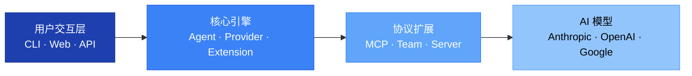
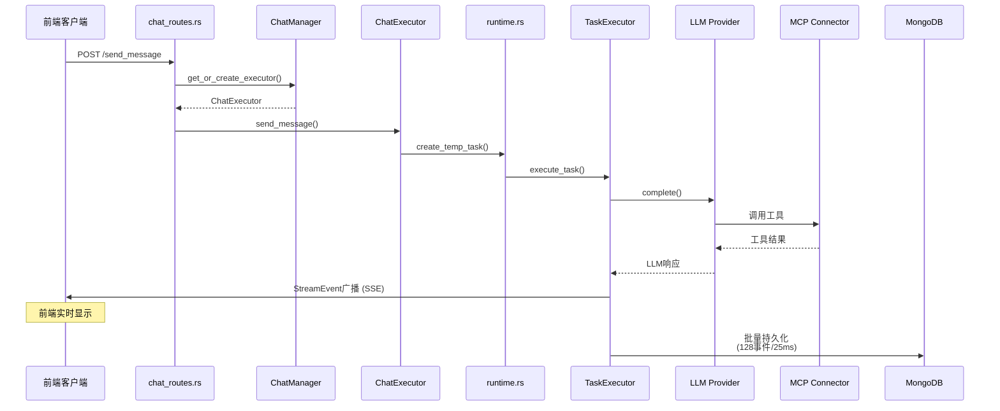
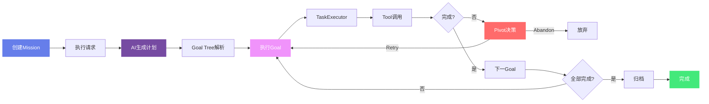
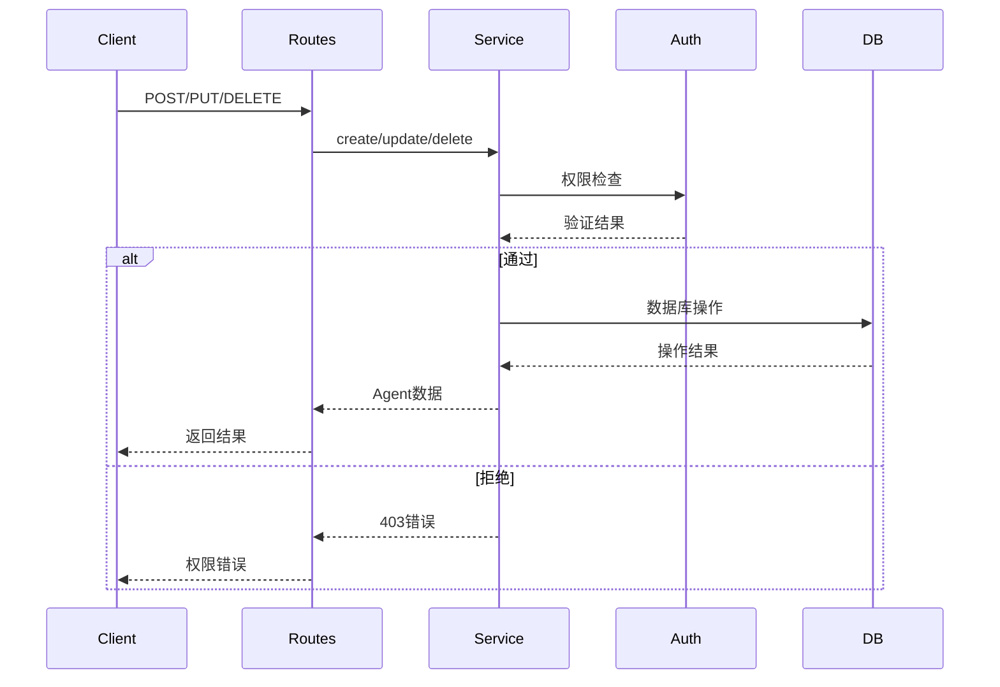
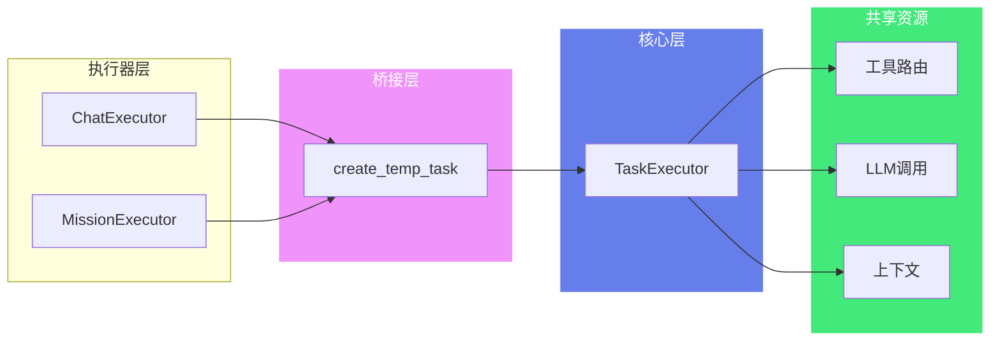
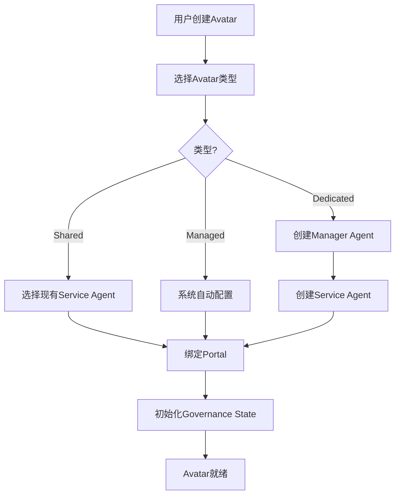
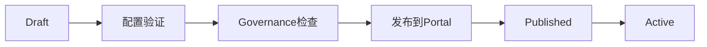

# AGIME 系统架构

## 概述

AGIME 是一个全功能的 AI Agent 框架，采用 Rust + TypeScript 构建，支持多种 LLM provider、MCP 协议集成、团队协作和企业级部署。

## 架构层次

### 整体架构（3个部署模式）



### agime-team-server 内部架构（7层）

```mermaid
graph LR
    subgraph Layer1["HTTP路由层"]
        Routes["Chat/Mission/Agent<br/>Portal/Avatar路由"]
    end

    subgraph Layer2["管理器层"]
        Managers["ChatManager<br/>MissionManager<br/>TaskManager<br/>AvatarManager"]
    end

    subgraph Layer3["服务层"]
        Services["AgentService<br/>SessionService<br/>AvatarService"]
    end

    subgraph Layer4["执行层"]
        Executors["TaskExecutor<br/>ChatExecutor<br/>MissionExecutor"]
    end

    subgraph Layer5["运行时层"]
        Runtime["Bridge Pattern<br/>Context注入<br/>Governance"]
    end

    subgraph Layer6["扩展层"]
        Extensions["MCP连接器<br/>平台扩展"]
    end

    subgraph Layer7["Provider层"]
        Providers["Provider工厂<br/>14+ LLM实现"]
    end

    Layer1 --> Layer2 --> Layer3 --> Layer4 --> Layer5 --> Layer6 --> Layer7

    style Layer1 fill:#667eea,stroke:#667eea,color:#ffffff
    style Layer2 fill:#764ba2,stroke:#764ba2,color:#ffffff
    style Layer3 fill:#f093fb,stroke:#f093fb,color:#ffffff
    style Layer4 fill:#4facfe,stroke:#4facfe,color:#ffffff
    style Layer5 fill:#00f2fe,stroke:#00f2fe,color:#ffffff
    style Layer6 fill:#43e97b,stroke:#43e97b,color:#ffffff
    style Layer7 fill:#38f9d7,stroke:#38f9d7,color:#ffffff
```



## 核心组件

### 1. Agent 系统 (agime/src/agents/)

**Agent** 是核心执行引擎，负责：
- 多轮对话管理
- Tool 调用路由
- Context 管理与压缩
- Subagent 委派
- Retry 策略

**关键模块：**
- `agent.rs` (3568 行): 主 Agent 实现
- `extension_manager.rs` (2026 行): MCP 客户端与工具管理
- `tool_router.rs`: 工具路由与索引
- `subagent_handler.rs`: 子代理委派
- `prompt_manager.rs`: 提示词管理

**Extension 系统：**
- **Built-in**: Todo, ChatRecall, Skills, Team, ExtensionManager
- **MCP**: stdio (本地进程), Remote HTTP, Streamable HTTP
- **Platform**: Developer, ComputerController, Memory, Tutorial

### 2. Provider 系统 (agime/src/providers/)

**Provider Trait** 统一接口：
```rust
pub trait Provider {
    async fn complete(&self, messages: &[Message]) -> Result<Response>;
    async fn stream_complete(&self, messages: &[Message]) -> Result<Stream<Response>>;
    fn supports_tools(&self) -> bool;
    fn supports_thinking(&self) -> bool;
}
```

**支持的 Provider (14+):**
- Anthropic (Claude 3.5/4)
- OpenAI (GPT-4, o1)
- Azure OpenAI
- Google (Gemini)
- AWS Bedrock
- Ollama (本地)
- OpenRouter
- Venice
- Tetrate Agent Router
- XAI (Grok)
- Databricks
- Snowflake

**Format 模块：**
- `openai_format.rs` (1925 行): OpenAI API 序列化
- `anthropic_format.rs` (1275 行): Anthropic API 序列化
- 每个 provider 有独立的格式转换模块

**Lead Worker Pattern:**
- Leader: 规划与决策 (高级模型)
- Worker: 执行具体任务 (快速模型)
- 自动切换与回退

### 3. Configuration 系统 (agime/src/config/)

**配置层次：**
1. 内置默认值
2. `~/.config/agime/config.yaml`
3. 项目级 `.agime/config.yaml`
4. 环境变量 (AGIME_*)
5. 命令行参数

**关键配置：**
- `base.rs`: 主配置结构
- `agime_mode.rs`: 模式配置 (interactive, headless, server)
- `extensions.rs`: Extension 配置
- `permission.rs`: Permission 规则
- `declarative_providers.rs`: Provider 声明式配置

**Keyring 集成：**
- 跨平台密钥存储
- 自动从 GOOSE_* 迁移到 AGIME_*

### 4. Context 管理 (agime/src/context_mgmt/)

**三种压缩策略：**

1. **LegacySegmented**: 分段保留，保留最近 N 条消息，丢弃中间历史
2. **CfpmMemoryV1**: 渐进式记忆 v1，提取关键事实，去重与合并
3. **CfpmMemoryV2**: 渐进式记忆 v2 (推荐)，自动事实提取，智能去重，上下文门控通知

**触发条件：** 默认 80% context 使用率，手动 `/compact` 命令，最大尝试次数 3 (CFPM: 6)

### 5. MCP 协议集成 (agime-mcp/)

**5 个专用 MCP Server:**

1. **Developer Server**: shell, text_editor (支持 LLM 辅助), analyze (8 语言 tree-sitter), image_processor, screen_capture
2. **Computer Controller**: web_scrape, automation_script, pdf_tool, docx_tool, xlsx_tool
3. **Auto Visualiser**: render_sankey, render_radar, render_donut, render_treemap
4. **Memory Server**: remember_memory, retrieve_memories (双级存储 local/global)
5. **Tutorial Server**: load_tutorial (交互式教程)

**代码分析引擎：** Tree-sitter 解析 8 语言，3 种分析模式 (Structure/Semantic/Focused)，Call graph 构建，LRU 缓存 100 条目

### 6. 团队协作系统

**agime-team (共享库):** Skills/Recipes/Extensions 共享，4 级保护 (Public/TeamInstallable/TeamOnlineOnly/Controlled)，版本控制 (semver)，Git 同步

**agime-team-server (后端):** MongoDB/SQLite 双数据库，认证 (Session Cookie + API Key)，两阶段执行 (Phase 1 Chat Track 直接对话，Phase 2 Mission Track 目标驱动)

**Web Admin (前端):** React 19 + TypeScript + Vite + Tailwind CSS 4，实时 SSE 流式通信，文档管理 (版本控制/悲观锁)，Portal 系统，i18n 中英双语

#### 6.1 Chat Track (Phase 1) - 直接对话

**核心模块：**
- `chat_manager.rs` (319行): ActiveChat结构，会话追踪，事件广播
- `chat_executor.rs`: 对话执行器，桥接TaskExecutor
- `chat_routes.rs`: HTTP路由，SSE流式传输

**特点：**
- 绕过正式Task系统的轻量级对话
- 实时事件广播 (broadcast::Sender)
- 批量持久化 (128事件/25ms)
- 自动清理 (4小时不活动)

#### 6.2 Mission Track (Phase 2) - 目标驱动

**核心模块：**
- `mission_executor.rs` (3700+行): Mission生命周期管理
- `mission_manager.rs`: 任务追踪，孤儿恢复
- `mission_routes.rs`: HTTP路由，审批工作流

**生命周期：** Draft → Planning → Planned → Running → Completed/Failed/Cancelled

**执行模式：**
- Sequential: 顺序执行步骤
- Adaptive: 自适应目标执行 (见下方AGE)

#### 6.3 核心支撑模块

**runtime.rs** - Bridge Pattern共享工具
- create_temp_task(): 临时任务创建
- 统一的工具执行接口
- Chat/Mission executor复用

**task_manager.rs** - 后台任务追踪
- StreamEvent枚举 (14+变体)
- 事件历史管理
- SSE流式传输

**session_mongo.rs** - 会话持久化
- AgentSessionDoc结构
- 消息历史存储
- Token统计

#### 6.4 Portal系统

**portal_public.rs** (68KB) - 公开访问路由
- 匿名访客会话
- Portal SDK内嵌
- 访客限制 (IP限速/会话时长/消息数)

**portal_tools.rs** (63KB) - Portal工具
- create_portal, update_portal, publish_portal
- 文档绑定，扩展白名单

#### 6.5 文档系统

**document_tools.rs** (64KB) - 文档工具
- create, read, search, list, update, delete
- 支持受限会话 (portal_restricted)

**document_analysis.rs** - 文档分析触发器
- AI驱动的文档分析
- 异步分析任务

#### 6.6 其他关键模块

**smart_log.rs** - 智能日志
- SmartLogTrigger实现
- 静态摘要生成 (build_fallback_summary)

**extension_installer.rs** - 扩展自动安装
- AutoInstallPolicy配置
- 依赖解析

**prompt_profiles.rs** - 提示词配置
- Portal专用overlay
- build_portal_coding_overlay()
- build_portal_manager_overlay()

### 7. Adaptive Goal Execution (自适应目标执行)

**adaptive_executor.rs** - AGE引擎实现

**执行流程：**
1. 解析mission goal为goal tree
2. 执行每个goal并评估进度 (ProgressSignal: Advancing/Stalled/Blocked)
3. 完成后检查完成标准
4. Pivot协议: 失败时切换方法 (PivotDecision: Retry/Abandon)
5. 最大pivot: 每goal 3次，每mission 15次
6. 追踪失败教训 (AttemptRecord)

**超时管理：**
- 默认goal执行: 20分钟 (DEFAULT_GOAL_EXECUTION_TIMEOUT_SECS=1200)
- Planning phase: 5分钟
- 可配置，带验证

## 数据流

### Chat Track流程 (Phase 1 - 直接对话)



### Mission Track流程 (Phase 2 - 目标驱动)



### Agent CRUD流程 (管理接口)



## 安全与权限

**Permission 系统:** Permission Judge (工具调用前检查/只读检测/危险操作识别)，Permission Inspector (可插拔检查器/重复检测/提示注入扫描)，Security Scanner (模式匹配/危险命令检测/路径遍历防护)

**路径安全:** 禁止 `../` 父目录遍历，Symlink 检查，`.gooseignore` 尊重，绝对路径验证

## 性能优化

**Token 计数:** tiktoken-rs 基础，LRU 缓存 10K 条目，批量计数优化

**并行处理:** Extension 加载 (JoinSet 并行初始化)，代码分析 (Rayon 并行文件遍历/AST 解析/Call graph 构建)

**缓存策略:** 分析缓存 (Key: path/mtime/mode, LRU 100 条目)，Tool 缓存 (TTL 5 秒，支持 list_changed 300 秒)

## 可观测性

**Tracing 集成:** Langfuse (完整对话追踪/Token 统计/工具调用记录)，OTLP (OpenTelemetry 协议/分布式追踪/指标收集)，日志系统 (文件 JSON 日志/环境变量控制级别/错误捕获层)

## 部署架构

**单机部署:** agime-cli (本地终端)

**服务器部署:** agime-server (REST API, Port 3000)

**团队服务器部署:** agime-team-server (Backend Axum Port 8080 + Web Admin /admin/ + MongoDB Port 27017)

**Docker Compose:**
```yaml
services:
  mongodb:
    image: mongo:6.0
    ports: ["27017:27017"]
  team-server:
    image: ghcr.io/agime/team-server:latest
    ports: ["8080:8080"]
    environment:
      DATABASE_URL: mongodb://mongodb:27017
```

## 扩展性

**添加新 Provider:** 实现 Provider trait → 创建 format 模块 → 注册到 provider_factory.rs → 添加配置支持

**添加新 Extension:** 实现 MCP server (rmcp SDK) → 定义 tool 接口 → 配置 stdio/HTTP transport → 添加到 config.yaml

**添加新语言支持 (代码分析):** 添加 tree-sitter parser → 创建 query 文件 → 实现 LanguageInfo → 注册到 languages/mod.rs

## 技术栈总结

**后端:** Rust 1.92.0, Tokio, Axum 0.8.1, rmcp 0.15.0, MongoDB 2.8/SQLx 0.7, rustls 0.23

**前端:** React 19.2.0, TypeScript 5.9.3, Vite 7.2.6, Tailwind CSS 4.1.17, React Router v7, Radix UI

**工具:** tree-sitter, tiktoken-rs, keyring, git2, lopdf, docx-rs, umya-spreadsheet

## 关键指标

- Context 限制: 最大 1M tokens (gpt-4-1, qwen3-coder)
- 默认 max turns: 1000
- 压缩阈值: 80%
- Token 缓存: 10K 条目
- 分析缓存: 100 条目
- Tool 缓存 TTL: 5 秒 (300 秒 with list_changed)
- 日志保留: 14 天
- Session 清理: 4 小时不活动 (chat), 3 小时 (mission)

## 关键设计模式

### Bridge Pattern (桥接模式)

**位置**: `runtime.rs` - 核心支撑模块

**目的**: Chat/Mission executor 复用 TaskExecutor 的共享工具和执行逻辑

**实现**:
```rust
// runtime.rs 提供桥接函数
pub fn create_temp_task() -> Task {
    // 创建临时任务包装
}

// ChatExecutor 使用桥接
ChatExecutor.send_message()
    → runtime::create_temp_task()
    → TaskExecutor.execute_task()

// MissionExecutor 使用桥接
MissionExecutor.execute_step()
    → runtime::create_temp_task()
    → TaskExecutor.execute_task()
```

**桥接模式架构图**:



**优势**:
- 避免代码重复：Chat/Mission 不需要重新实现 LLM 调用逻辑
- 统一工具执行接口：所有执行路径使用相同的工具路由
- 简化维护：核心执行逻辑集中在 TaskExecutor

## Avatar 执行流程

### Avatar 创建流程



### Avatar 发布流程



## 设计原则

1. **模块化**: 清晰的 crate 边界
2. **异步优先**: 全面 async/await
3. **类型安全**: Rust 强类型系统
4. **可扩展**: Trait-based 抽象
5. **可观测**: 完整 tracing 集成
6. **安全**: 多层权限与验证
7. **性能**: 缓存与并行优化
8. **跨平台**: Windows/macOS/Linux 支持
