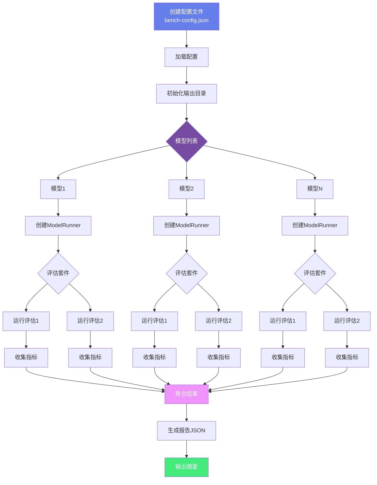

# AGIME 性能测试指南

## 概述

agime-bench 是 AGIME 的性能测试框架，用于评估不同模型和配置的性能表现。

## 核心概念

### BenchRunConfig（测试配置）

```json
{
  "models": [
    {
      "provider": "anthropic",
      "name": "claude-3-5-sonnet-20241022",
      "parallel_safe": true
    }
  ],
  "evals": [
    {
      "selector": "core",
      "parallel_safe": true
    }
  ],
  "repeat": 2,
  "output_dir": "./bench-results"
}
```

**配置字段**：
- `models`: 要测试的模型列表
  - `provider`: 模型提供商（anthropic, openai, google等）
  - `name`: 模型名称
  - `parallel_safe`: 是否支持并行执行
  - `tool_shim`: 工具调用优化配置（可选）
    - `use_tool_shim`: 是否启用工具shim
    - `tool_shim_model`: shim使用的模型
- `evals`: 评估套件选择器
  - `selector`: 评估选择器（如"core", "core/developer", "vibes"）
  - `post_process_cmd`: 后处理命令（可选）
  - `parallel_safe`: 是否支持并行执行
- `repeat`: 重复次数（默认2次，建议2-5次）
- `run_id`: 运行标识符（可选，用于区分不同运行）
- `output_dir`: 结果输出目录（默认当前目录）
- `eval_result_filename`: 评估结果文件名（默认"eval-results.json"）
- `run_summary_filename`: 运行摘要文件名（默认"run-results-summary.json"）
- `env_file`: 环境变量文件路径（可选）
- `include_dirs`: 额外的评估目录列表（可选）

### 评估套件（Eval Suites）

#### Core 套件（核心功能测试）

**developer** - 开发者工具评估
- 测试代码分析、文件编辑、命令执行能力
- 评估指标：任务完成率、代码质量、执行时间
- 选择器：`core/developer`

**memory** - 记忆系统评估
- 测试上下文记忆、事实提取、信息检索能力
- 评估指标：记忆准确率、检索速度、上下文保持
- 选择器：`core/memory`

**computercontroller** - 计算机控制评估
- 测试自动化操作、GUI 交互、系统控制能力
- 评估指标：操作成功率、响应时间、错误处理
- 选择器：`core/computercontroller`

**developer_image** - 图像处理评估
- 测试图像分析、视觉理解能力
- 评估指标：识别准确率、描述质量
- 选择器：`core/developer_image`

**developer_search_replace** - 搜索替换评估
- 测试代码搜索、批量替换能力
- 评估指标：搜索准确率、替换正确率
- 选择器：`core/developer_search_replace`

#### Vibes 套件（场景测试）

**agime_wiki** - Wiki 编辑场景
- 测试结构化文档编辑、格式化能力
- 评估指标：编辑准确性、格式正确性
- 选择器：`vibes/agime_wiki`

**blog_summary** - 博客摘要场景
- 测试文本理解、摘要生成能力
- 评估指标：摘要质量、关键信息提取
- 选择器：`vibes/blog_summary`

**flappy_bird** - 游戏开发场景
- 测试代码生成、游戏逻辑实现能力
- 评估指标：代码可运行性、功能完整性
- 选择器：`vibes/flappy_bird`

**restaurant_research** - 信息研究场景
- 测试信息收集、数据整理能力
- 评估指标：信息准确性、数据完整性
- 选择器：`vibes/restaurant_research`

**squirrel_census** - 数据分析场景
- 测试数据处理、统计分析能力
- 评估指标：分析准确性、结果可视化
- 选择器：`vibes/squirrel_census`

## 快速开始

**测试执行流程**:



### 1. 创建配置文件

```bash
cat > bench-config.json <<EOF
{
  "models": [
    {
      "provider": "anthropic",
      "name": "claude-3-5-sonnet-20241022",
      "parallel_safe": true
    }
  ],
  "evals": [
    {
      "selector": "core",
      "parallel_safe": true
    }
  ],
  "repeat": 1
}
EOF
```

### 2. 运行测试

```bash
# 使用CLI运行
agime bench run --config bench-config.json

# 或使用脚本
./scripts/run-benchmarks.sh
```

### 3. 查看结果

测试结果保存在输出目录：
- `eval-results.json`: 详细评估结果
- `run-results-summary.json`: 运行摘要

## 评估指标

每个评估返回的指标类型：
- **Int**: 整数值（如成功次数）
- **Float**: 浮点值（如准确率）
- **String**: 字符串值（如状态）
- **Bool**: 布尔值（如是否通过）

### 常见指标说明

**性能指标**：
- `execution_time`: 执行时间（秒）
- `token_count`: 使用的token数量
- `api_calls`: API调用次数
- `retry_count`: 重试次数

**质量指标**：
- `success_rate`: 成功率（0.0-1.0）
- `accuracy`: 准确率（0.0-1.0）
- `completeness`: 完整性评分（0.0-1.0）
- `error_count`: 错误数量

**任务特定指标**：
- `code_quality`: 代码质量评分
- `test_pass_rate`: 测试通过率
- `memory_retention`: 记忆保持率
- `response_relevance`: 响应相关性

## 结果分析

### 结果文件结构

**eval-results.json**：
```json
{
  "run_id": "run-2024-01-01",
  "timestamp": "2024-01-01T10:00:00Z",
  "models": [
    {
      "provider": "anthropic",
      "name": "claude-3-5-sonnet-20241022",
      "evaluations": [
        {
          "name": "core/developer",
          "runs": [
            {
              "metrics": {
                "success_rate": 0.95,
                "execution_time": 45.2,
                "token_count": 12500
              },
              "status": "completed"
            }
          ],
          "aggregate": {
            "mean_success_rate": 0.95,
            "std_dev": 0.02
          }
        }
      ]
    }
  ]
}
```

**run-results-summary.json**：
```json
{
  "total_runs": 10,
  "successful_runs": 9,
  "failed_runs": 1,
  "total_duration": 450.5,
  "models_tested": 2,
  "evaluations_run": 5,
  "summary": {
    "best_model": "claude-3-5-sonnet-20241022",
    "avg_success_rate": 0.92
  }
}
```

### 性能对比分析

**对比多个模型**：
```bash
# 生成对比报告
agime bench compare \
  --results results-model-a.json \
  --results results-model-b.json \
  --output comparison.html
```

**关键对比维度**：
1. **成功率**：任务完成的成功率
2. **执行时间**：平均执行时间
3. **Token效率**：每个任务的token消耗
4. **稳定性**：多次运行的标准差
5. **成本效益**：性能与成本的平衡

## 自定义评估

### 创建评估套件

```rust
use agime_bench::eval_suites::evaluation::Evaluation;

pub struct MyEval;

impl Evaluation for MyEval {
    fn name(&self) -> String {
        "my_eval".to_string()
    }

    async fn run(&self, agent: &mut dyn BenchAgent) -> EvalResult {
        // 实现评估逻辑
    }
}
```

### 注册评估

```rust
use agime_bench::eval_suites::factory::register_evaluation;

register_evaluation("my_eval", Box::new(MyEval));
```

## 并行执行

设置 `parallel_safe: true` 启用并行执行：
- 模型级并行：多个模型同时测试
- 评估级并行：多个评估同时运行

**注意**：某些评估可能不支持并行（如需要独占资源）。

### 并行执行策略

**全并行模式**（最快）：
```json
{
  "models": [
    {"provider": "anthropic", "name": "claude-3-5-sonnet", "parallel_safe": true},
    {"provider": "openai", "name": "gpt-4", "parallel_safe": true}
  ],
  "evals": [
    {"selector": "core/developer", "parallel_safe": true},
    {"selector": "core/memory", "parallel_safe": true}
  ]
}
```

**混合模式**（平衡）：
```json
{
  "models": [
    {"provider": "anthropic", "name": "claude-3-5-sonnet", "parallel_safe": true}
  ],
  "evals": [
    {"selector": "core/developer", "parallel_safe": true},
    {"selector": "vibes/flappy_bird", "parallel_safe": false}
  ]
}
```

**串行模式**（最稳定）：
```json
{
  "models": [
    {"provider": "anthropic", "name": "claude-3-5-sonnet", "parallel_safe": false}
  ],
  "evals": [
    {"selector": "core", "parallel_safe": false}
  ]
}
```

### 性能优化建议

1. **CPU密集型评估**：设置 `parallel_safe: false`
2. **IO密集型评估**：设置 `parallel_safe: true`
3. **共享资源评估**：使用串行模式
4. **独立评估**：使用并行模式

## 工作目录管理

每个评估在独立的工作目录中运行：
- 自动创建临时目录
- 测试完成后自动清理
- 支持自定义 `include_dirs` 引入额外文件

## 错误处理

测试框架会捕获并记录：
- 评估执行错误
- 模型响应错误
- 超时错误

所有错误都会记录在结果文件中，不会中断整个测试流程。

## 最佳实践

1. **使用合适的 repeat 值**：建议至少2次以获得稳定结果
2. **设置合理的超时**：避免单个评估运行过久
3. **检查 parallel_safe**：确保评估支持并行执行
4. **定期清理结果**：避免输出目录过大
5. **版本控制配置**：将配置文件纳入版本控制
6. **环境隔离**：使用独立环境运行测试
7. **结果归档**：保存历史测试结果用于趋势分析

## CI/CD 集成

### GitHub Actions 示例

```yaml
name: Benchmark Tests

on:
  push:
    branches: [main]
  pull_request:
    branches: [main]

jobs:
  benchmark:
    runs-on: ubuntu-latest
    steps:
      - uses: actions/checkout@v3

      - name: Setup Rust
        uses: actions-rs/toolchain@v1
        with:
          toolchain: stable

      - name: Run Benchmarks
        env:
          AGIME_ANTHROPIC_API_KEY: ${{ secrets.ANTHROPIC_API_KEY }}
        run: |
          cargo build --release
          agime bench run --config bench-config.json

      - name: Upload Results
        uses: actions/upload-artifact@v3
        with:
          name: benchmark-results
          path: bench-results/

      - name: Compare with Baseline
        run: |
          agime bench compare \
            --baseline baseline-results.json \
            --current bench-results/eval-results.json \
            --threshold 0.05
```

### 性能回归检测

```bash
# 设置基线
agime bench run --config baseline.json
cp bench-results/eval-results.json baseline-results.json

# 运行新测试
agime bench run --config current.json

# 对比检测回归
agime bench compare \
  --baseline baseline-results.json \
  --current bench-results/eval-results.json \
  --threshold 0.05 \
  --fail-on-regression
```

## 高级用法

### 自定义后处理

```json
{
  "evals": [
    {
      "selector": "core/developer",
      "post_process_cmd": "./scripts/analyze-code-quality.sh",
      "parallel_safe": true
    }
  ]
}
```

**后处理脚本示例**：
```bash
#!/bin/bash
# analyze-code-quality.sh
RESULT_FILE=$1
python3 scripts/code_analyzer.py "$RESULT_FILE"
```

### 环境变量配置

```json
{
  "env_file": ".env.bench",
  "models": [...]
}
```

**.env.bench**：
```bash
AGIME_ANTHROPIC_API_KEY=sk-ant-xxx
AGIME_OPENAI_API_KEY=sk-xxx
BENCH_TIMEOUT=300
BENCH_MAX_RETRIES=3
```

### 增量测试

```bash
# 只测试失败的评估
agime bench run \
  --config bench-config.json \
  --retry-failed \
  --previous-results bench-results/eval-results.json
```

### 分布式测试

```bash
# 节点1：测试模型A
agime bench run --config config-model-a.json --output results-a/

# 节点2：测试模型B
agime bench run --config config-model-b.json --output results-b/

# 合并结果
agime bench merge \
  --results results-a/eval-results.json \
  --results results-b/eval-results.json \
  --output merged-results.json
```
4. **定期清理结果**：避免输出目录过大

## 命令行选项

```bash
agime bench run [OPTIONS]

OPTIONS:
  --config <FILE>     配置文件路径
  --output <DIR>      输出目录
  --models <LIST>     覆盖配置中的模型列表
  --evals <LIST>      覆盖配置中的评估列表
  --repeat <N>        重复次数
```

## 示例

### 测试单个模型

```json
{
  "models": [
    {
      "provider": "anthropic",
      "name": "claude-3-5-sonnet-20241022",
      "parallel_safe": true
    }
  ],
  "evals": [{"selector": "core", "parallel_safe": true}],
  "repeat": 3
}
```

### 对比多个模型

```json
{
  "models": [
    {"provider": "anthropic", "name": "claude-3-5-sonnet-20241022", "parallel_safe": true},
    {"provider": "openai", "name": "gpt-4", "parallel_safe": true}
  ],
  "evals": [{"selector": "core", "parallel_safe": true}],
  "repeat": 2
}
```

### 运行特定评估

```json
{
  "models": [
    {"provider": "anthropic", "name": "claude-3-5-sonnet-20241022", "parallel_safe": true}
  ],
  "evals": [
    {"selector": "core/developer", "parallel_safe": true},
    {"selector": "vibes/wiki_edit", "parallel_safe": false}
  ],
  "repeat": 1
}
```

## 故障排查

**问题：测试运行缓慢**
- 检查 `parallel_safe` 设置
- 减少 `repeat` 次数
- 使用更快的模型

**问题：评估失败**
- 检查模型 API 配置
- 查看错误日志
- 确认评估依赖的工具可用

**问题：结果不一致**
- 增加 `repeat` 次数
- 检查评估是否有随机性
- 确认环境一致性

## 相关文档

- [核心引擎](CORE_ENGINE.md) - 了解 Agent 系统
- [CLI 工具](CLI_AND_TOOLS.md) - 命令行使用
- [构建部署](BUILD_AND_DEPLOY.md) - 环境配置
