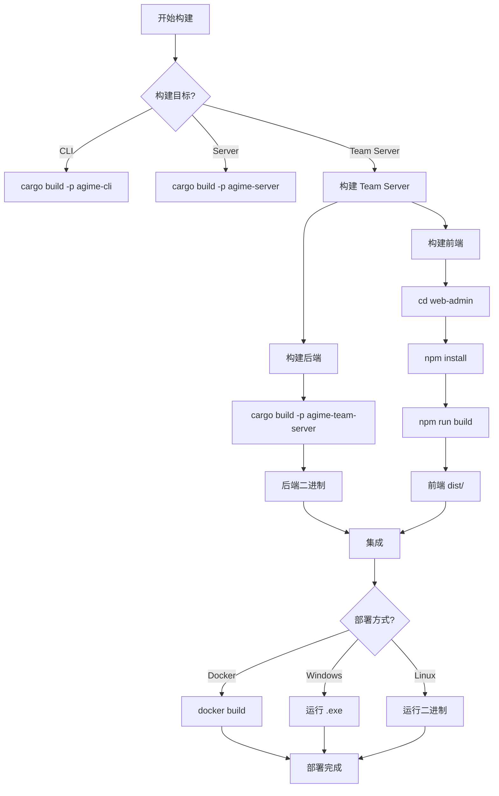

# AGIME 构建与部署指南

本文档详细描述 AGIME 项目的构建系统、部署方式及基础设施配置。

---

## 目录

- [项目结构概览](#项目结构概览)
- [前置依赖](#前置依赖)
- [构建系统](#构建系统)
- [构建命令](#构建命令)
- [Docker 部署](#docker-部署)
- [Windows 部署](#windows-部署)
- [Linux/云端部署](#linux云端部署)
- [CI/CD 流水线](#cicd-流水线)
- [环境变量配置](#环境变量配置)
- [Nix 支持](#nix-支持)
- [开发环境](#开发环境)

---

## 项目结构概览

AGIME 采用 Rust workspace 多 crate 架构，共包含 8 个 crate：

| Crate | 说明 |
|-------|------|
| `agime` | 核心引擎 — AI agent、provider 抽象、会话管理 |
| `agime-cli` | 命令行客户端 |
| `agime-server` | 本地 HTTP 服务（agimed 二进制） |
| `agime-mcp` | MCP 工具服务器集合（Developer、Memory 等） |
| `agime-team` | 团队协作库 — 数据模型、MongoDB/SQLite 持久化 |
| `agime-team-server` | 独立团队服务器（含 Web Admin 前端） |
| `agime-bench` | 性能基准测试 |
| `agime-test` | 集成测试 |

Workspace 配置位于根目录 `Cargo.toml`，使用 `resolver = "2"`。

---

## 前置依赖

### 必需

| 工具 | 版本要求 | 说明 |
|------|---------|------|
| **Rust** | 1.92.0+ | 由 `rust-toolchain.toml` 指定，channel = `1.92.0` |
| **Node.js** | 22+ | Web Admin 前端构建 |
| **MongoDB** | 6.0+ | Team Server 默认数据库后端 |

### 可选

| 工具 | 说明 |
|------|------|
| Docker | 容器化部署 |
| Nix | 可复现开发环境（`flake.nix`） |
| Visual Studio 2022 | Windows 原生构建 |
| protobuf-compiler | 跨平台编译时需要 |

---

## 构建系统

### Rust 工具链

- **Toolchain**: 1.92.0（`rust-toolchain.toml` 指定）
- **Edition**: 2021
- **Workspace version**: 2.8.0
- **License**: Apache-2.0

### 核心依赖

| 依赖 | 版本 | 用途 |
|------|------|------|
| `rmcp` | 0.15.0 | MCP 协议实现（features: schemars, auth） |
| `rustls` | 0.23 | TLS（ring 后端，避免 aws-lc-rs 的 C 编译器依赖） |
| `axum` | 0.8.1 | HTTP 框架 |
| `tokio` | 1.43 | 异步运行时 |
| `sqlx` | — | SQLite 数据库驱动 |
| `mongodb` | — | MongoDB 驱动 |

### 前端技术栈

| 技术 | 版本 | 说明 |
|------|------|------|
| React | 19.2 | UI 框架 |
| Vite | 7.2.6 | 构建工具 |
| Tailwind CSS | 4.1 | 样式框架 |
| TypeScript | 5.9 | 类型系统 |
| i18next | 24.2 | 国际化（中/英） |

### 构建优化

- 并行编译：`jobs = 4`（适合 12GB 内存环境）
- Release profile：`codegen-units = 1`、`opt-level = 2`、`panic = "abort"`
- Docker 构建：LTO 开启、`opt-level = z`（体积优化）、strip 符号

---

**完整构建流程**：



## 构建命令

### 全量 Workspace 构建

```bash
# Debug 构建
cargo build

# Release 构建
cargo build --release

# 仅构建 Team Server
cargo build --release -p agime-team-server

# 构建含 team feature 的本地服务器
cargo build --release -p agime-server --features team
```

### Windows Team Server 构建脚本

```bat
:: build_team_server.bat
:: 自动配置 VS2022 环境并构建
```

### Web Admin 前端构建

```bash
cd crates/agime-team-server/web-admin
npm install
npm run build        # 生产构建 (tsc && vite build)
npm run dev          # 开发模式
npm run typecheck    # 仅类型检查
```

构建产物输出到 `web-admin/dist/`，由 Team Server 自动挂载到 `/admin` 路径。

### 测试

```bash
# 运行全部测试（跳过 scenario 测试）
cargo test -- --skip scenario_tests::scenarios::tests

# 单线程运行 scenario 测试（避免资源竞争）
cargo test --jobs 1 scenario_tests::scenarios::tests

# 代码格式检查
cargo fmt --check

# Clippy lint
./scripts/clippy-lint.sh
```

---

## Docker 部署

### Dockerfile

项目根目录的 `Dockerfile` 采用多阶段构建：

```
阶段 1 (builder): rust:1.82-bookworm
  - 安装构建依赖 (build-essential, pkg-config, libssl-dev, protobuf-compiler...)
  - 编译 Release 二进制 (LTO + strip)

阶段 2 (runtime): debian:bookworm-slim
  - 仅安装运行时依赖 (ca-certificates, libssl3, curl, git)
  - 创建非 root 用户 (agime:1000)
  - ENTRYPOINT: /usr/local/bin/agime
```

支持平台：`linux/amd64`, `linux/arm64`

### docker-compose.yml

Team Server 的 Docker Compose 配置位于 `crates/agime-team-server/docker-compose.yml`：

```yaml
services:
  team-server:
    build:
      context: ../..
      dockerfile: crates/agime-team-server/Dockerfile
    ports:
      - "${TEAM_SERVER_PORT:-8080}:8080"
    environment:
      - TEAM_SERVER_HOST=0.0.0.0
      - TEAM_SERVER_PORT=8080
      - DATABASE_URL=sqlite:///data/team.db?mode=rwc
      - RUST_LOG=agime_team_server=info,tower_http=debug
    volumes:
      - team-data:/data
    healthcheck:
      test: ["CMD", "curl", "-f", "http://localhost:8080/health"]
      interval: 30s
      timeout: 10s
      retries: 3
    restart: unless-stopped

volumes:
  team-data:
    driver: local

networks:
  default:
    name: agime-network
```

### Docker Registry

镜像发布到 GitHub Container Registry (ghcr.io)：

```
ghcr.io/<owner>/agime:latest        # 主分支最新
ghcr.io/<owner>/agime:sha-<commit>  # 提交 SHA
ghcr.io/<owner>/agime:<version>     # 语义化版本
```

---

## Windows 部署

### 运行脚本 (`run_team_server.bat`)

```bat
@echo off
cd /d E:\yw\agiatme\goose

:: 配置 Visual Studio 2022 环境
call "E:\vs\VC\Auxiliary\Build\vcvarsall.bat" x64

:: 设置环境变量
set DATABASE_TYPE=mongodb
set DATABASE_URL=mongodb://localhost:27017
set DATABASE_NAME=agime_team
set TEAM_SERVER_HOST=0.0.0.0
set TEAM_SERVER_PORT=8080

:: 启动服务
cargo run -p agime-team-server
```

### 注意事项

- 需要安装 Visual Studio 2022 并配置 C++ 工具链
- 确保 MongoDB 在本地运行
- VS2022 环境自动由 `vcvarsall.bat x64` 配置

---

## Linux/云端部署

### 部署脚本 (`deploy_team_server.sh`)

一键部署脚本，用于 Linux 云服务器：

```bash
#!/bin/bash
# 工作目录: /data/agime-team
# 步骤:
# 1. 检查系统环境（内存、磁盘）
# 2. 安装 Docker（如未安装）
# 3. 创建数据目录
# 4. 生成 docker-compose.yml
# 5. 创建 bin 目录用于放置二进制
# 6. 提示上传二进制并启动
```

### 裸机部署

1. 编译 Release 二进制：
   ```bash
   cargo build --release -p agime-team-server
   ```

2. 上传二进制到服务器：
   ```bash
   scp target/release/agime-team-server user@server:/data/agime-team/bin/
   ```

3. 配置环境变量并运行：
   ```bash
   export DATABASE_TYPE=mongodb
   export DATABASE_URL=mongodb://localhost:27017
   export TEAM_SERVER_HOST=0.0.0.0
   export TEAM_SERVER_PORT=8080
   ./agime-team-server
   ```

### systemd 服务

```ini
[Unit]
Description=AGIME Team Server
After=network.target mongod.service

[Service]
Type=simple
User=agime
WorkingDirectory=/data/agime-team
ExecStart=/data/agime-team/bin/agime-team-server
Restart=on-failure
RestartSec=5
EnvironmentFile=/data/agime-team/.env

[Install]
WantedBy=multi-user.target
```

---

## CI/CD 流水线

### GitHub Actions 工作流

项目配置了 4 个 GitHub Actions 工作流：

#### 1. `ci.yml` — 持续集成

**触发条件**: push 到 main、PR 到 main、merge_group

**Jobs**:

| Job | 说明 |
|-----|------|
| `changes` | 检测文件变更，跳过纯文档修改 |
| `rust-format` | `cargo fmt --check` 格式检查 |
| `rust-build-and-test` | 编译 + 测试（Ubuntu） |
| `rust-lint` | Clippy lint 检查 |
| `openapi-schema-check` | 验证 OpenAPI Schema 是否最新 |
| `desktop-lint` | Electron 桌面应用 lint + 测试（macOS） |

#### 2. `build-all-platforms.yml` — 多平台构建

**触发条件**: workflow_call、workflow_dispatch

**构建矩阵**（共 15 个 target）:

| 平台 | 架构 | 格式 | Runner |
|------|------|------|--------|
| Windows | x64 | ZIP | ubuntu-latest (Docker 交叉编译) |
| Windows | x64 | Installer ZIP | ubuntu-latest (Docker 交叉编译) |
| Windows | x64 | EXE (Squirrel) | windows-latest (原生) |
| macOS | ARM64 | ZIP | macos-latest |
| macOS | ARM64 | DMG | macos-latest |
| macOS | ARM64 | PKG | macos-latest |
| macOS | x64 | ZIP | macos-15 |
| macOS | x64 | DMG | macos-15 |
| macOS | x64 | PKG | macos-15 |
| Linux | x64 | tar.gz | ubuntu-latest |
| Linux | x64 | DEB | ubuntu-latest |
| Linux | x64 | RPM | ubuntu-latest |
| Linux | ARM64 | tar.gz | ubuntu-24.04-arm |
| Linux | ARM64 | DEB | ubuntu-24.04-arm |
| Linux | ARM64 | RPM | ubuntu-24.04-arm |

**Windows 交叉编译细节**:
- 在 Ubuntu 上使用 Docker + `rust:latest` 镜像
- 安装 `mingw-w64` 工具链
- Target: `x86_64-pc-windows-gnu`
- 自动复制运行时 DLL（libstdc++-6.dll, libgcc_s_seh-1.dll, libwinpthread-1.dll）

**Release 创建**:
- 自动 SHA256 checksums（`SHA256SUMS.txt`）
- 通过 `softprops/action-gh-release` 发布到 GitHub Releases
- 支持手动指定 release tag 或自动从 git tag 获取

#### 3. `publish-docker.yml` — Docker 镜像发布

**触发条件**: push 到 main、tag `v*.*.*`、workflow_dispatch

**行为**:
- 使用 Docker Buildx 构建多平台镜像（linux/amd64, linux/arm64）
- 发布到 ghcr.io
- 自动 tag 管理：latest、sha-xxx、语义化版本（major.minor.patch）
- 带缓存优先策略，失败时回退无缓存构建

#### 4. `release.yml` — 发布

**触发条件**: tag push `v*`、workflow_dispatch

**行为**: 调用 `build-all-platforms.yml` 并自动创建 Release。

---

## 环境变量配置

### Team Server 核心配置

| 变量 | 默认值 | 说明 |
|------|--------|------|
| `DATABASE_TYPE` | `mongodb` | 数据库类型：`mongodb` 或 `sqlite` |
| `TEAM_SERVER_HOST` | `0.0.0.0` | 监听地址 |
| `TEAM_SERVER_PORT` | `8080` | 监听端口 |
| `DATABASE_URL` | `mongodb://localhost:27017` | 数据库连接 URL（别名 `MONGODB_URL`） |
| `DATABASE_NAME` | `agime_team` | MongoDB 数据库名（别名 `MONGODB_DATABASE`） |
| `DATABASE_MAX_CONNECTIONS` | `10` | 最大连接数 |
| `REGISTRATION_MODE` | `open` | 注册模式：`open`/`approval`/`disabled` |
| `WORKSPACE_ROOT` | `./data/workspaces` | 工作区隔离根目录 |
| `BASE_URL` | — | 服务器公网 URL（用于邀请链接等） |
| `CORS_ALLOWED_ORIGINS` | — | CORS 白名单（逗号分隔，留空则 mirror 模式） |

### 认证与安全

| 变量 | 默认值 | 说明 |
|------|--------|------|
| `ADMIN_API_KEY` | — | 管理员 API Key |
| `ADMIN_EMAILS` | — | 自动获得 admin 角色的邮箱（逗号分隔） |
| `MAX_API_KEYS_PER_USER` | `10` | 每用户最大 API Key 数 |
| `LOGIN_MAX_FAILURES` | `5` | 锁定前最大失败次数 |
| `LOGIN_LOCKOUT_MINUTES` | `15` | 锁定时长（分钟） |
| `SESSION_SLIDING_WINDOW_HOURS` | `2` | 会话滑动续期窗口（小时） |
| `SECURE_COOKIES` | `false` | Cookie 是否设置 Secure 标志 |
| `LICENSE_KEY` | — | 品牌定制 License Key |

### AI Describe 配置

| 变量 | 默认值 | 说明 |
|------|--------|------|
| `AI_DESCRIBE_API_KEY` | — | 专用 API Key（回退到 agent 配置） |
| `AI_DESCRIBE_MODEL` | — | 模型名 |
| `AI_DESCRIBE_API_URL` | — | API 端点 |
| `AI_DESCRIBE_API_FORMAT` | — | API 格式：`anthropic` 或 `openai` |

### 任务超时配置

| 变量 | 默认值 | 说明 |
|------|--------|------|
| `TEAM_MISSION_MIN_STEP_TIMEOUT_SECS` | `300` | 单步最小超时（秒） |
| `TEAM_MISSION_COMPLEX_STEP_TIMEOUT_SECS` | `900` | 复杂步骤超时（秒） |
| `TEAM_MISSION_MIN_GOAL_TIMEOUT_SECS` | `600` | 目标最小超时（秒） |
| `TEAM_MISSION_STALE_SECS` | `10800` | 过期任务清理阈值（默认 3 小时） |

### MCP 配置

| 变量 | 默认值 | 说明 |
|------|--------|------|
| `TEAM_MCP_ENABLE_TASK_CALLS` | `true` | 是否启用 MCP task calls |
| `MCP_TASK_TIMEOUT_SECS` | `600` | MCP 任务超时 |
| `TEAM_MCP_ENABLE_ELICITATION` | `false` | 是否启用 MCP elicitation |
| `TEAM_MCP_ELICITATION_DEFAULT_ACTION` | `cancel` | Elicitation 默认动作 |

### Agent 运行时配置

| 变量 | 默认值 | 说明 |
|------|--------|------|
| `TEAM_AGENT_RESOURCE_MODE` | `explicit` | 资源模式：`explicit`/`auto` |
| `TEAM_AGENT_SKILL_MODE` | `on_demand` | 技能模式：`assigned`/`on_demand` |
| `TEAM_AGENT_AUTO_EXTENSION_POLICY` | `reviewed_only` | 自动扩展策略：`reviewed_only`/`all` |
| `TEAM_AGENT_AUTO_INSTALL_EXTENSIONS` | `true` | 自动安装缺失的 stdio 扩展 |
| `TEAM_AGENT_EXTENSION_CACHE_ROOT` | `./data/runtime/extensions` | 扩展缓存目录 |

### 后台清理配置

| 变量 | 默认值 | 说明 |
|------|--------|------|
| `TEAM_CHAT_CLEANUP_INTERVAL_SECS` | `60` | Chat 清理间隔（最小 15 秒） |
| `TEAM_CHAT_STALE_MAX_AGE_SECS` | `14400` | Chat 过期阈值（默认 4 小时） |

### 日志配置

| 变量 | 默认值 | 说明 |
|------|--------|------|
| `RUST_LOG` | `agime_team_server=info,tower_http=debug` | 日志级别 |
| `LOG_LEVEL` | — | 通用日志级别 |
| `LANGFUSE_*` | — | Langfuse 观测平台集成 |
| `OTEL_*` | — | OpenTelemetry 集成 |

### AGIME Core 配置（本地服务）

| 变量 | 说明 |
|------|------|
| `AGIME_PROVIDER` | AI 提供商（anthropic, openai, google 等） |
| `AGIME_MODEL` | 模型名称 |
| `AGIME_API_KEY` | API 密钥（或使用提供商专用 key） |

---

## Nix 支持

项目提供 `flake.nix` 用于可复现开发环境：

```bash
# 进入开发环境
nix develop

# 或使用 direnv 自动激活
echo "use flake" > .envrc
direnv allow
```

---

## 开发环境

### IDE 集成

- **rust-analyzer.toml**: 配置 IDE 的 Rust 分析器设置
- **Cross.toml**: 交叉编译配置

### VS Code Dev Container

项目包含 `.devcontainer/` 目录，支持 VS Code Remote Containers 开发。

### 项目提示

- `.goosehints`: 项目级别的 AI 代理提示文件

### 端口约定

| 服务 | 默认端口 |
|------|---------|
| Team Server | 8080 |
| Local Server (agimed) | 动态分配 |
| MongoDB | 27017 |

### 健康检查

Team Server 提供健康检查端点：

```bash
curl http://localhost:8080/health
# 返回:
# {
#   "status": "healthy",
#   "database": "mongodb",
#   "database_connected": true,
#   "version": "2.8.0"
# }
```
