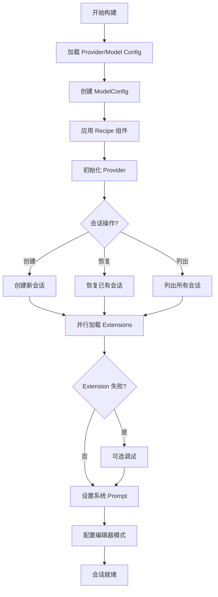

# CLI 与工具集

## 概述

AGIME 提供完整的命令行工具集，包括交互式 CLI、REST API 服务器、基准测试框架和测试基础设施。

## agime-cli (命令行界面)

### 核心架构

**CliSession** 是主会话结构：
```rust
pub struct CliSession {
    agent: Agent,
    messages: Conversation,
    session_id: String,
    debug_flags: DebugFlags,
    completion_cache: CompletionCache,
}
```

### SessionBuilderConfig

**会话构建配置：**
- Extension 列表 (stdio, remote, streamable HTTP, built-ins)
- Provider/model 覆盖
- Max turns, retry config, output format
- Recipe 集成
- 定时任务追踪

**build_session() 流程：**



### 交互式功能

**输入系统 (InputResult enum):**
- Message: 用户消息
- Exit: 退出命令
- AddExtension: 添加扩展
- Plan: 规划模式
- Recipe: 配方执行
- 其他操作

**get_input():**
- 使用 rustyline 交互式 readline
- 自定义按键绑定:
  - Ctrl+J: 换行
  - Ctrl+C: 清除/退出
  - Tab: 命令补全 (GooseCompleter)

**输出模块:**
- 终端渲染，带颜色
- 主题支持
- 格式化输出

**补全模块:**
- 提示词/命令补全缓存
- 上下文感知补全

### 会话生命周期方法

**run_interactive():** 主事件循环，用户交互
**headless():** 非交互式执行 (从消息字符串)
**process_*():** 处理不同消息类型 (tool responses, streaming 等)
**export_session_to_markdown():** 会话历史导出，带格式化

### CLI 命令 (commands/ 模块)

**session.rs:**
- list: 列出会话 (带排序/过滤)
- remove: 删除会话 (交互式/正则)
- export: 导出会话
- diagnostics: 会话诊断

**recipe.rs:**
- list: 列出配方
- validate: 验证配方
- open: 打开配方
- explain: 解释配方 (带 deeplinks)

**bench.rs:** 连接到 agime-bench，桥接 CLI 到基准测试

**schedule.rs:** 任务调度和 cron 管理

**configure.rs:** Provider 设置和配置

**project.rs:** 项目管理

**acp.rs:** Agent Client Protocol 实现

**term.rs:** 终端/shell 集成

**web.rs:** Web 服务器模式

**update.rs:** 版本检查

**info.rs:** 系统信息

### Recipe 系统 (recipes/ 模块)

**recipe.rs:** 核心配方加载、解析、验证

**github_recipe.rs:** GitHub 集成

**search_recipe.rs:** 配方搜索

**print_recipe.rs:** 配方格式化显示

**extract_from_cli.rs:** 从命令行参数提取配方

**secret_discovery.rs:** 检测提示词中的密钥

### 特殊功能

**场景测试 (scenario_tests/):** 场景测试框架

**信号处理 (signal.rs):**
- Unix: SIGTERM/SIGINT
- Windows: Ctrl+C

**日志系统 (logging.rs):**
- 文件 JSON 日志
- OTLP 集成 (telemetry)
- Langfuse 集成 (tracing)
- 错误捕获层 (benchmarking)
- 环境变量控制日志级别

### 关键依赖

- tokio (async runtime)
- clap (参数解析)
- cliclack (交互式提示)
- rustyline (行编辑)
- serde_yaml (配方解析)
- agime, agime-mcp (核心逻辑)
- agime-bench (基准测试)

## agime-server (REST API 服务器)

### 核心基础设施

**AppState (state.rs):**
```rust
pub struct AppState {
    agent_manager: Arc<AgentManager>,
    recipe_file_hash_map: Cache<RecipeFiles>,
    session_counter: AtomicU64,
    recipe_session_tracker: HashSet<SessionId>,
}
```

**方法:**
- `new()`: 使用 AgentManager 初始化
- `get_agent()`: 获取或创建会话的 agent
- `get_agent_for_route()`: 路由安全的 agent 访问，带错误处理
- `scheduler()`: 访问 scheduler trait

**配置 (configuration.rs):**
- **Settings**: Host 和 port 配置
- 默认: 0.0.0.0:3000
- 从环境加载:
  - 首先: GOOSE_* 前缀 (向后兼容)
  - 然后: AGIME_* 前缀 (优先)
  - 验证，带有用的错误消息

**认证 (auth.rs):**
- 密钥管理
- Token 验证 (通过中间件)
- 支持环境配置

### API 路由

**Session 管理 (session.rs):**

`GET /session` - 列出会话，带分页
- Query 参数: limit, before (cursor), favorites_only, tags, working_dir, date filters, sort options
- 响应: PaginatedSessionListResponse (has_more, next_cursor)

`GET /session/{id}` - 获取单个会话

`PUT /session/{id}` - 更新会话名称/元数据

`POST /session/{id}/fork` - Fork 会话 (在消息点编辑)

`DELETE /session/{id}` - 删除会话

`POST /session/{id}/export` - 导出会话 (JSON/YAML/Markdown)

`POST /session/{id}/memory/*` - Memory fact 管理 (create, list, delete, patch)

`POST /session/{id}/insights` - 获取会话洞察

`POST /session/import` - 从 JSON 导入会话

**Agent 生命周期 (agent.rs):**

`POST /agent/start` - 创建新 agent 会话
- 参数: working_dir, recipe/recipe_id/recipe_deeplink
- 返回: Session 对象

`POST /agent/{id}/stop` - 停止运行的 agent

`POST /agent/{id}/resume` - 恢复暂停的 agent
- load_model_and_extensions flag

`PUT /agent/{id}/provider` - 更新 provider/model
- 参数: provider, model (可选)

`POST /agent/{id}/extension` - 添加 extension

`DELETE /agent/{id}/extension` - 移除 extension

`GET /agent/{id}/tools` - 列出可用工具

`POST /agent/{id}/tool/read-resource` - 读取 MCP resource

`POST /agent/{id}/tool/call` - 直接执行工具

**Chat 与流式 (reply.rs):**

`POST /chat` - 发送消息并获取 SSE 流式响应
- 流式 MessageEvent 类型:
  - Message (带 TokenState)
  - Error
  - Finish (带 reason)
  - ModelChange (用于 lead/worker 模式)
  - Notification (MCP)
  - UpdateConversation
  - Ping
- 实时 token 追踪
- Tool telemetry 追踪 (计数器)

**Recipe 管理 (recipe.rs):**
- `POST /recipe/create` - 从会话提取配方
- `POST /recipe/encode` - 编码配方为 deeplink
- `POST /recipe/decode` - 解码 deeplink 为配方
- `POST /recipe/validate` - 验证配方
- `POST /recipe/scan` - 安全扫描
- `POST /recipe/save` - 保存配方到磁盘
- `GET /recipe/list` - 列出可用配方
- `GET /recipe/manifests` - 获取配方元数据
- `GET /recipe/{id}` - 通过 ID 获取配方

**Setup 流程 (setup.rs):**
- `POST /handle_openrouter` - OpenRouter OAuth 流程
- `POST /handle_tetrate` - Tetrate Agent Router 设置

**Provider 配置 (config_management.rs):**
- Provider/model 列表和信息
- Extension 列表 (带工具信息)
- Tool 参数提取
- Router tool selector 更新

**调度 (schedule.rs):**
- 任务调度端点
- Cron 表达式处理
- 任务生命周期管理

**其他路由:**
- `status.rs`: 健康检查，版本信息
- `action_required.rs`: 权限确认
- `shared_session.rs`: 共享会话链接
- `upload.rs`: 文件上传
- `audio.rs`: 音频转录/流式
- `mcp_ui_proxy.rs`: MCP UI 代理 (WebSocket)
- `web_ui.rs`: Web 界面服务

### Team 功能 (可选)

通过 "team" feature flag 启用：
- SQLite 数据库初始化
- 从 agime-team crate 合并路由
- 基于用户的隔离
- Skill/recipe/extension 安装

### 服务器启动 (commands/agent.rs)

1. 加载日志配置
2. 初始化定价缓存
3. 生成/加载密钥
4. 使用 AgentManager 初始化 AppState
5. 设置 CORS (允许所有来源)
6. 挂载 API 路由 (带 auth 中间件)
7. 条件初始化 team 数据库
8. 设置优雅关闭处理器
9. 在配置的 host:port 启动

### 关键依赖

- axum (web 框架)
- tokio (async runtime)
- utoipa (OpenAPI 文档)
- serde_json (JSON 处理)
- sqlx (条件，用于 team 功能)
- tower-http (CORS, 中间件)

## agime-bench (基准测试框架)

### 配置 (bench_config.rs)

**BenchRunConfig:**
```rust
pub struct BenchRunConfig {
    models: Vec<BenchModel>,           // provider, name, parallel_safe, tool_shim
    evals: Vec<BenchEval>,             // selector, post_process_cmd, parallel_safe
    include_dirs: Vec<PathBuf>,        // 测试用例目录
    repeat: u32,                       // 迭代次数 (默认 2)
    run_id: String,                    // 运行标识符
    output_dir: PathBuf,               // 结果目录
    eval_result_filename: String,      // 输出 JSON 文件名
    env_file: Option<PathBuf>,         // 环境变量文件
}
```

从 JSON 加载，验证路径，规范化目录引用。

### Session 抽象 (bench_session.rs)

**BenchBaseSession trait:**
```rust
pub trait BenchBaseSession {
    async fn headless(&mut self, message: &str) -> Result<()>;
    fn message_history(&self) -> &Conversation;
    fn get_total_token_usage(&self) -> TokenUsage;
    fn get_session_id(&self) -> &str;
}
```

**BenchAgent:** BenchBaseSession 包装器
- 错误收集 (Arc<Mutex<Vec<BenchAgentError>>>)
- `prompt()`: 发送消息并获取对话
- `get_errors()`: 检索捕获的错误
- `get_token_usage()`: Token 计数

**CliSession 集成 (cli/src/commands/bench.rs):**
- 为 CliSession 实现 BenchBaseSession
- `agent_generator()`: 创建配置了 extensions 的 BenchAgent

### 评估框架 (eval_suites/)

**Factory Pattern (factory.rs):**

**EvaluationSuite:** 评估的静态注册表
- `register_eval()`: 注册评估构造器
- `from()`: 通过 selector 获取评估
- `registered_evals()`: 列出所有已注册
- `select()`: 通过 selectors 过滤 (正则匹配)
- `available_selectors()`: 层次 selector 计数

使用 OnceLock 实现线程安全初始化。嵌套 selectors: "core:developer", "vibes:blog_summary" 等。

**Evaluation Trait (evaluation.rs):**
```rust
pub trait Evaluation: Send + Sync {
    async fn run(&self, agent: &mut BenchAgent, run_loc: &mut BenchmarkWorkDir)
        -> Result<Vec<(String, EvalMetricValue)>>;
    fn name(&self) -> &str;
    fn required_extensions(&self) -> ExtensionRequirements;
}
```

返回 (metric_name, value) 元组向量。可指定所需 extensions。指标捕获在 EvalMetricValue enum 中。

**Metrics (metrics.rs):**
- **EvalMetricValue**: Integer, Float, String, Boolean
- Display 格式化 (浮点数 2 位小数精度)
- 支持多样化指标类型

**核心评估套件:**
- **developer**: 文件操作 (create, list, search/replace)
- **computercontroller**: 脚本执行，web 抓取
- **memory**: Fact 保存和检索
- **developer_image**: 图像处理
- **example**: 最小测试用例

**Vibes 评估套件:**
- **agime_wiki**: Wiki 编辑任务
- **blog_summary**: 博客摘要
- **flappy_bird**: 游戏 AI
- **restaurant_research**: 信息收集
- **squirrel_census**: 数据收集任务

### Runners (runners/)

**BenchRunner (bench_runner.rs):**
- 编排完整基准测试执行
- 处理并行 vs 串行模型执行
- 配置加载和验证
- 输出: eval-results.json, run-results-summary.json
- `list_selectors()`: 显示可用评估 selectors

**ModelRunner (model_runner.rs):**
- 针对评估套件执行特定模型
- 单个模型，多个评估
- Token 追踪和错误收集
- 输出聚合

**EvalRunner (eval_runner.rs):**
- 运行单个评估
- 消息历史管理
- 错误处理和恢复

**MetricAggregator (metric_aggregator.rs):**
- 跨运行聚合指标
- 摘要统计
- 跨模型比较

### Work Directory 管理 (bench_work_dir.rs)

**BenchmarkWorkDir:** 每次运行的隔离工作目录
- 测试用例隔离
- 输出目录管理
- 规范路径处理

### 错误捕获 (error_capture.rs)

**BenchAgentError:** Message, level, timestamp
- Tracing subscriber layer 用于捕获错误
- 与日志系统集成

### 报告 (reporting.rs)

**EvaluationResult:** Name, metrics, errors
**SuiteResult:** Suite name, evaluations
**BenchmarkResults:** Provider, timestamp, suites
**summary():** 生成人类可读摘要

### 执行流程

1. 从 JSON 加载 BenchRunConfig
2. 初始化输出目录
3. 对每个模型:
   - 按 parallel_safe 过滤
   - 创建 ModelRunner
   - 运行所有选定的评估
   - 收集结果
4. 聚合指标
5. 生成报告 JSON
6. 输出摘要

### 关键依赖

- agime (核心 agent 逻辑)
- tokio (async)
- chrono (时间戳)
- serde_json (JSON I/O)
- regex (selector 匹配)

## agime-test (测试基础设施)

### MCP Standard I/O (mcp/stdio/)

**Recording (record.rs):**
- 捕获 MCP 交互到 JSON
- 请求/响应对
- 时间戳追踪
- 确定性重放数据

**Playback (playback.rs):**
- 重放录制的 MCP 交互
- 与实时 MCP 相同接口
- 用于确定性测试
- 无需网络

**Test Binary (bin/capture.rs):**
- 命令行工具捕获 MCP 会话
- 保存交互到 JSON 文件
- 用于创建测试 fixtures

### 设计模式

**MCP 通信抽象:**
- Record 模式: 捕获真实交互
- Playback 模式: 使用录制数据

**优势:**
- 确定性测试
- 离线测试
- 调试/分析 MCP 交互
- 测试期间无外部依赖

### 关键依赖

- clap (参数解析)
- serde_json (序列化)
- 设计上最小依赖

## 跨 Crate 集成点

### Session 连续性

1. CLI 使用 SessionBuilderConfig 构建会话
2. Server 提供相同的会话 API
3. Bench 使用 BenchAgent trait 抽象
4. 所有共享来自 agime core 的 SessionManager

### Extension 系统

- 在 agime core 中定义
- CLI: 交互式 extension 加载
- Server: 通过 API 的 Extension
- Bench: 每个评估所需的 extensions

### Provider 管理

- 全局存储配置 (agime::config::Config)
- CLI: 通过 `configure` 命令交互式设置
- Server: Provider 更新端点
- Bench: 在 BenchRunConfig 中指定 Provider

### Recipe 处理

1. CLI: 从磁盘加载，应用到 agent
2. Server: Recipe CRUD, deeplink 编码
3. Bench: 将 recipe 组件应用到 agent
4. 所有: 验证，编码/解码 deeplinks

### Telemetry 与日志

- CLI: 文件 JSON 日志 + 可选 OTLP/Langfuse
- Server: 中间件日志 + 指标
- Bench: 错误捕获层 + 结果报告
- 通过共享日志基础设施协调

### 错误处理

- CLI: 用户友好的错误消息 + 调试辅助
- Server: 结构化 JSON 错误响应
- Bench: BenchAgentError 中的错误收集
- 所有: 使用 anyhow/thiserror 的异步错误传播

## 架构洞察

### 使用的设计模式

1. **Trait-Based 抽象**: BenchBaseSession, Evaluation, Provider
2. **Registry Pattern**: EvaluationSuite 用于动态注册
3. **State 管理**: AppState 集中 agent/session 访问
4. **Builder Pattern**: SessionBuilderConfig 用于复杂构造
5. **Async/Await Throughout**: 所有 I/O 操作非阻塞
6. **Middleware 架构**: Auth, logging, CORS 通过 tower

### 可扩展性考虑

- 并行模型执行，带串行回退
- 异步 agent 管理
- 多用户的可选 team 功能
- Team 数据库使用 SQLite
- Session 隔离

### 安全

- API 的密钥生成
- 基于 Token 的认证
- 凭证的环境变量处理
- 操作的权限系统
- 资源验证

### 测试策略

- MCP 交互录制/回放
- CLI 中基于场景的测试
- 评估驱动的基准测试
- 错误捕获和分析

## 总结

AGIME 系统是一个架构良好的 agent 框架，关注点清晰分离：

- **CLI**: 交互式用户体验
- **Server**: 远程编程访问
- **Bench**: 严格的评估方法
- **Test**: 可靠性基础

每个 crate 遵循异步 Rust 最佳实践，具有适当的错误处理、全面的日志记录和可扩展的设计模式。系统支持多种执行模型 (交互式、API、批量评估)，同时保持一致的会话状态和结果追踪。
