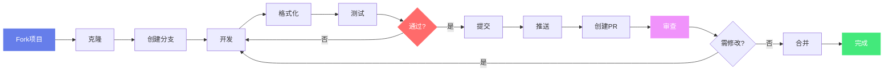

# AGIME 开发者贡献指南

## 欢迎贡献

感谢你对 AGIME 项目的关注！我们欢迎各种形式的贡献。

## 快速开始

### 开发环境设置

**必需工具**：
- Rust 1.92.0+
- Node.js 22.17.1+
- MongoDB（可选，用于 Team Server）

**克隆项目**：
```bash
git clone https://github.com/jsjm1986/AGIME.git
cd AGIME
```

**安装依赖**：
```bash
# Rust 依赖
cargo build

# UI 依赖
cd ui/desktop
npm install
```

### 项目结构

```
crates/
  ├── agime/              # 核心库：Agent逻辑、Provider、扩展管理
  │   ├── src/
  │   │   ├── agents/     # Agent系统
  │   │   ├── providers/  # LLM Provider实现
  │   │   ├── config/     # 配置管理
  │   │   ├── context_mgmt/ # 上下文管理
  │   │   └── ...
  │   └── tests/          # 集成测试
  ├── agime-cli/          # CLI工具：命令行交互界面
  │   ├── src/
  │   │   ├── commands/   # CLI命令
  │   │   ├── session/    # 会话管理
  │   │   └── recipes/    # Recipe系统
  ├── agime-server/       # HTTP服务器：为前端提供API
  │   ├── src/
  │   │   ├── routes/     # API路由
  │   │   └── state.rs    # 应用状态
  ├── agime-team-server/  # 团队服务器：协作后端
  │   ├── src/
  │   │   ├── agent/      # Agent管理
  │   │   ├── auth/       # 认证授权
  │   │   └── models/     # 数据模型
  │   └── web-admin/      # Web管理前端
  ├── agime-team/         # 团队协作库
  ├── agime-mcp/          # MCP扩展库
  │   ├── src/
  │   │   ├── developer/  # 开发者工具
  │   │   └── ...
  ├── agime-bench/        # 性能测试库
  └── agime-test/         # 测试工具

ui/desktop/             # Electron应用
  ├── src/
  │   ├── components/     # React组件
  │   ├── api/           # API客户端
  │   └── main.ts        # Electron主进程
  └── tests/             # E2E测试

docs/                   # 文档
scripts/                # 构建和工具脚本
```

### 技术栈

**后端（Rust）**：
- Tokio：异步运行时
- Axum：Web框架
- MongoDB/SQLite：数据库
- rmcp：MCP协议实现
- Serde：序列化

**前端（TypeScript）**：
- React 19：UI框架
- Electron：桌面应用
- Vite：构建工具
- Tailwind CSS：样式
- i18next：国际化

## 开发流程

**完整贡献流程**:



### 1. 创建分支

```bash
git checkout -b feature/your-feature-name
```

### 2. 进行开发

**代码规范**：
```bash
# Rust 格式化
cargo fmt

# Rust 检查
cargo clippy

# TypeScript 检查
cd ui/desktop
npm run lint
```

### 3. 运行测试

```bash
# Rust 测试
cargo test

# UI 测试
cd ui/desktop
npm test
```

### 4. 提交代码

**提交信息格式**：
```
<type>(<scope>): <subject>

<body>

<footer>
```

**类型**：
- `feat`: 新功能
- `fix`: 修复 bug
- `docs`: 文档更新
- `style`: 代码格式
- `refactor`: 重构
- `test`: 测试
- `chore`: 构建/工具

**示例**：
```
feat(mcp): add new visualization tool

Add render_chord tool for relationship visualization

Closes #123
```

### 5. 创建 Pull Request

**PR 标题格式**：
```
<type>(<scope>): <description>

例如：
feat(mcp): add visualization tools
fix(cli): resolve session resume issue
```

**PR 描述模板**：
```markdown
## 变更说明
简要描述本次变更的内容和目的

## 变更类型
- [ ] 新功能
- [ ] Bug 修复
- [ ] 文档更新
- [ ] 性能优化
- [ ] 重构

## 测试
- [ ] 添加了单元测试
- [ ] 添加了集成测试
- [ ] 手动测试通过

## 检查清单
- [ ] 代码已格式化（cargo fmt / npm run lint）
- [ ] 通过所有测试（cargo test / npm test）
- [ ] 更新了相关文档
- [ ] 无破坏性变更（或已在 CHANGELOG 说明）

## 关联 Issue
Closes #123
```

**审查流程**：
1. 自动 CI 检查（格式、测试、构建）
2. 代码审查（至少 1 位维护者批准）
3. 解决审查意见
4. 合并到主分支

## 代码审查指南

### 审查者职责

**检查项**：
- 代码逻辑正确性
- 错误处理完整性
- 测试覆盖充分性
- 文档清晰准确性
- 性能影响评估
- 安全隐患排查

**审查示例**：
```rust
// ❌ 不好：未处理错误
let content = fs::read_to_string("file.txt").unwrap();

// ✅ 好：正确处理错误
let content = fs::read_to_string("file.txt")
    .map_err(|e| ConfigError::FileReadError(e))?;
```

### 提交者职责

**响应审查**：
- 及时回复审查意见
- 解释设计决策
- 修改代码或提供理由
- 保持讨论专业友好

**提交质量**：
```bash
# 保持提交历史清晰
git rebase -i HEAD~3  # 整理提交

# 每个提交应该是独立的逻辑单元
git commit -m "feat(mcp): add tool schema validation"
git commit -m "test(mcp): add schema validation tests"
```

## 代码规范

### Rust 代码

**命名规范**：
```rust
// 类型使用 PascalCase
struct AgentConfig { }
enum ProviderType { }

// 函数和变量使用 snake_case
fn create_session() { }
let session_id = "abc";

// 常量使用 SCREAMING_SNAKE_CASE
const MAX_RETRIES: u32 = 3;
```

**错误处理**：
```rust
// 使用 Result 返回错误
fn load_config() -> Result<Config, ConfigError> {
    let content = fs::read_to_string("config.yaml")?;
    serde_yaml::from_str(&content)
        .map_err(ConfigError::ParseError)
}

// 使用 Option 处理可选值
fn find_session(id: &str) -> Option<Session> {
    sessions.iter().find(|s| s.id == id).cloned()
}
```

**文档注释**：
```rust
/// 创建新的 Agent 会话
///
/// # Arguments
/// * `config` - 会话配置
/// * `provider` - LLM Provider
///
/// # Returns
/// 返回会话 ID
///
/// # Errors
/// 配置无效时返回 `ConfigError`
pub fn create_session(
    config: SessionConfig,
    provider: Box<dyn Provider>
) -> Result<String, ConfigError> {
    // 实现
}
```

**异步代码**：
```rust
// 使用 async/await
async fn fetch_data(url: &str) -> Result<String, reqwest::Error> {
    let response = reqwest::get(url).await?;
    response.text().await
}

// 并发执行
use tokio::join;
let (result1, result2) = join!(
    fetch_data("url1"),
    fetch_data("url2")
);
```

### TypeScript 代码

**类型注解**：
```typescript
// 接口定义
interface SessionConfig {
  provider: string;
  model: string;
  temperature?: number;
}

// 函数类型
function createSession(config: SessionConfig): Promise<string> {
  return api.post('/session', config);
}

// 泛型
function fetchData<T>(url: string): Promise<T> {
  return fetch(url).then(res => res.json());
}
```

**React 组件**：
```typescript
// 函数式组件
interface ChatProps {
  sessionId: string;
  onMessage: (msg: string) => void;
}

export const ChatPanel: React.FC<ChatProps> = ({ sessionId, onMessage }) => {
  const [messages, setMessages] = useState<Message[]>([]);

  useEffect(() => {
    loadMessages(sessionId);
  }, [sessionId]);

  return <div>{/* UI */}</div>;
};
```

**Hooks 规范**：
```typescript
// 自定义 Hook
function useSession(sessionId: string) {
  const [session, setSession] = useState<Session | null>(null);
  const [loading, setLoading] = useState(true);

  useEffect(() => {
    api.getSession(sessionId)
      .then(setSession)
      .finally(() => setLoading(false));
  }, [sessionId]);

  return { session, loading };
}
```

## 测试要求

### 单元测试

**基本测试**：
```rust
#[cfg(test)]
mod tests {
    use super::*;

    #[test]
    fn test_session_creation() {
        let config = SessionConfig::default();
        let session = Session::new(config);
        assert!(session.id.len() > 0);
    }

    #[test]
    fn test_invalid_config() {
        let config = SessionConfig { model: "".to_string(), ..Default::default() };
        let result = validate_config(&config);
        assert!(result.is_err());
    }
}
```

**参数化测试**：
```rust
use rstest::rstest;

#[rstest]
#[case("anthropic", "claude-3-5-sonnet-20241022")]
#[case("openai", "gpt-4")]
#[case("google", "gemini-pro")]
fn test_provider_support(#[case] provider: &str, #[case] model: &str) {
    let config = SessionConfig {
        provider: provider.to_string(),
        model: model.to_string(),
        ..Default::default()
    };
    assert!(is_supported(&config));
}
```

### 集成测试

**异步测试**：
```rust
#[tokio::test]
async fn test_agent_execution() {
    let agent = Agent::new(test_config()).await.unwrap();
    let response = agent.execute("test prompt").await.unwrap();
    assert!(!response.is_empty());
}
```

**MCP 集成测试**：
```rust
#[tokio::test]
async fn test_mcp_tool_call() {
    let playback = Playback::from_file("tests/recordings/developer.json").unwrap();
    let response = playback.get_response(1).unwrap();
    assert!(response.result.is_some());
}
```

### 前端测试

**组件测试**：
```typescript
import { render, screen, fireEvent } from '@testing-library/react';
import { ChatPanel } from './ChatPanel';

test('sends message on submit', async () => {
  const onMessage = jest.fn();
  render(<ChatPanel sessionId="test" onMessage={onMessage} />);

  const input = screen.getByRole('textbox');
  fireEvent.change(input, { target: { value: 'Hello' } });
  fireEvent.submit(input);

  expect(onMessage).toHaveBeenCalledWith('Hello');
});
```

**E2E 测试**：
```typescript
import { test, expect } from '@playwright/test';

test('create new session', async ({ page }) => {
  await page.goto('http://localhost:3000');
  await page.click('button:has-text("New Session")');
  await expect(page.locator('.session-panel')).toBeVisible();
});
```

### 测试覆盖率

**运行覆盖率**：
```bash
# Rust 覆盖率
cargo tarpaulin --out Html

# TypeScript 覆盖率
npm run test:coverage
```

**覆盖率要求**：
- 核心功能：≥ 80%
- 工具函数：≥ 90%
- UI 组件：≥ 70%

## 文档要求

### 代码文档

**Rust 文档**：
```rust
/// Agent 会话管理器
///
/// 负责创建、管理和销毁 Agent 会话。支持多种 Provider 和扩展。
///
/// # Examples
///
/// ```
/// use agime::AgentManager;
///
/// let manager = AgentManager::new();
/// let session_id = manager.create_session(config).await?;
/// ```
pub struct AgentManager {
    sessions: HashMap<String, Session>,
}
```

**TypeScript 文档**：
```typescript
/**
 * 创建新的聊天会话
 * @param config - 会话配置
 * @returns 会话 ID
 * @throws {ConfigError} 配置无效时抛出
 */
export async function createSession(config: SessionConfig): Promise<string> {
  // 实现
}
```

### 用户文档

**新功能文档**：
- 在 `docs/` 目录添加功能说明
- 更新 `docs/USER_GUIDE.md`
- 添加使用示例

**API 文档**：
- 更新 `docs/API_REFERENCE.md`
- 添加请求/响应示例
- 说明错误码

**架构文档**：
- 重大架构变更更新 `docs/ARCHITECTURE.md`
- 添加架构图（使用 Mermaid）
- 说明设计决策

### 文档示例

**功能文档模板**：
```markdown
# 功能名称

## 概述
简要描述功能用途

## 使用方法
### CLI
\`\`\`bash
agime command --option value
\`\`\`

### API
\`\`\`typescript
api.method(params)
\`\`\`

## 配置
配置选项说明

## 示例
实际使用示例

## 故障排查
常见问题和解决方案
```

## 发布流程

### 版本号规范

遵循语义化版本（Semantic Versioning）：
- **主版本号**（Major）：不兼容的 API 变更
- **次版本号**（Minor）：向后兼容的功能新增
- **修订号**（Patch）：向后兼容的问题修复

**示例**：
- `1.0.0` → `2.0.0`：重大架构变更
- `1.0.0` → `1.1.0`：新增功能
- `1.0.0` → `1.0.1`：Bug 修复

### 发布步骤

**1. 更新版本号**：

```bash
# 更新 Rust 版本
# 编辑 Cargo.toml
version = "1.2.0"

# 更新 UI 版本
cd ui/desktop
npm version 1.2.0
```

**2. 更新 CHANGELOG**：

```markdown
## [1.2.0] - 2024-01-15

### Added
- 新增 MCP 可视化工具
- 支持 Google Gemini 模型

### Changed
- 优化上下文压缩算法
- 改进错误提示信息

### Fixed
- 修复会话恢复问题
- 修复内存泄漏

### Deprecated
- 旧版配置格式将在 2.0 移除
```

**3. 创建 Release Tag**：

```bash
# 创建标签
git tag -a v1.2.0 -m "Release version 1.2.0"

# 推送标签
git push origin v1.2.0
```

**4. GitHub Release**：

1. 访问 GitHub Releases 页面
2. 点击 "Draft a new release"
3. 选择标签 `v1.2.0`
4. 填写 Release Notes（从 CHANGELOG 复制）
5. 上传构建产物（可选，CI 会自动构建）
6. 发布

**5. CI 自动构建**：

CI 会自动：
- 构建所有平台二进制文件
- 运行测试套件
- 构建 Docker 镜像
- 发布到 GitHub Releases
- 发布到 Docker Hub/GHCR

### 预发布版本

**Beta 版本**：
```bash
git tag -a v1.2.0-beta.1 -m "Beta release"
```

**RC 版本**：
```bash
git tag -a v1.2.0-rc.1 -m "Release candidate"
```

### 发布检查清单

- [ ] 所有测试通过
- [ ] 文档已更新
- [ ] CHANGELOG 已更新
- [ ] 版本号已更新
- [ ] 无已知严重 Bug
- [ ] 向后兼容性检查
- [ ] 性能回归测试
- [ ] 安全审计通过

## 最佳实践

### 性能优化

**异步操作**：
```rust
// ❌ 串行执行（慢）
let result1 = fetch_data("url1").await?;
let result2 = fetch_data("url2").await?;

// ✅ 并发执行（快）
let (result1, result2) = tokio::join!(
    fetch_data("url1"),
    fetch_data("url2")
);
```

**资源管理**：
```rust
// 使用 Arc 共享数据
use std::sync::Arc;
let shared_config = Arc::new(config);

// 使用 tokio::spawn 并发任务
let handle = tokio::spawn(async move {
    process_data(shared_config).await
});
```

**缓存策略**：
```rust
use std::collections::HashMap;
use tokio::sync::RwLock;

struct Cache {
    data: RwLock<HashMap<String, String>>,
}

impl Cache {
    async fn get_or_fetch(&self, key: &str) -> Result<String> {
        // 先读缓存
        if let Some(value) = self.data.read().await.get(key) {
            return Ok(value.clone());
        }

        // 缓存未命中，获取数据
        let value = fetch_from_source(key).await?;
        self.data.write().await.insert(key.to_string(), value.clone());
        Ok(value)
    }
}
```

### 安全实践

**输入验证**：
```rust
fn validate_path(path: &str) -> Result<PathBuf, SecurityError> {
    let path = PathBuf::from(path);

    // 防止路径穿越
    if path.components().any(|c| c == Component::ParentDir) {
        return Err(SecurityError::PathTraversal);
    }

    // 确保在允许的目录内
    let canonical = path.canonicalize()?;
    if !canonical.starts_with(&ALLOWED_DIR) {
        return Err(SecurityError::UnauthorizedPath);
    }

    Ok(canonical)
}
```

**敏感信息处理**：
```rust
// ❌ 不要在日志中输出敏感信息
log::info!("API Key: {}", api_key);

// ✅ 脱敏处理
log::info!("API Key: {}***", &api_key[..8]);

// ✅ 使用 Secret 类型
use secrecy::{Secret, ExposeSecret};
let api_key: Secret<String> = Secret::new(key);
```

### 错误处理模式

**自定义错误类型**：
```rust
use thiserror::Error;

#[derive(Error, Debug)]
pub enum AgentError {
    #[error("配置错误: {0}")]
    Config(String),

    #[error("Provider 错误: {0}")]
    Provider(#[from] ProviderError),

    #[error("IO 错误: {0}")]
    Io(#[from] std::io::Error),
}
```

**错误传播**：
```rust
// 使用 ? 操作符
fn load_and_parse() -> Result<Config, AgentError> {
    let content = fs::read_to_string("config.yaml")?;
    let config = serde_yaml::from_str(&content)
        .map_err(|e| AgentError::Config(e.to_string()))?;
    Ok(config)
}
```

### 调试技巧

**日志级别**：
```rust
use tracing::{debug, info, warn, error};

debug!("详细调试信息");
info!("一般信息");
warn!("警告信息");
error!("错误信息");
```

**条件编译**：
```rust
#[cfg(debug_assertions)]
fn debug_print(msg: &str) {
    println!("[DEBUG] {}", msg);
}

#[cfg(not(debug_assertions))]
fn debug_print(_msg: &str) {}
```

## 常见问题

### 编译问题

**问题：依赖冲突**
```bash
error: failed to select a version for `tokio`
```

**解决**：
```bash
cargo update
cargo clean
cargo build
```

**问题：链接错误**
```bash
error: linking with `cc` failed
```

**解决**：
- macOS: `xcode-select --install`
- Linux: `sudo apt install build-essential`
- Windows: 安装 Visual Studio Build Tools

### 运行时问题

**问题：端口被占用**
```bash
Error: Address already in use (os error 48)
```

**解决**：
```bash
# 查找占用端口的进程
lsof -i :3000

# 杀死进程
kill -9 <PID>
```

**问题：MongoDB 连接失败**
```bash
Error: Connection refused
```

**解决**：
```bash
# 启动 MongoDB
mongod --dbpath /data/db

# 或使用 Docker
docker run -d -p 27017:27017 mongo
```

### 测试问题

**问题：测试超时**
```bash
test result: FAILED. 0 passed; 1 failed
```

**解决**：
```rust
#[tokio::test]
#[timeout(Duration::from_secs(30))]
async fn test_with_timeout() {
    // 测试代码
}
```

## 获取帮助

- GitHub Issues: 报告 bug 或提问
- GitHub Discussions: 讨论功能和想法
- 微信: agimeme（企业服务）

## 行为准则

- 尊重所有贡献者
- 建设性反馈
- 专注于技术讨论
- 保持友好和专业

## 许可证

贡献代码即表示同意 Apache License 2.0 许可。
