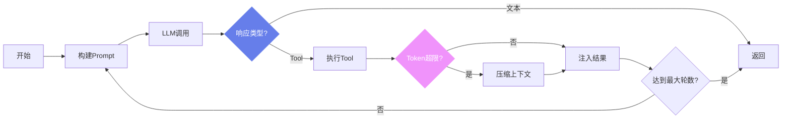
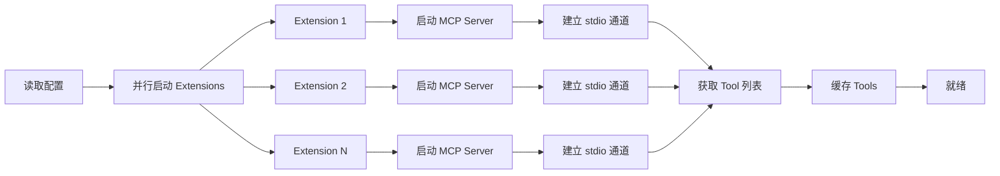
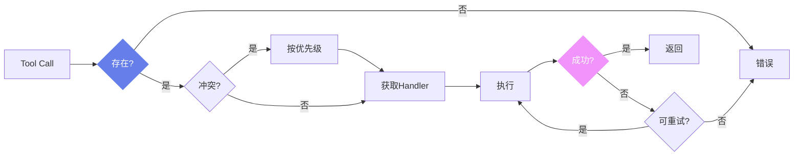

# AGIME 核心引擎

本文档详细描述 AGIME 核心 crate (`crates/agime/src/`) 的架构与实现。

---

## 目录

- [Agent 系统](#agent-系统)
- [Provider 系统](#provider-系统)
- [配置系统](#配置系统)
- [Capabilities 模块](#capabilities-模块)
- [Context 管理](#context-管理)
- [Conversation 模块](#conversation-模块)
- [Session 模块](#session-模块)
- [Security 模块](#security-模块)
- [Permission 模块](#permission-模块)
- [Recipe 模块](#recipe-模块)
- [Scheduler 模块](#scheduler-模块)
- [Tracing 模块](#tracing-模块)
- [其他关键模块](#其他关键模块)
- [关键常量](#关键常量)

---

## Agent 系统

Agent 系统位于 `agents/` 目录，是 AGIME 与 LLM 交互的核心引擎。

### Agent (`agent.rs`)

主 LLM 交互引擎，约 3568 行代码。负责：

- **多轮对话循环**：维护完整的 conversation 上下文，在每轮中向 LLM 发送消息、接收响应、处理 tool call，直到任务完成或达到最大轮数限制。
- **Tool Call 处理**：解析 LLM 返回的 tool call 请求，路由至对应的 tool handler 执行，并将结果注入对话上下文。
- **Context 管理**：监控 token 使用量，在接近上下文窗口限制时自动触发 compaction（压缩）策略，确保对话不会因 token 溢出而失败。
- **Streaming 响应**：支持流式输出，将 LLM 的逐 token 响应实时传递给调用方，提供低延迟的用户体验。

**Agent 对话循环流程**：



### ExtensionManager (`extension_manager.rs`)

MCP 客户端与 tool 管理器，约 2026 行代码。核心职责：

- **Extension 加载**：从配置中读取 extension 定义，启动对应的 MCP server 进程，建立 stdio 通信通道。
- **Tool 缓存**：采用分级 TTL 缓存策略：
  - 默认 TTL：5 秒
  - 带 `list_changed` 通知的 extension：300 秒（5 分钟）
  - 缓存失效后自动重新获取 tool 列表
- **并行初始化**：多个 extension 同时启动，减少初始化等待时间。

**Extension 加载流程**：



### Extensions 插件体系

AGIME 支持多种内置 extension，以插件形式提供额外能力：

| Extension | 功能 |
|-----------|------|
| **Todo** | 任务管理，待办事项跟踪 |
| **ChatRecall** | 对话记忆检索，跨 session 上下文回忆 |
| **Skills** | 技能系统，可复用的操作模板 |
| **Team** | 团队协作，多 agent 通信 |
| **ExtensionManager** | MCP extension 的统一管理入口 |

### Tool Router

Tool Router 负责将 tool call 请求分发到正确的 handler：

- 维护全局 tool 索引（tool name → handler 映射）
- 处理 tool 名称冲突和优先级
- 支持动态注册/注销 tool

**Tool 路由流程**：



### Subagent 系统

子 agent 系统支持任务委派，包含以下组件：

- **`subagent_tool.rs`**：定义 subagent tool 的接口和参数
- **`subagent_handler.rs`**：处理 subagent 的生命周期管理
- **`subagent_execution_tool/`**：子 agent 执行引擎，支持在独立上下文中运行子任务，结果回传给父 agent

### Prompt Manager

系统 prompt 的构建与管理：

- 组装系统级指令、用户偏好、工具描述等信息
- 动态调整 prompt 内容以适应不同的运行模式
- 管理 prompt 模板的生命周期

### Retry Manager

Tool 执行重试管理器：

- 可配置的重试策略（次数、退避间隔）
- 区分可重试错误和不可重试错误
- 支持指数退避

### Platform Tools

内置平台工具，直接由 agent 提供给 LLM 使用，无需外部 extension。

### Reply Parts

流式响应组装模块：

- 将 LLM 的流式 token 输出组装为结构化的 reply 片段
- 支持文本、tool call、thinking 等多种 part 类型

### Router Tools

工具选择与路由逻辑，负责根据上下文和配置决定哪些 tool 可用于当前对话。

---

## Provider 系统

Provider 系统位于 `providers/` 目录，实现了对 14+ LLM 提供商的统一抽象。

### 支持的 Provider

| Provider | 说明 |
|----------|------|
| **OpenAI** | GPT 系列模型，兼容 API |
| **Anthropic** | Claude 系列模型 |
| **Google** | Gemini 系列模型 |
| **Azure** | Azure OpenAI Service |
| **Databricks** | Databricks 托管模型 |
| **Snowflake** | Snowflake Cortex |
| **OpenRouter** | 多模型路由聚合 |
| **Venice** | Venice AI 平台 |
| **Tetrate** | Tetrate AI 服务 |
| **Ollama** | 本地模型推理 |
| **XAI** | xAI (Grok) 模型 |
| **Bedrock** | AWS Bedrock 托管模型 |
| **GCP Vertex AI** | Google Cloud Vertex AI |
| **SageMaker** | AWS SageMaker 端点 |
| **LiteLLM** | LiteLLM 代理 |
| **GitHub Copilot** | GitHub Copilot 模型 |

### Provider Trait

统一的 provider 接口定义：

```rust
// 核心完成方法
async fn complete_with_model()      // 核心实现方法（需实现）
async fn complete()                 // 使用默认模型完成
async fn complete_with_options()    // 带选项的完成（支持 tool_choice 等）
async fn complete_fast()            // 使用快速模型完成（带回退）

// 配置与元数据
fn metadata()                       // 获取 provider 元数据（静态）
fn get_name()                       // 获取 provider 名称
fn get_model_config()               // 获取模型配置
fn retry_config()                   // 获取重试配置

// 模型发现
async fn fetch_supported_models()   // 获取支持的模型列表
async fn fetch_recommended_models() // 获取推荐的模型列表
```

所有 provider 实现此 trait，确保上层代码无需关心具体的 LLM 服务差异。

### Format 模块

每个 provider 对应一个格式化模块，负责 API 特定的序列化/反序列化：

- **`openai.rs`**（约 1925 行）：OpenAI API 格式，同时作为多个兼容 provider 的基础格式
- **`anthropic.rs`**（约 1275 行）：Anthropic Messages API 格式
- **`google.rs`**：Google Gemini API 格式
- **`bedrock.rs`**：AWS Bedrock API 格式
- 其他 provider 各自的格式适配

### Model Registry (`canonical/`)

规范模型注册与能力检测：

- 预定义 40+ 模型的规范映射
- 模型名称标准化（别名 → 规范名）
- 自动检测模型能力（vision、tool use、thinking 等）

### Lead Worker Pattern

Leader/Planner Worker 模式，用于复杂任务：

- Leader 负责任务规划与分解
- Worker 执行具体子任务
- 支持不同模型担任不同角色

### Thinking Handler

扩展推理（Extended Thinking / Chain-of-Thought）支持：

- 解析 LLM 的推理过程
- 管理 thinking token 的显示与隐藏
- 支持 Anthropic、OpenAI 等不同格式的 thinking 输出

### Provider Factory

动态 provider 创建：

- 根据配置文件动态实例化对应的 provider
- 支持运行时切换 provider

### Pricing

Token 成本计算模块：

- 按模型定义 input/output token 单价
- 支持 thinking token 单独计价
- 累计统计 session 级别费用

### Usage Estimator

Token 使用量预估模块，在发送请求前预估 token 消耗，辅助 context 管理决策。

---

## 配置系统

配置系统位于 `config/` 目录，提供灵活的分层配置管理。

### 核心特性

- **YAML 配置文件**：主配置采用 YAML 格式，结构清晰
- **环境变量覆盖**：支持通过环境变量覆盖配置项
- **Keyring 集成**：敏感信息（API Key 等）通过操作系统 keyring 安全存储，跨平台支持（Windows Credential Manager、macOS Keychain、Linux Secret Service）
- **Legacy 迁移**：自动将 `GOOSE_*` 前缀的环境变量和配置项迁移为 `AGIME_*` 前缀

### AgimeMode

核心运行模式配置，定义：

- 使用的 provider 和 model
- 启用的 extension 列表
- 每种模式的特定行为

### 其他配置项

- **Permission Rules**：权限规则定义，控制 tool 的执行权限
- **Custom System Prompts**：自定义系统级 prompt
- **Experiment / Feature Flags**：实验性功能开关
- **Path Management**：配置文件搜索路径管理，按优先级从多个位置加载配置

---

## Capabilities 模块

位于 `capabilities/` 目录，提供配置驱动的模型能力检测系统。

- **Registry**：模型能力注册表，记录每个模型支持的功能（vision、tool use、thinking、streaming 等）
- **Runtime 检测**：运行时动态查询模型能力，确保只使用模型实际支持的功能
- **配置驱动**：能力定义来自配置文件和预定义注册表，支持用户自定义覆盖

---

## Context 管理

当前主线位于 `context_runtime/`，是 DirectHarness V4 保证长对话可持续运行的关键模块。旧 `context_mgmt/` 口径只作为历史背景，不再作为 team-server 执行主线。

### Context Runtime 策略

| 策略 | 说明 |
|------|------|
| **Provider Projection** | Provider 调用前按模型窗口和工具上下文投影消息 |
| **Staged Collapse** | 运行中先生成可回滚的压缩快照 |
| **Committed Collapse** | 成功后把压缩结果提交进 `context_runtime_state` |
| **Session Memory** | 长会话保留关键事实、决策和恢复线索 |

### Progressive Memory

渐进式记忆系统的核心机制：

- **事实提取**：从对话历史中自动提取关键事实和决策
- **重要性评分**：对提取的事实进行优先级排序
- **渐进压缩**：随对话增长，逐步压缩较旧的内容，保留关键信息

### 自动触发

- **默认阈值**：80% context 窗口使用率时自动触发 compaction
- 支持手动触发和配置自定义阈值

---

## Conversation 模块

位于 `conversation/` 目录，定义了对话的数据模型。

### 消息类型

| 类型 | 说明 |
|------|------|
| **Text** | 纯文本消息 |
| **ToolRequest** | Tool 调用请求（由 LLM 发起） |
| **ToolResponse** | Tool 执行结果 |
| **SystemNotification** | 系统级通知 |
| **ActionRequired** | 需要用户操作的消息 |

### 其他功能

- **Validation**：消息格式验证
- **Tool Result Serde**：Tool 执行结果的序列化/反序列化

---

## Session 模块

位于 `session/` 目录，管理对话 session 的持久化。

- **Session 持久化**：将对话历史保存到磁盘，支持恢复
- **History 管理**：浏览和管理历史 session
- **Extension State**：保存和恢复 extension 的运行状态
- **CFPM Reports**：Context compaction 报告存储
- **Diagnostics**：Session 级别的诊断信息

---

## Security 模块

位于 `security/` 目录，提供安全防护机制。

- **Prompt Injection 检测**：检测输入中潜在的 prompt injection 攻击
- **Pattern Scanner**：基于模式匹配的安全扫描器
- **Security Inspector**：综合安全检查器，整合多种检测策略

---

## Permission 模块

位于 `permission/` 目录，控制 tool 执行的权限体系。

- **Permission Judge**：权限判定器，根据规则决定是否允许 tool 执行
- **Inspector**：权限检查器
- **Confirmation**：需要用户确认的操作处理流程
- **Store**：权限规则持久化存储

---

## Recipe 模块

位于 `recipe/` 目录，提供可复用的任务定义机制。

- **YAML/JSON 定义**：使用 YAML 或 JSON 格式定义自动化任务
- **Sub-recipe 支持**：Recipe 可嵌套引用其他 recipe
- **Response Schema**：定义期望的响应格式
- **Retry Config**：配置任务失败后的重试策略

---

## Scheduler 模块

位于 `scheduler.rs`，提供基于 cron 的定时任务调度。

- **Cron 表达式**：支持 5 字段和 6 字段 cron 格式
- **生命周期管理**：支持 pause（暂停）、resume（恢复）、cancel（取消）操作
- **与 Recipe 集成**：可定时执行 recipe 任务

---

## Tracing 模块

位于 `tracing/` 目录，提供分布式追踪和可观测性支持。

- **Langfuse**：集成 Langfuse 平台，记录 LLM 调用的详细轨迹
- **OTLP**：支持 OpenTelemetry Protocol 导出
- **Observation Layers**：分层观测，记录不同粒度的运行数据

---

## 其他关键模块

### Execution (`execution/`)

执行管理器，协调 agent 的整体执行流程。

### Token Counter

基于 tiktoken 的 token 计数器：

- 使用 10,000 条目的 LRU 缓存，避免重复计算
- 支持多种 tokenizer 编码

### OAuth

MCP server 认证流程支持，用于需要 OAuth 认证的 extension。

### Hints

自动加载项目根目录的 `HINTS.md` 和 `AGENTS.md` 文件，为 agent 提供项目特定的上下文指引。

---

## 关键常量

| 常量 | 值 | 说明 |
|------|-----|------|
| 最大 context token 数 | 1,000,000 (未验证) | 单次对话支持的最大 token 上下文 |
| 默认最大轮数 | 1,000 (未验证) | 对话循环的默认最大轮数 |
| 默认 compaction 阈值 | 80% | context 使用率达到此值时自动触发压缩 |
| 日志保留天数 | 14 天 (未验证) | session 日志的默认保留期 |
| Tool 缓存 TTL（默认） | 5 秒 | ExtensionManager tool 列表缓存 |
| Tool 缓存 TTL（list_changed） | 300 秒 | 带变更通知的 tool 列表缓存 |
| Token Counter LRU 缓存 | 10,000 条目 (未验证) | tiktoken 计算结果缓存上限 |
