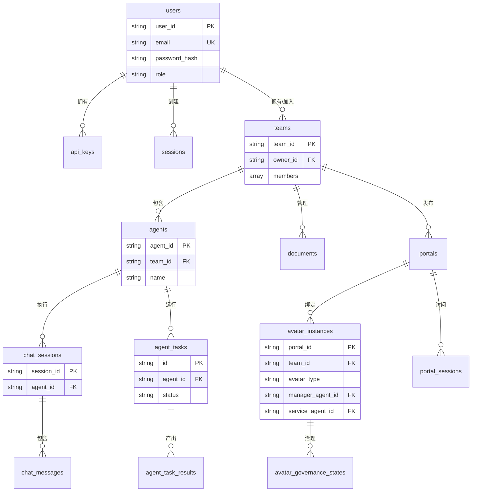

# 数据库 Schema 文档

## 概述

AGIME Team Server 支持双数据库架构：MongoDB (主要，完整功能) 和 SQLite (基础，向后兼容)。

**数据库关系图**：



## MongoDB Collections

### 1. users (用户)

```javascript
{
  _id: ObjectId,
  user_id: String,              // 唯一用户标识
  email: String,                // 邮箱 (唯一)
  display_name: String,
  password_hash: String,        // Argon2 哈希
  role: String,                 // "user" | "admin"
  is_active: Boolean,
  created_at: DateTime,
  last_login_at: DateTime,
  updated_at: DateTime
}

// 索引
{ user_id: 1 } unique
{ email: 1 } unique, partial (where email exists)
{ created_at: -1 }
```

### 2. api_keys (API 密钥)

```javascript
{
  _id: ObjectId,
  key_id: String,               // 唯一密钥 ID
  user_id: String,              // 关联用户
  key_prefix: String,           // 前 8 字符 (显示用)
  key_hash: String,             // Argon2 哈希
  name: String,                 // 密钥名称
  expires_at: DateTime,
  last_used_at: DateTime,
  created_at: DateTime
}

// 索引
{ key_id: 1 } unique
{ user_id: 1 }
{ expires_at: 1 }
```

### 3. sessions (会话)

```javascript
{
  _id: ObjectId,
  session_id: String,           // 唯一会话 ID
  user_id: String,
  expires_at: DateTime,         // 7 天 TTL
  created_at: DateTime,
  last_accessed_at: DateTime
}

// 索引
{ session_id: 1 } unique
{ user_id: 1 }
{ expires_at: 1 } TTL
```

### 4. teams (团队)

```javascript
{
  _id: ObjectId,
  team_id: String,              // 唯一团队 ID
  name: String,
  owner_id: String,             // 所有者用户 ID
  members: [                    // 嵌入成员数组
    {
      user_id: String,
      role: String,             // "owner" | "admin" | "member"
      status: String,           // "active" | "invited" | "blocked"
      permissions: {
        can_share: Boolean,
        can_install: Boolean,
        can_delete_own: Boolean
      },
      joined_at: DateTime
    }
  ],
  settings: {
    extension_review: Boolean,
    member_invites: Boolean,
    visibility: String          // "team" | "public"
  },
  created_at: DateTime,
  updated_at: DateTime
}

// 索引
{ team_id: 1 } unique
{ owner_id: 1 }
{ "members.user_id": 1 }
{ created_at: -1 }
```

### 5. team_agents (团队代理)

```javascript
{
  _id: ObjectId,
  agent_id: String,
  team_id: String,
  name: String,
  description: String,
  avatar: String,               // 头像标识

  // LLM配置
  model: String,                // "claude-3-5-sonnet-20241022"
  provider: String,             // "anthropic" | "openai" | ...
  api_key: String,              // API key (加密存储)
  system_prompt: String,        // 系统提示词
  temperature: Number,          // LLM温度
  max_tokens: Number,           // 最大token数
  context_limit: Number,        // 上下文限制

  // 扩展配置
  enabled_extensions: [         // 启用的扩展
    {
      name: String,
      config: Object
    }
  ],
  custom_extensions: [          // 自定义扩展
    {
      name: String,
      type: String,
      config: Object
    }
  ],

  // 技能配置
  assigned_skills: [            // 分配的技能
    {
      skill_id: String,
      config: Object
    }
  ],

  // 权限与限制
  allowed_groups: [String],     // 允许的用户组
  max_concurrent_tasks: Number, // 最大并发任务数
  max_turns: Number,

  // 状态
  status: String,               // "idle" | "running" | "paused" | "error"
  auto_approve_chat: Boolean,
  last_error: String,           // 最后错误

  // 元数据
  created_by: String,
  created_at: DateTime,
  updated_at: DateTime
}

// 索引
{ agent_id: 1 } unique
{ team_id: 1 }
{ created_by: 1 }
{ status: 1 }
```

### 6. agent_sessions (代理会话)

```javascript
{
  _id: ObjectId,
  session_id: String,
  team_id: String,
  agent_id: String,
  user_id: String,

  // 会话元数据
  name: String,                 // 会话名称
  title: String,                // 自动生成的标题
  pinned: Boolean,              // 是否置顶
  last_message_preview: String, // 最后消息预览
  is_processing: Boolean,       // 是否正在处理
  hidden_from_chat_list: Boolean, // 是否隐藏

  // 消息与Token
  messages_json: String,        // JSON 序列化的消息数组
  message_count: Number,
  total_tokens: Number,
  input_tokens: Number,
  output_tokens: Number,
  compaction_count: Number,

  // 扩展配置
  disabled_extensions: [String],
  enabled_extensions: [String],
  allowed_extensions: [String],
  allowed_skill_ids: [String],

  // 执行配置
  status: String,               // "active" | "archived"
  workspace_path: String,
  extra_instructions: String,
  max_turns: Number,
  tool_timeout_seconds: Number,
  require_final_report: Boolean,
  retry_config: Object,         // 重试配置 {max_retries, backoff_ms}

  // Portal相关
  portal_restricted: Boolean,
  portal_id: String,
  portal_slug: String,          // Portal slug
  visitor_id: String,           // 访客ID
  max_portal_retry_rounds: Number, // Portal重试轮次上限
  document_access_mode: String, // "ReadOnly" | "CoEditDraft" | "ControlledWrite"

  // 文档关联
  attached_document_ids: [String], // 附加文档ID列表

  // 来源追踪
  session_source: String,       // 会话来源 (默认"chat")
  source_mission_id: String,    // 历史 lineage 兼容字段

  // 时间戳
  created_at: DateTime,
  updated_at: DateTime,
  last_message_at: DateTime
}

// 索引
{ session_id: 1 } unique
{ team_id: 1, agent_id: 1 }
{ user_id: 1 }
{ status: 1 }
{ last_message_at: -1 }
{ portal_id: 1 }
```

### 7. chat_stream_events (聊天流事件)

```javascript
{
  _id: ObjectId,
  session_id: String,
  event_id: Number,             // i64类型，非String
  event_type: String,           // "text" | "thinking" | "toolcall" | ...
  payload: Object,              // 事件数据 (JSON)，非event_data
  run_id: String,               // 运行ID
  created_at: DateTime
}

// 索引
{ session_id: 1, event_id: 1 }
{ created_at: -1 }
```

### 8. agent_tasks (AgentTask)

```javascript
{
  _id: ObjectId,
  id: String,
  team_id: String,
  agent_id: String,
  creator_id: String,
  status: String,               // "approved" | "queued" | "running" | "completed" | "failed" | "cancelled"
  task_type: String,            // "chat" | "recipe" | "skill"
  content: Object,              // messages/session_id/workspace_path/result_contract 等
  created_at: DateTime,
  updated_at: DateTime,
  started_at: DateTime,
  completed_at: DateTime
}
```

### 9. agent_task_results (AgentTask 结果)

```javascript
{
  _id: ObjectId,
  task_id: String,
  result_type: String,          // "message" | "artifact" | "diagnostic"
  content: Object,              // final summary、completion report、artifacts、runtime session
  created_at: DateTime
}
```

### 10. documents (文档)

```javascript
{
  _id: ObjectId,
  team_id: String,

  // 基本信息
  title: String,
  display_name: String,         // 显示名称
  content: String,              // 文本内容
  folder_path: String,
  mime_type: String,
  size: Number,
  tags: [String],
  is_public: Boolean,           // 是否公开

  // 来源与分类
  origin: String,               // "human" | "agent" (DocumentOrigin枚举)
  category: String,             // 文档分类 (DocumentCategory)
  status: String,               // "draft" | "active" | "archived"

  // 创建者追踪
  uploaded_by: String,          // 上传用户ID
  created_by_agent_id: String,  // 创建代理ID

  // 血缘追踪
  source_snapshots: [Object],   // 来源快照 SourceDocumentSnapshot[]
  source_session_id: String,    // 来源会话
  source_mission_id: String,    // 历史 lineage 兼容字段
  supersedes_id: String,        // 替代文档ID (原parent_document_id)
  lineage_description: String,  // 血缘描述

  // 版本控制
  version_number: Number,

  // 删除标记
  is_deleted: Boolean,

  // 时间戳
  created_at: DateTime,
  updated_at: DateTime
}

// 索引
{ document_id: 1 } unique
{ team_id: 1, folder_path: 1 }
{ uploaded_by: 1 }
{ is_deleted: 1 }
```

### 11. portals (门户)

```javascript
{
  _id: ObjectId,
  team_id: ObjectId,
  slug: String,                     // URL唯一标识
  name: String,
  description: String,
  status: String,                   // "draft" | "published" | "archived"
  output_form: String,              // "website" | "widget" | "agent_only"

  // Agent配置
  agent_enabled: Boolean,
  coding_agent_id: String,          // Lab环境代理
  service_agent_id: String,         // 公开服务代理
  agent_id: String,                 // 遗留单代理字段
  agent_system_prompt: String,
  agent_welcome_message: String,

  // 文档绑定
  bound_document_ids: [String],     // 绑定文档ID列表

  // 权限控制
  allowed_extensions: [String],     // 允许的扩展白名单
  allowed_skill_ids: [String],      // 允许的技能白名单
  document_access_mode: String,     // "ReadOnly" | "CoEditDraft" | "ControlledWrite"

  // 元数据
  tags: [String],
  settings: Object,                 // JSON配置
  project_path: String,             // 文件系统项目路径

  created_by: String,
  is_deleted: Boolean,
  published_at: DateTime,
  created_at: DateTime,
  updated_at: DateTime
}

// 索引
{ slug: 1 } unique
{ team_id: 1 }
{ status: 1 }
```

### 12. avatar_instances (数字分身实例)

```javascript
{
  _id: ObjectId,
  portal_id: String,                // 关联Portal
  team_id: String,
  slug: String,
  name: String,
  status: String,                   // "draft" | "published" | "active" | "paused"
  avatar_type: String,              // "dedicated" | "shared" | "managed"
  manager_agent_id: String,         // 管理代理ID
  service_agent_id: String,         // 服务代理ID
  document_access_mode: String,
  governance_counts: {
    pending_capability_requests: Number,
    pending_gap_proposals: Number,
    pending_optimization_tickets: Number,
    pending_runtime_logs: Number
  },
  portal_updated_at: DateTime,
  projected_at: DateTime
}

// 索引
{ portal_id: 1 } unique
{ team_id: 1 }
{ avatar_type: 1 }
```

### 13. avatar_governance_states (Avatar治理状态)

```javascript
{
  _id: ObjectId,
  portal_id: String,
  team_id: String,
  state: Object,                    // 治理状态JSON
  config: Object,                   // 自动化配置JSON
  updated_at: DateTime
}

// 索引
{ portal_id: 1 } unique
{ team_id: 1 }
```

### 14. portal_interactions (门户交互)

```javascript
{
  _id: ObjectId,
  portal_id: ObjectId,
  team_id: ObjectId,
  visitor_id: String,               // 访客标识
  session_id: String,               // 关联会话
  interaction_type: String,         // "chat" | "view" | "action"
  ip_address: String,
  user_agent: String,
  created_at: DateTime
}

// 索引
{ portal_id: 1, created_at: -1 }
{ visitor_id: 1 }
{ created_at: 1 } TTL (90天)
```

### 13-23. 其他 Collections

**13. skills (技能)**
```javascript
{
  _id: ObjectId,
  team_id: ObjectId,
  name: String,
  description: String,
  storage_type: String,            // "inline" | "package"
  content: String,                 // 内联内容
  skill_md: String,                // Markdown文档
  files: [Object],                 // SkillFile[]
  manifest: Object,                // 清单配置
  package_url: String,             // 包URL
  package_hash: String,            // 包哈希
  package_size: Number,            // 包大小
  metadata: Object,
  version: String,
  previous_version_id: String,
  tags: [String],
  dependencies: [String],
  visibility: String,              // "public" | "team" | "private"
  protection_level: String,        // "public" | "team_installable" | "controlled"
  ai_description: String,          // AI生成描述
  ai_description_lang: String,
  ai_described_at: DateTime,
  use_count: Number,
  is_deleted: Boolean,
  created_by: String,
  created_at: DateTime,
  updated_at: DateTime
}
```

**14. smart_logs (智能日志)**
```javascript
{
  _id: ObjectId,
  team_id: ObjectId,
  action: String,                  // "create" | "update" | "delete" | "install" | "access"
  resource_type: String,           // "skill" | "extension" | "document" | "portal"
  resource_id: String,
  resource_name: String,
  user_id: String,
  ai_summary: String,              // 静态摘要
  ai_summary_status: String,       // "complete"
  created_at: DateTime
}
// TTL索引: 90天
```

**15-23. 其他集合简要说明**
- **document_versions**: 文档版本历史
- **document_locks**: 文档悲观锁
- **folders**: 文件夹结构
- **recipes**: 配方定义
- **extensions**: 扩展配置
- **audit_logs**: 审计日志（180天TTL）
- **invites**: 团队邀请
- **registration_requests**: 注册申请
- **auth_audit_logs**: 认证审计日志（90天TTL）

## SQLite Schema (基础版)

```sql
CREATE TABLE users (
    user_id TEXT PRIMARY KEY,
    email TEXT UNIQUE,
    display_name TEXT,
    password_hash TEXT,
    role TEXT DEFAULT 'user',
    is_active INTEGER DEFAULT 1,
    created_at TEXT
);

CREATE TABLE teams (
    team_id TEXT PRIMARY KEY,
    name TEXT,
    owner_id TEXT,
    settings_json TEXT,
    created_at TEXT
);

CREATE TABLE installed_resources (
    id INTEGER PRIMARY KEY AUTOINCREMENT,
    user_id TEXT,
    resource_type TEXT,
    resource_id TEXT,
    team_id TEXT,
    authorization_status TEXT,
    installed_at TEXT
);
```

## 数据保留策略

| Collection | 保留期 | 清理方式 |
|-----------|-------|---------|
| audit_logs | 180 天 | TTL 索引 |
| auth_audit_logs | 90 天 | TTL 索引 |
| smart_logs | 90 天 | TTL 索引 |
| portal_interactions | 90 天 | TTL 索引 |
| sessions | 7 天 | TTL 索引 |
| 软删除资源 | 30 天 | 后台任务 |

## 备份

**MongoDB:**
```bash
mongodump --uri="mongodb://localhost:27017" --db=agime_team --out=/backup
mongorestore --uri="mongodb://localhost:27017" --db=agime_team /backup/agime_team
```

**SQLite:**
```bash
sqlite3 agime_team.db ".backup agime_team_backup.db"
```

## MongoDB索引创建

**关键集合索引示例:**

```javascript
// users
db.users.createIndex({ user_id: 1 }, { unique: true })
db.users.createIndex({ email: 1 }, { unique: true, partialFilterExpression: { email: { $exists: true } } })

// agent_sessions
db.agent_sessions.createIndex({ session_id: 1 }, { unique: true })
db.agent_sessions.createIndex({ team_id: 1, agent_id: 1 })
db.agent_sessions.createIndex({ last_message_at: -1 })

// agent_tasks
db.agent_tasks.createIndex({ id: 1 }, { unique: true })
db.agent_tasks.createIndex({ team_id: 1, agent_id: 1, status: 1 })

// documents
db.documents.createIndex({ document_id: 1 }, { unique: true })
db.documents.createIndex({ team_id: 1, folder_path: 1 })

// TTL索引
db.sessions.createIndex({ expires_at: 1 }, { expireAfterSeconds: 0 })
db.audit_logs.createIndex({ created_at: 1 }, { expireAfterSeconds: 15552000 }) // 180天
db.smart_logs.createIndex({ created_at: 1 }, { expireAfterSeconds: 7776000 }) // 90天
```

**索引创建脚本:** 在team-server启动时自动调用 `ensure_*_indexes()` 函数创建所有必要索引。
