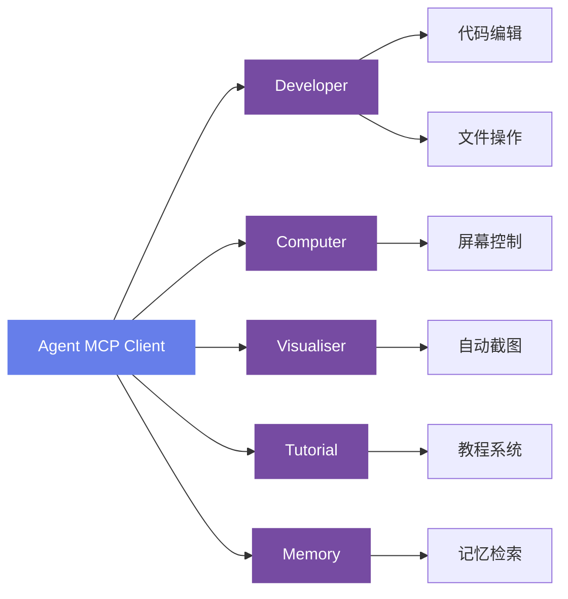
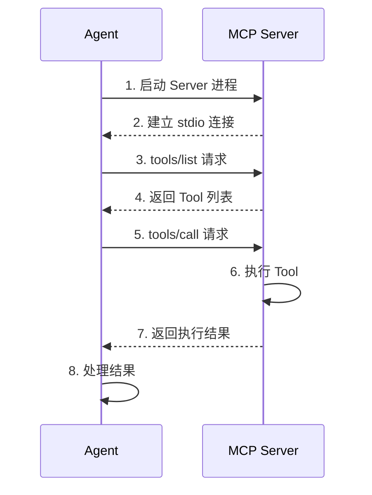

# MCP 协议集成

本文档详细描述 AGIME 的 MCP (Model Context Protocol) 集成实现，对应 crate `crates/agime-mcp/src/`。

---

## 目录

- [概述](#概述)
- [Developer Server](#developer-server)
- [代码分析系统](#代码分析系统)
- [Computer Controller Server](#computer-controller-server)
- [Auto Visualiser Server](#auto-visualiser-server)
- [Tutorial Server](#tutorial-server)
- [Memory Server](#memory-server)
- [安全与防护](#安全与防护)

---

## 概述

AGIME MCP 模块基于 **rmcp 0.15+**（Rust MCP SDK）构建，提供 5 个专用 MCP server，通过 stdio 传输协议与 agent 通信。

### 架构总览



**MCP 协议交互流程**：



### 核心依赖

- **rmcp 0.15+**：Rust 语言的 MCP 协议 SDK，提供 server/client 框架
- **传输协议**：stdio-based MCP protocol，通过标准输入/输出进行 JSON-RPC 通信

---

## Developer Server

Developer Server 是最核心的 MCP server，为 agent 提供完整的软件开发工具集。

### 结构体定义

`DeveloperServer` 包含以下核心字段：

| 字段 | 类型 | 说明 |
|------|------|------|
| `tool_router` | ToolRouter | 工具路由器 |
| `file_history` | FileHistory | 文件编辑历史，支持撤销 |
| `ignore_patterns` | IgnorePatterns | 文件忽略规则（.gooseignore） |
| `editor_model` | EditorModel | 可插拔的 LLM 编辑模型 |
| `code_analyzer` | CodeAnalyzer | 代码结构分析器 |

### 工具列表

Developer Server 提供以下 tool：

#### `shell` — 命令行执行

跨平台的命令行执行工具：

- **Windows**：PowerShell（优先）/ CMD
- **Unix**：bash / zsh / fish
- 进程组管理，确保子进程正确清理
- 环境变量配置与继承

#### `text_editor` — 文本编辑器

功能完整的文本编辑器，支持以下操作：

| 操作 | 说明 |
|------|------|
| `view` | 查看文件内容，支持行范围指定 |
| `write` | 写入新文件或完全覆盖现有文件 |
| `str_replace` | 精确字符串替换 |
| `insert` | 在指定行插入内容 |
| `undo_edit` | 撤销上一次编辑操作 |

关键参数与限制：

- **Fuzzy Diff Matching**：模糊匹配阈值 70%，容忍轻微差异的字符串替换
- **Unified Diff 支持**：可接受 unified diff 格式的编辑指令
- **最大文件大小**：400KB，超过此限制将拒绝操作

#### `image_processor` — 图像处理

处理图像文件，支持基本的图像分析功能。

#### `screen_capture` — 屏幕截图

捕获当前屏幕内容，用于 UI 相关的开发和调试场景。

#### `list_windows` — 列出窗口

列出当前系统中所有可用的窗口标题，用于窗口管理和自动化场景。

#### `analyze` — 代码分析

深度代码分析工具，支持 3 种分析模式（详见[代码分析系统](#代码分析系统)）。

### Editor Models

可插拔的 LLM 辅助编辑模型，用于智能化的代码编辑：

| 模型 | 说明 |
|------|------|
| **OpenAICompatibleEditor** | 基于 OpenAI 兼容 API 的编辑模型 |
| **MorphLLMEditor** | Morph LLM 专用编辑模型 |
| **RelaceEditor** | Relace 编辑模型 |

### Prompt 系统

- 嵌入式 JSON 模板
- 参数验证，确保 prompt 参数的完整性和类型正确性
- 支持动态参数替换

---

## 代码分析系统

位于 `developer/analyze/` 目录，提供深度的静态代码分析能力。

### CodeAnalyzer

核心分析器，包含以下组件：

- **ParserManager**：管理 tree-sitter 解析器实例
- **AnalysisCache**：分析结果 LRU 缓存，避免重复解析

### 三种分析模式

#### Structure 模式

结构化分析，输出代码的组织结构：

- 文件列表与目录树
- 模块、类、函数的层级关系
- 导入依赖图

#### Semantic 模式

语义分析，理解代码的含义和关系：

- 函数签名与类型信息
- 类继承与接口实现
- 跨文件引用关系

#### Focused 模式

聚焦分析，针对特定目标的深度分析：

- 指定函数或类的详细分析
- 调用链追踪
- 影响范围评估

### Tree-sitter 支持

通过 tree-sitter 解析器支持 8 种编程语言的 AST 解析：

| 语言 | 说明 |
|------|------|
| Python | `.py` 文件 |
| Rust | `.rs` 文件 |
| JavaScript | `.js` / `.jsx` / `.mjs` 文件 |
| Go | `.go` 文件 |
| Java | `.java` 文件 |
| Kotlin | `.kt` / `.kts` 文件 |
| Swift | `.swift` 文件 |
| Ruby | `.rb` 文件 |

### ElementExtractor

从 AST 中提取代码元素：

- **Functions**：函数定义、参数、返回类型
- **Classes**：类定义、方法、属性
- **Imports**：导入语句、依赖关系

### FileTraverser

文件遍历器：

- 递归遍历目录结构
- 遵循 `.gooseignore` 规则跳过不需要的文件
- 使用 rayon 进行并行处理，提高大项目的分析速度

### CallGraph

调用图分析：

- **有向图结构**：构建函数/方法间的调用关系图
- **BFS 遍历**：广度优先搜索，查找调用路径
- **环检测**：检测递归调用和循环依赖

### Formatter

分析结果格式化器，对应三种输出模式（Structure、Semantic、Focused），生成结构化的分析报告。

---

## Computer Controller Server

Computer Controller Server 提供系统级控制能力和文档处理工具。

### 工具列表

| Tool | 说明 |
|------|------|
| `web_scrape` | 网页内容抓取与解析 |
| `automation_script` | 自动化脚本执行 |
| `computer_control` | 计算机控制（鼠标、键盘模拟） |
| `cache` | 缓存管理工具 |

### 文档处理工具

| Tool | 依赖库 | 说明 |
|------|--------|------|
| `pdf_tool` | lopdf | PDF 文件读取与解析 |
| `docx_tool` | docx-rs | Word 文档（.docx）处理 |
| `xlsx_tool` | umya-spreadsheet | Excel 表格（.xlsx）处理 |

### 平台抽象

通过 `SystemAutomation` trait 实现跨平台抽象：

```
SystemAutomation (trait)
  ├── WindowsAutomation    （Windows 实现）
  ├── MacOSAutomation      （macOS 实现）
  └── LinuxAutomation      （Linux 实现）
```

每个平台实现封装了对应操作系统的自动化 API（如 Windows UI Automation、AppleScript、xdotool 等）。

---

## Auto Visualiser Server

Auto Visualiser Server 提供数据可视化工具，生成多种图表类型。

### 工具列表

| Tool | 说明 |
|------|------|
| `render_sankey` | 渲染桑基图（Sankey Diagram），展示流量/转化关系 |
| `render_radar` | 渲染雷达图（Radar Chart），展示多维度对比 |
| `render_donut` | 渲染环形图（Donut Chart），展示占比分布 |
| `render_treemap` | 渲染树图（Treemap），展示层级比例关系 |
| `render_chord` | 渲染弦图（Chord Diagram），展示实体间关系强度 |
| `render_map` | 渲染地图可视化，展示地理数据分布 |
| `render_mermaid` | 渲染 Mermaid 图表（流程图、时序图等） |
| `show_chart` | 显示已生成的图表内容 |

### 特性

- **JSON Schema 验证**：对输入数据进行严格的 schema 验证，确保数据格式正确
- **双受众内容**：生成的可视化内容同时适配人类阅读和 LLM 解析

---

## Tutorial Server

Tutorial Server 提供内置教程内容，帮助用户学习 AGIME 的使用方式。

### 工具

| Tool | 说明 |
|------|------|
| `load_tutorial` | 加载并返回指定教程的内容 |

### 可用教程

| 教程 ID | 说明 |
|---------|------|
| `build-mcp-extension` | 构建 MCP extension 的完整指南 |
| `first-game` | 使用 AGIME 创建第一个游戏项目 |

教程文件以嵌入式资源形式内置于 server 二进制中，无需额外下载。

---

## Memory Server

Memory Server 提供持久化的记忆存储功能，支持 agent 跨 session 保存和检索信息。

### 工具列表

| Tool | 说明 |
|------|------|
| `remember_memory` | 保存一条记忆，指定分类和内容 |
| `retrieve_memories` | 根据条件检索已保存的记忆 |
| `remove_memory_category` | 删除指定分类下的所有记忆 |
| `remove_specific_memory` | 删除特定的单条记忆 |

### 存储位置

Memory Server 使用两级存储：

| 级别 | 路径 | 作用域 |
|------|------|--------|
| 本地存储 | `.agime/memory/` | 当前项目目录级别 |
| 全局存储 | `~/.config/agime/memory/` | 用户级别，跨项目共享 |

本地存储优先，全局存储作为补充和跨项目共享的通道。

---

## 安全与防护

AGIME MCP 模块在多个层面实施安全防护措施。

### 路径验证

- **禁止路径穿越**：拒绝包含 `../` 的路径，防止访问预期范围外的文件
- **Symlink 检查**：检测并处理符号链接，防止通过 symlink 绕过路径限制
- **`.gooseignore` 支持**：遵循 `.gooseignore` 文件的规则，不操作被忽略的文件

### 参数限制

- **参数长度限制**：工具参数长度限制在 1-1000 字符，防止异常输入
- **输入验证**：所有工具参数在执行前进行类型和格式验证

### 进程隔离

- **隐藏窗口**：在 Windows 平台上，子进程以隐藏窗口模式运行，避免干扰用户桌面
- **进程组管理**：确保子进程在 tool 执行结束后被正确清理
- **超时控制**：长时间运行的命令受超时限制，防止资源泄漏
