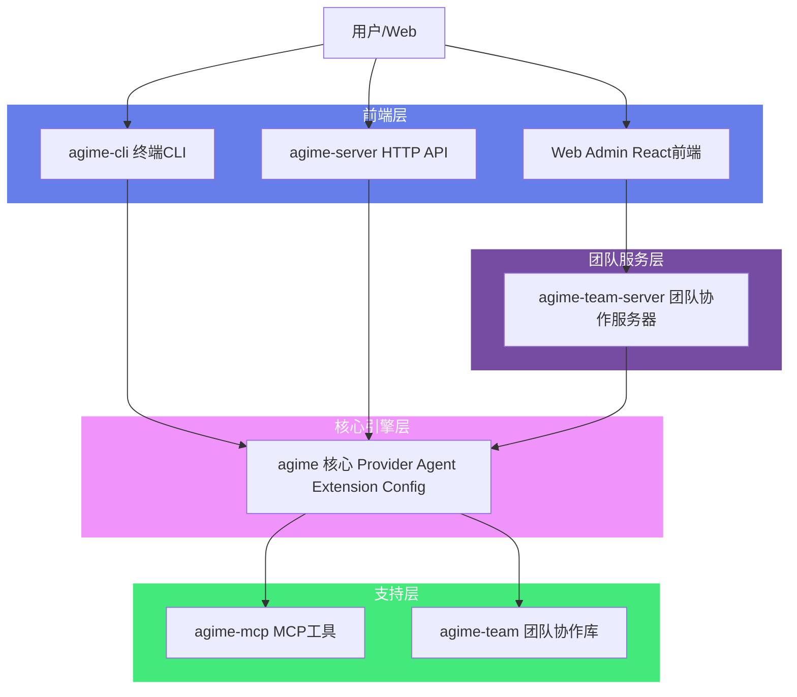
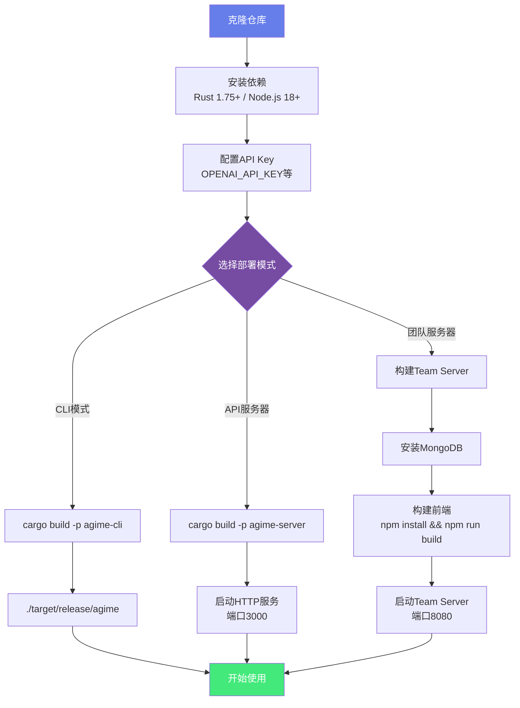

# AGIME - Agiatme Intelligent Multi-modal Engine

**版本**: 2.8.0 | **许可证**: Apache-2.0 | **语言**: Rust + TypeScript

AGIME 是一个基于 Rust 构建的 AI Agent 框架，提供从单人 CLI 到多人协作的完整 AI 工作流解决方案。框架核心围绕 **Model Context Protocol (MCP)** 协议设计，支持 14+ 种 LLM Provider，并通过独创的**双阶段执行系统**（Chat Track + Mission Track）满足从简单对话到复杂自主任务的全场景需求。

## 先看这份（非技术用户）

- [AGIME 用户使用说明（小白版）](./USER_GUIDE.md)

如果你是产品、运营、业务同学，建议先读上面的使用说明，再看后面的技术文档。

## 📚 文档阅读页面

我们提供了一个便捷的文档阅读页面，方便浏览所有文档：

**启动方式**：
```bash
# Windows
cd docs
serve.bat

# Linux/macOS
cd docs
chmod +x serve.sh
./serve.sh
```

然后在浏览器访问：http://localhost:8000

文档页面包含左侧导航栏和右侧内容区，支持快速切换和阅读所有文档。

## 核心特性

### 多模型支持
- **14+ LLM Provider**: OpenAI, Anthropic, Google, Azure, Databricks, Snowflake, OpenRouter, Venice, Tetrate, Ollama, xAI, AWS Bedrock, GCP Vertex AI, SageMaker TGI, LiteLLM, GitHub Copilot 等
- **Canonical Model Registry**: 统一模型能力描述，自动映射别名与定价
- **Format 抽象层**: 针对不同 API 格式（OpenAI, Anthropic, Google, Bedrock, Snowflake, Databricks, GCP Vertex AI）提供独立的消息序列化模块
- **Provider 自动检测**: 根据环境变量与配置自动选择最佳 Provider
- **Declarative Providers**: 通过 YAML 配置文件声明自定义 Provider

### 双阶段执行系统
- **Phase 1 - Chat Track**: 直接多轮对话，Session 持久化，支持实时 SSE 流式输出
- **Phase 2 - Mission Track**: 多步骤自主任务执行，包含规划、执行、验证的完整生命周期
- **AGE (Adaptive Goal Execution) 引擎**: 基于目标树的自适应执行，支持 Pivot 协议（重试/放弃策略）

### Extension 系统
- **MCP Client 架构**: 基于 rmcp 0.15 实现，支持 stdio 和 Streamable HTTP 两种传输方式
- **内置 Extension**: Developer (代码编辑/搜索/终端)、Memory (语义记忆)、ComputerController (屏幕操作)、AutoVisualiser (自动截图)、Tutorial (教程系统)
- **Platform Extensions**: Todo、ChatRecall、Skills、Team Collaboration、Extension Manager

### 数字分身系统
- **Avatar 实例管理**: 支持 Dedicated/Shared/Managed 三种类型
- **双层代理架构**: Manager Agent（治理）+ Service Agent（服务）
- **Governance 治理**: 自动化策略、能力缺口检测、运行日志分析
- **Portal 集成**: 与门户系统深度集成，支持公开访问
- **Extension 热插拔**: 运行时动态安装、启用、禁用 Extension

### 团队协作
- **Team Server**: 独立部署的团队协作服务器，支持多团队、多 Agent 管理
- **Portal 系统**: 将 Agent 发布为可共享的 Web 应用（支持匿名/认证访问）
- **文档管理**: 团队级文档存储、版本控制、权限管理
- **Smart Logging**: 结构化任务日志与分析

### 安全与权限
- **认证体系**: 用户注册/登录 + API Key 认证，Argon2 密码哈希
- **权限分级**: Admin / Member / ReadOnly 角色，支持 UserGroup 细粒度权限
- **Rate Limiting**: 可配置的请求频率限制
- **Prompt Injection 检测**: 内置安全扫描器

### 开发者工具
- **Skills**: 可复用的 Prompt 模板，支持参数化
- **Recipes**: 预定义工作流（含多步 SubRecipe）
- **Subagent**: Agent 内部可创建子 Agent 并行处理任务
- **Context Runtime**: 分层上下文运行时，负责投影、折叠、session memory 与恢复

## 架构概览

AGIME 采用 **Monorepo** 组织方式，包含 8 个 Rust crate。详细架构设计请参阅 [ARCHITECTURE.md](./ARCHITECTURE.md)。



## Crate 结构

| Crate | 说明 | 核心技术 |
|-------|------|----------|
| **agime** | 核心库：Provider 抽象、Agent 引擎、Extension 系统、配置管理、会话管理 | tokio, rmcp, reqwest, sqlx, serde, minijinja, tiktoken-rs |
| **agime-mcp** | MCP 工具服务器：Developer (代码工具)、Memory (记忆)、ComputerController、AutoVisualiser、Tutorial | rmcp (server+client), tree-sitter (多语言解析), xcap, lopdf, docx-rs |
| **agime-cli** | 命令行客户端：交互式终端、Session 管理、Recipe 执行 | clap, rustyline, cliclack, bat (语法高亮), axum (内嵌 Web 服务) |
| **agime-server** | HTTP API 服务器：RESTful API、WebSocket、SSE 流式输出 | axum, tower-http, utoipa (OpenAPI), tokio-tungstenite |
| **agime-team** | 团队协作核心库：数据模型、MongoDB/SQLite 持久化、路由、同步 | mongodb, sqlx, git2, validator, zip |
| **agime-team-server** | 团队协作服务器：Agent 执行、认证、Portal、文档管理、Chat/Mission Track | axum, mongodb, argon2, ed25519-dalek, pulldown-cmark |
| **agime-bench** | 基准测试框架：LLM 能力评估、自动化测试套件 | criterion (间接), agime core |
| **agime-test** | 测试基础设施：请求/响应捕获工具 | clap, serde_json |

## 快速开始

**快速上手流程**:



### 前置要求

- **Rust**: 1.75+ (2021 edition)
- **Node.js**: 18+ (用于 Web Admin 前端)
- **MongoDB**: 6.0+ (团队服务器主数据库)
- **LLM API Key**: 至少配置一个 Provider 的 API Key

### 构建

```bash
# 克隆仓库
git clone https://github.com/jsjm1986/AGIME.git
cd AGIME

# 构建所有 crate
cargo build --release

# 构建 CLI（含 cloud providers）
cargo build --release -p agime-cli

# 构建 Team Server
cargo build --release -p agime-team-server
```

### 运行 CLI

```bash
# 设置 Provider API Key（以 OpenAI 为例）
export OPENAI_API_KEY="sk-..."

# 启动交互式 CLI
./target/release/agime

# 指定 Provider 和模型
AGIME_PROVIDER=anthropic AGIME_MODEL=claude-sonnet-4-20250514 ./target/release/agime
```

### 运行 Team Server

```bash
# 启动 MongoDB（使用 Docker）
cd crates/agime-team-server
docker-compose up -d

# 配置环境变量
export MONGODB_URL="mongodb://localhost:27017"
export DATABASE_NAME="agime_team"
export OPENAI_API_KEY="sk-..."

# 启动 Team Server
./target/release/agime-team-server

# 服务器默认监听 http://0.0.0.0:8080
```

### 构建 Web Admin 前端

```bash
cd crates/agime-team-server/web-admin

# 安装依赖
npm install

# 开发模式
npm run dev

# 生产构建（输出到 dist/，Team Server 自动 serve）
npm run build
```

## 配置

AGIME 支持多层配置，优先级从高到低：

1. **环境变量**: `AGIME_PROVIDER`, `AGIME_MODEL`, `OPENAI_API_KEY`, `ANTHROPIC_API_KEY` 等
2. **配置文件**: `~/.config/agime/config.yaml`（CLI）或 `config.toml`（Team Server）
3. **Profile 文件**: `~/.config/agime/profiles/*.yaml`
4. **Declarative Providers**: `~/.config/agime/providers/*.yaml`（自定义 Provider 配置）

### 关键环境变量

| 环境变量 | 说明 | 默认值 |
|----------|------|--------|
| `AGIME_PROVIDER` | LLM Provider 名称 | `openai` |
| `AGIME_MODEL` | 模型名称 | Provider 默认模型 |
| `OPENAI_API_KEY` | OpenAI API Key | - |
| `ANTHROPIC_API_KEY` | Anthropic API Key | - |
| `MONGODB_URL` | MongoDB 连接 URL | `mongodb://localhost:27017` |
| `DATABASE_NAME` | 数据库名称 | `agime_team` |
| `TEAM_SERVER_PORT` | Team Server 端口 | `8080` |
| `CORS_ALLOWED_ORIGINS` | CORS 允许的域名 | 开发模式自动镜像 |
| `REGISTRATION_MODE` | 注册模式 (open/approval/disabled) | `open` |

## 文档索引

- [ARCHITECTURE.md](./ARCHITECTURE.md) - 系统架构设计详解
