# AGIME Team 架构与流程图（完整留存版）

> 生成日期：2026-01-28  
> 覆盖范围：Team 协作（本地/局域网/云端）、资源共享/安装、邀请、同步、鉴权、技能包（Agent Skills）、授权/清理、Team Server Web Admin、MCP 工具与 UI 连接/聚合模式  
> 主要依据代码：`crates/agime-team`、`crates/agime-team-server`、`crates/agime-server`、`crates/agime`、`ui/desktop`

---

## 0. 代码依据（来源索引）
- Team 核心：`crates/agime-team/src/*`（routes/services/models/migrations/config）
- Team Server：`crates/agime-team-server/src/*`
- Team Server Web Admin：`crates/agime-team-server/web-admin/src/*`
- 本地 agimed 集成：`crates/agime-server/src/commands/agent.rs`、`crates/agime-server/src/auth.rs`
- MCP Team 扩展：`crates/agime/src/agents/team_extension.rs`
- Team 技能授权/加载：`crates/agime/src/agents/skills_extension.rs`
- UI Team 模块：`ui/desktop/src/components/team/*`
- UI 连接/数据源：`ui/desktop/src/components/team/api.ts`、`ui/desktop/src/components/team/servers/*`、`ui/desktop/src/components/team/lan/*`、`ui/desktop/src/components/team/sources/*`、`ui/desktop/src/components/team/skill-package/*`、`ui/desktop/src/components/team/auth/authAdapter.ts`
- 文档（产品/远程访问）：`docs/product/TEAM.md`、`docs/product/REMOTE_ACCESS.md`

---

## 1. 系统全景（部署与调用关系）

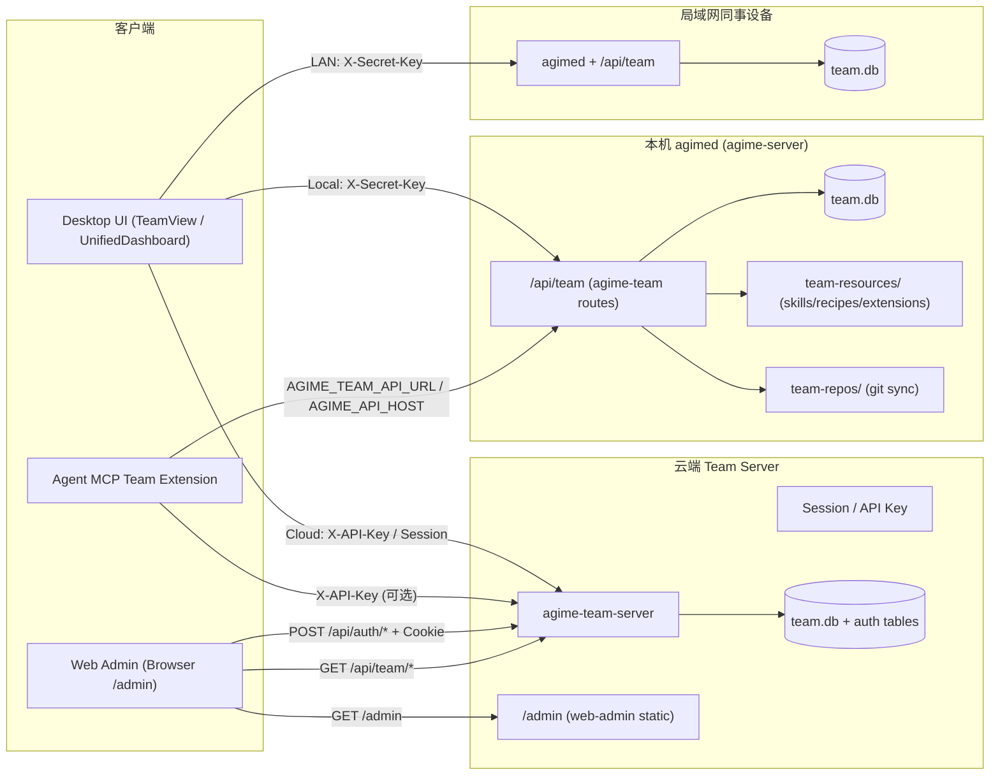
```mermaid
flowchart LR
  subgraph Client["客户端"]
    UI["Desktop UI (TeamView / UnifiedDashboard)"]
    Agent["Agent MCP Team Extension"]
    WebAdmin["Web Admin (Browser /admin)"]
  end

  subgraph Local["本机 agimed (agime-server)"]
    LocalAPI["/api/team (agime-team routes)"]
    LocalDB[(team.db)]
    LocalRes["team-resources/ (skills/recipes/extensions)"]
    LocalGit["team-repos/ (git sync)"]
  end

  subgraph LAN["局域网同事设备"]
    LanAPI["agimed + /api/team"]
    LanDB[(team.db)]
  end

  subgraph Cloud["云端 Team Server"]
    CloudSrv["agime-team-server"]
    CloudAuth["Session / API Key"]
    CloudAdmin["/admin (web-admin static)"]
    CloudDB[(team.db + auth tables)]
  end

  UI -- "Local: X-Secret-Key" --> LocalAPI
  UI -- "LAN: X-Secret-Key" --> LanAPI
  UI -- "Cloud: X-API-Key / Session" --> CloudSrv

  Agent -- "AGIME_TEAM_API_URL / AGIME_API_HOST" --> LocalAPI
  Agent -- "X-API-Key (可选)" --> CloudSrv

  WebAdmin -- "GET /admin" --> CloudAdmin
  WebAdmin -- "POST /api/auth/* + Cookie" --> CloudSrv
  WebAdmin -- "GET /api/team/*" --> CloudSrv

  LocalAPI --> LocalDB
  LocalAPI --> LocalRes
  LocalAPI --> LocalGit

  LanAPI --> LanDB
  CloudSrv --> CloudDB
```

---

## 2. UI Team 模式与数据源

### 2.1 模式选择流程（TeamView）
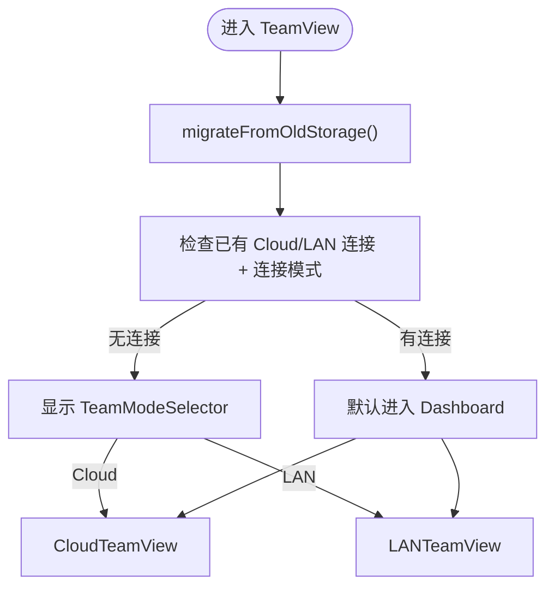
```mermaid
flowchart TD
  Start([进入 TeamView]) --> Migrate["migrateFromOldStorage()"]
  Migrate --> CheckConn["检查已有 Cloud/LAN 连接 + 连接模式"]
  CheckConn -->|有连接| Dashboard["默认进入 Dashboard"]
  CheckConn -->|无连接| ModeSelect["显示 TeamModeSelector"]
  ModeSelect -->|Cloud| CloudView["CloudTeamView"]
  ModeSelect -->|LAN| LanView["LANTeamView"]
  Dashboard --> CloudView
  Dashboard --> LanView
```

### 2.2 数据源适配器结构（Local / LAN / Cloud）
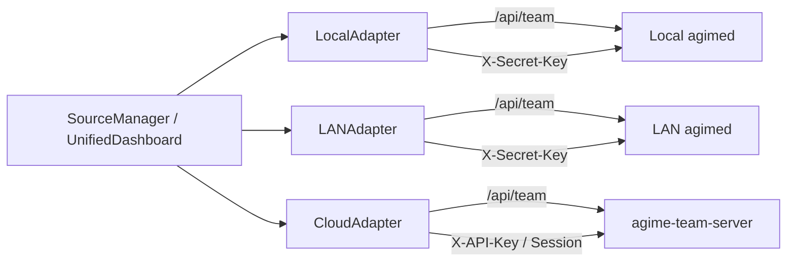
```mermaid
flowchart LR
  SourceManager["SourceManager / UnifiedDashboard"] --> LocalAdapter
  SourceManager --> LANAdapter
  SourceManager --> CloudAdapter

  LocalAdapter -->|/api/team| LocalAgimed["Local agimed"]
  LANAdapter -->|/api/team| LanAgimed["LAN agimed"]
  CloudAdapter -->|/api/team| TeamServer["agime-team-server"]

  LocalAdapter -->|X-Secret-Key| LocalAgimed
  LANAdapter -->|X-Secret-Key| LanAgimed
  CloudAdapter -->|X-API-Key / Session| TeamServer
```

### 2.3 UI 鉴权头选择逻辑
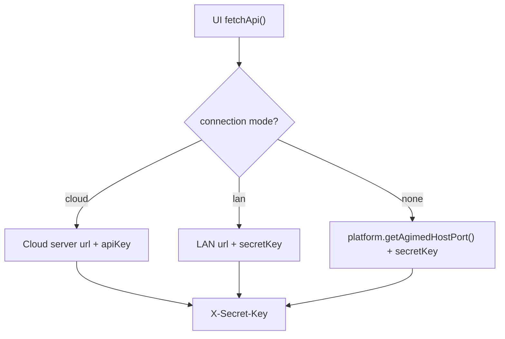
```mermaid
flowchart TD
  Req["UI fetchApi()"] --> Mode{"connection mode?"}
  Mode -->|cloud| CloudCfg["Cloud server url + apiKey"]
  Mode -->|lan| LanCfg["LAN url + secretKey"]
  Mode -->|none| LocalCfg["platform.getAgimedHostPort() + secretKey"]
  CloudCfg --> Header["X-API-Key"]
  LanCfg --> Header["X-Secret-Key"]
  LocalCfg --> Header["X-Secret-Key"]
```

### 2.4 连接配置与存储（Legacy + Multi-Server）
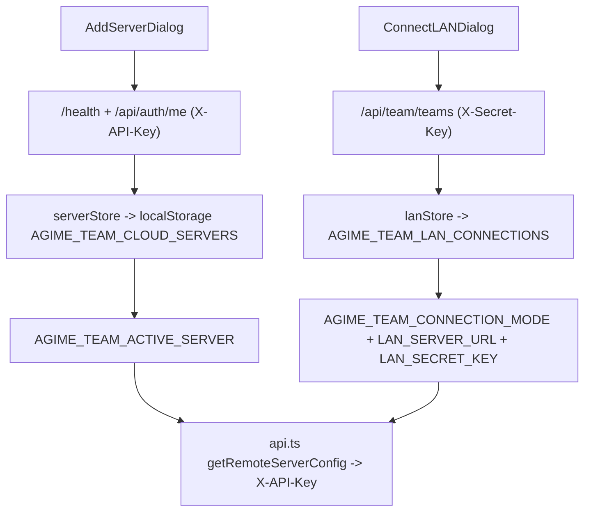
```mermaid
flowchart TD
  CloudAdd["AddServerDialog"] --> CloudTest["/health + /api/auth/me (X-API-Key)"]
  CloudTest --> CloudStore["serverStore -> localStorage AGIME_TEAM_CLOUD_SERVERS"]
  CloudStore --> CloudActive["AGIME_TEAM_ACTIVE_SERVER"]
  CloudActive --> ApiConfig["api.ts getRemoteServerConfig -> X-API-Key"]

  LanAdd["ConnectLANDialog"] --> LanTest["/api/team/teams (X-Secret-Key)"]
  LanTest --> LanStore["lanStore -> AGIME_TEAM_LAN_CONNECTIONS"]
  LanStore --> LanMode["AGIME_TEAM_CONNECTION_MODE + LAN_SERVER_URL + LAN_SECRET_KEY"]
  LanMode --> ApiConfig
```

### 2.5 统一数据源 SourceManager（新）
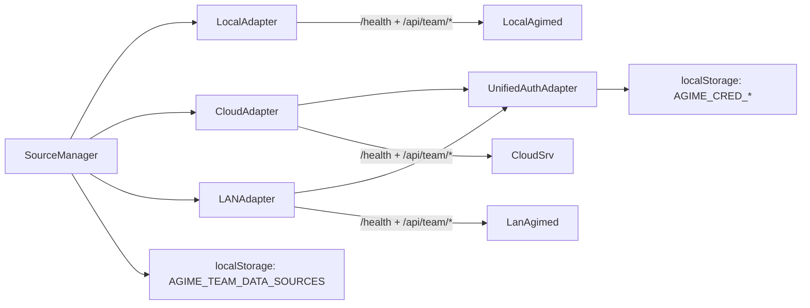
```mermaid
flowchart LR
  SourceMgr["SourceManager"] --> LocalAdapter
  SourceMgr --> CloudAdapter
  SourceMgr --> LANAdapter

  SourceMgr --> LS["localStorage: AGIME_TEAM_DATA_SOURCES"]
  CloudAdapter --> AuthAdapter["UnifiedAuthAdapter"]
  LANAdapter --> AuthAdapter
  AuthAdapter --> CredStore["localStorage: AGIME_CRED_*"]

  LocalAdapter -->|/health + /api/team/*| LocalAgimed
  CloudAdapter -->|/health + /api/team/*| CloudSrv
  LANAdapter -->|/health + /api/team/*| LanAgimed
```

### 2.6 SourceManager 初始化 + 凭据/健康
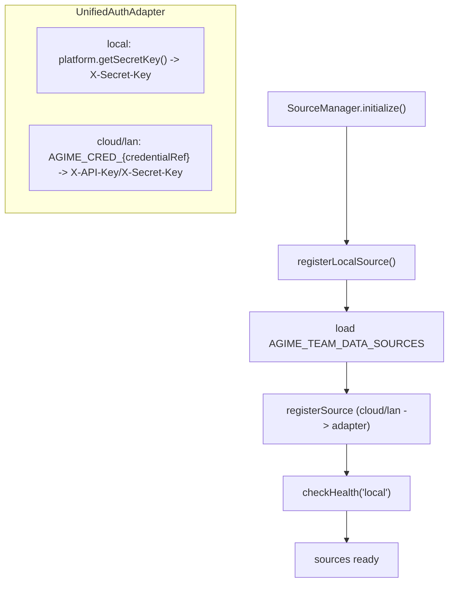
```mermaid
flowchart TD
  Init["SourceManager.initialize()"] --> RegisterLocal["registerLocalSource()"]
  RegisterLocal --> Load["load AGIME_TEAM_DATA_SOURCES"]
  Load --> Register["registerSource (cloud/lan -> adapter)"]
  Register --> Health["checkHealth('local')"]
  Health --> Ready["sources ready"]

  subgraph Auth["UnifiedAuthAdapter"]
    Local["local: platform.getSecretKey() -> X-Secret-Key"]
    Remote["cloud/lan: AGIME_CRED_{credentialRef} -> X-API-Key/X-Secret-Key"]
  end
```
> `AGIME_TEAM_ACTIVE_SOURCE`/`AGIME_TEAM_STORAGE_MIGRATED` 目前未被实际使用。  

### 2.7 聚合资源视图（UnifiedResourceView）
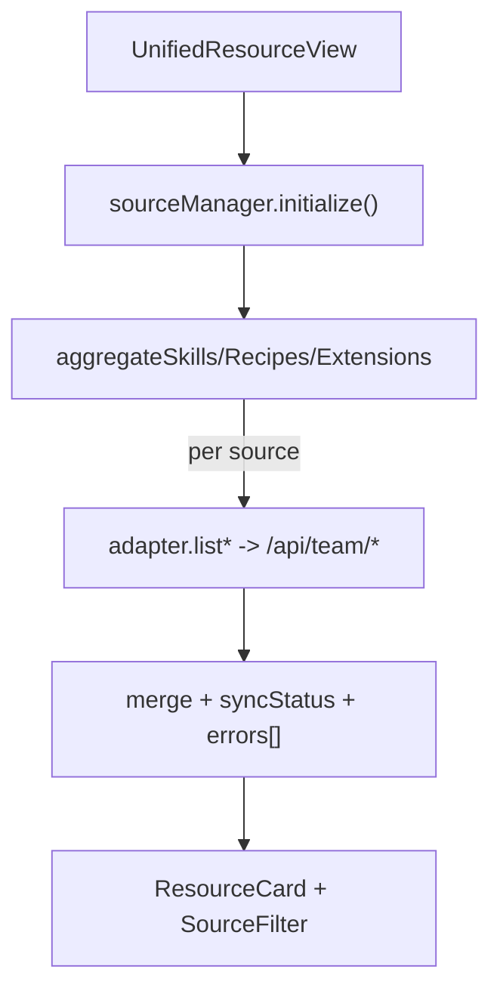
```mermaid
flowchart TD
  View["UnifiedResourceView"] --> Init["sourceManager.initialize()"]
  Init --> Fetch["aggregateSkills/Recipes/Extensions"]
  Fetch -->|per source| Adapter["adapter.list* -> /api/team/*"]
  Adapter --> Merge["merge + syncStatus + errors[]"]
  Merge --> Render["ResourceCard + SourceFilter"]
```
> `EnhancedDashboard`/`UnifiedResourceView` 已实现但尚未接入 `TeamView` 主流程（仍以 legacy UnifiedDashboard 为入口）。  

---

## 3. Team 后端分层架构（agime-team）
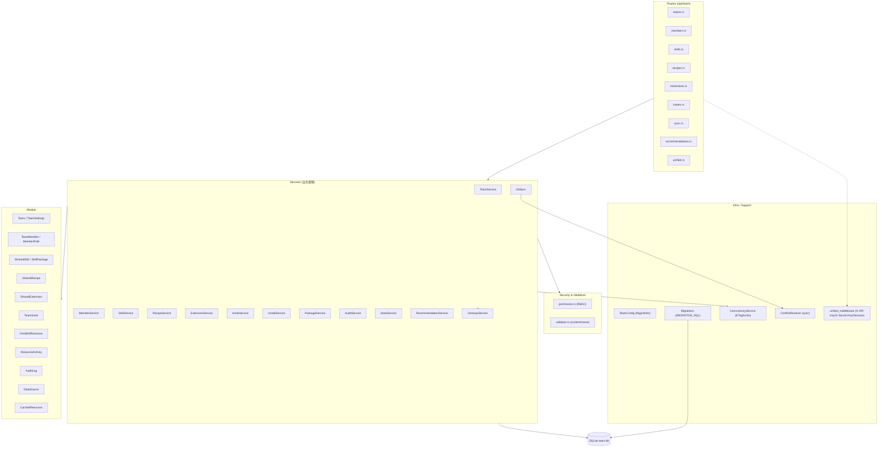
```mermaid
flowchart TB
  subgraph Routes["Routes (/api/team)"]
    Teams["teams.rs"]
    Members["members.rs"]
    Skills["skills.rs"]
    Recipes["recipes.rs"]
    Extensions["extensions.rs"]
    Invites["invites.rs"]
    Sync["sync.rs"]
    Reco["recommendations.rs"]
    Unified["unified.rs"]
  end

  subgraph Services["Services (业务逻辑)"]
    TeamSvc["TeamService"]
    MemberSvc["MemberService"]
    SkillSvc["SkillService"]
    RecipeSvc["RecipeService"]
    ExtSvc["ExtensionService"]
    InviteSvc["InviteService"]
    InstallSvc["InstallService"]
    PackageSvc["PackageService"]
    SyncSvc["GitSync"]
    AuditSvc["AuditService"]
    StatsSvc["StatsService"]
    RecoSvc["RecommendationService"]
    CleanupSvc["CleanupService"]
  end

  subgraph Security["Security & Validation"]
    Perm["permission.rs (RBAC)"]
    Validator["validator.rs (content/name)"]
  end

  subgraph Support["Infra / Support"]
    Config["TeamConfig (flags/limits)"]
    Migrations["Migrations (MIGRATION_SQL)"]
    Concurrency["ConcurrencyService (ETag/locks)"]
    Conflict["ConflictResolver (sync)"]
    AuthMid["unified_middleware (X-API-Key/X-Secret-Key/Session)"]
  end

  subgraph Models["Models"]
    Team["Team / TeamSettings"]
    Member["TeamMember / MemberRole"]
    Skill["SharedSkill / SkillPackage"]
    Recipe["SharedRecipe"]
    Ext["SharedExtension"]
    Invite["TeamInvite"]
    Installed["InstalledResource"]
    Activity["ResourceActivity"]
    Audit["AuditLog"]
    DataSource["DataSource"]
    Cache["CachedResource"]
  end

  DB[(SQLite team.db)]

  Routes --> Services
  Services --> Models
  Services --> DB
  Services --> Security
  Services --> Concurrency
  Services --> CleanupSvc
  SyncSvc --> Conflict
  Migrations --> DB
  Routes -.-> AuthMid
```

---

## 4. 本机 agimed 中的 Team 集成
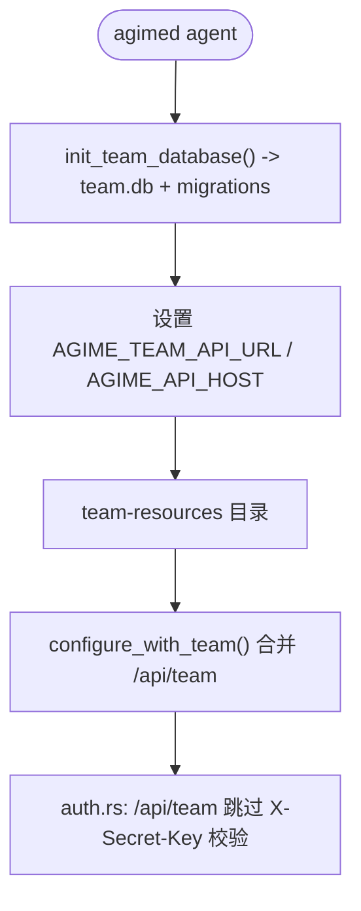
```mermaid
flowchart TD
  Start([agimed agent]) --> InitTeamDB["init_team_database() -> team.db + migrations"]
  InitTeamDB --> SetEnv["设置 AGIME_TEAM_API_URL / AGIME_API_HOST"]
  SetEnv --> BasePath["team-resources 目录"]
  BasePath --> ConfigureRoutes["configure_with_team() 合并 /api/team"]
  ConfigureRoutes --> AuthBypass["auth.rs: /api/team 跳过 X-Secret-Key 校验"]
```

### 4.1 关键环境变量/配置要点
- `AGIME_TEAM_API_URL`：生成邀请链接的基础地址（推荐设置为局域网/公网可访问地址）。  
- `AGIME_SERVER_ADDR`：当未设置 `AGIME_TEAM_API_URL` 时的 fallback（0.0.0.0 不可用于邀请链接）。  
- `AGIME_TOKEN_SECRET`：`/skills/{id}/verify-access` 生成 HMAC 授权 token 的密钥（未设置时使用默认字符串）。  
- `AGIME_TEAM_API_KEY`：MCP Team 扩展访问云端 Team Server 的 API Key（可选）。  
- TeamConfig（`TeamConfig`）：默认 `enabled=false`，限制项 `max_teams_per_user=10`、`max_members_per_team=100`、`soft_delete_retention_days=30`。  
- Team Server：`TEAM_SERVER_HOST`、`TEAM_SERVER_PORT`、`DATABASE_URL`、`DATABASE_MAX_CONNECTIONS`、`ADMIN_API_KEY`。  

---

## 5. Team Server（云端）鉴权流程

### 5.1 鉴权策略（Session -> API Key）
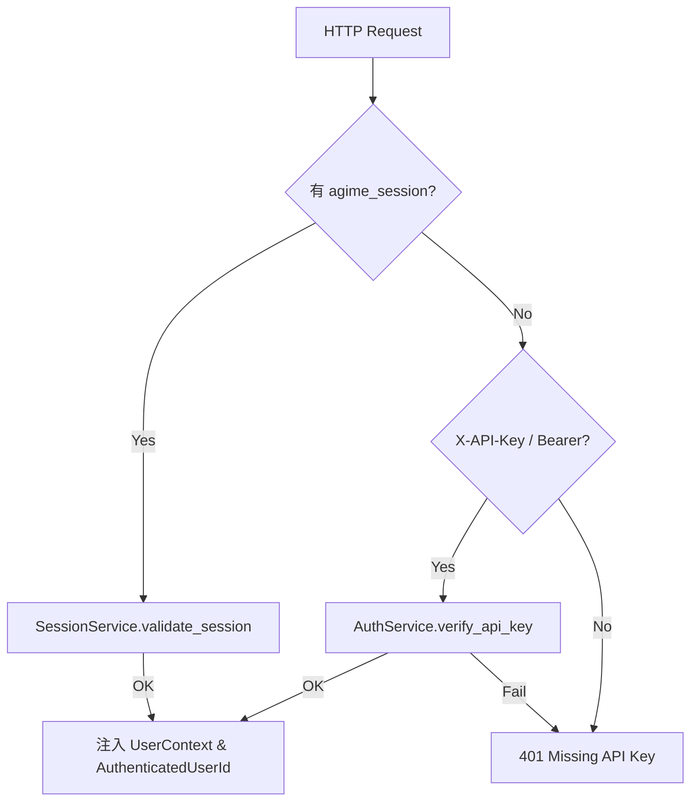
```mermaid
flowchart TD
  Req[HTTP Request] --> CookieCheck{"有 agime_session?"}
  CookieCheck -->|Yes| SessionVerify["SessionService.validate_session"]
  SessionVerify -->|OK| InjectUser["注入 UserContext & AuthenticatedUserId"]
  CookieCheck -->|No| ApiKeyCheck{"X-API-Key / Bearer?"}
  ApiKeyCheck -->|Yes| ApiKeyVerify["AuthService.verify_api_key"]
  ApiKeyVerify -->|OK| InjectUser
  ApiKeyCheck -->|No| Reject["401 Missing API Key"]
  ApiKeyVerify -->|Fail| Reject
```

### 5.2 Team Server 路由装配
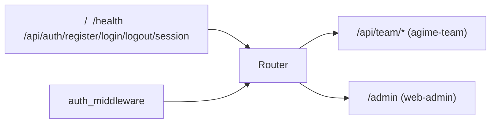
```mermaid
flowchart LR
  Public["/  /health  /api/auth/register/login/logout/session"] --> Router
  AuthGuard["auth_middleware"] --> Router
  Router --> TeamRoutes["/api/team/* (agime-team)"]
  Router --> AdminUI["/admin (web-admin)"]
```

### 5.3 Web Admin 登录与会话
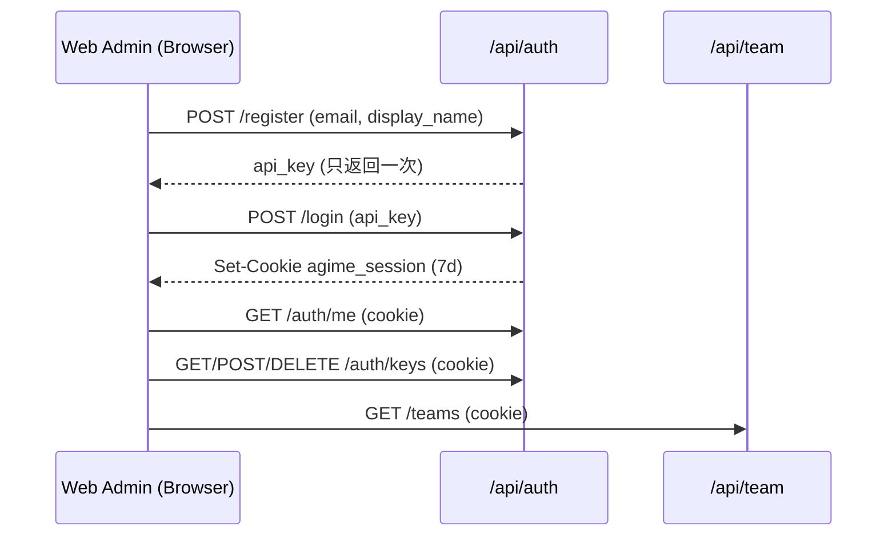
```mermaid
sequenceDiagram
  participant Browser as Web Admin (Browser)
  participant Auth as /api/auth
  participant Team as /api/team

  Browser->>Auth: POST /register (email, display_name)
  Auth-->>Browser: api_key (只返回一次)
  Browser->>Auth: POST /login (api_key)
  Auth-->>Browser: Set-Cookie agime_session (7d)
  Browser->>Auth: GET /auth/me (cookie)
  Browser->>Auth: GET/POST/DELETE /auth/keys (cookie)
  Browser->>Team: GET /teams (cookie)
```

---

## 6. API 路由总览（/api/team）

### 6.1 资源与团队
```
POST   /teams
GET    /teams
GET    /teams/{id}
PUT    /teams/{id}
DELETE /teams/{id}

POST   /teams/{team_id}/members
GET    /teams/{team_id}/members
GET    /teams/{team_id}/members/cleanup-count
PUT    /members/{member_id}
DELETE /members/{member_id}
POST   /teams/{team_id}/leave
```

### 6.2 Skills
```
POST   /skills
GET    /skills
POST   /skills/import
POST   /skills/validate-package
POST   /skills/install-local
GET    /skills/local
GET    /skills/{id}
PUT    /skills/{id}
DELETE /skills/{id}
POST   /skills/{id}/install
DELETE /skills/{id}/uninstall
GET    /skills/{id}/export
GET    /skills/{id}/files
POST   /skills/{id}/files
GET    /skills/{id}/files/{*path}
DELETE /skills/{id}/files/{*path}
POST   /skills/{id}/convert-to-package
POST   /skills/{id}/verify-access
```

### 6.3 Recipes / Extensions
```
POST   /recipes
GET    /recipes
POST   /recipes/install-local
GET    /recipes/{id}
PUT    /recipes/{id}
DELETE /recipes/{id}
POST   /recipes/{id}/install
DELETE /recipes/{id}/uninstall

POST   /extensions
GET    /extensions
POST   /extensions/install-local
GET    /extensions/{id}
PUT    /extensions/{id}
DELETE /extensions/{id}
POST   /extensions/{id}/install
DELETE /extensions/{id}/uninstall
POST   /extensions/{id}/review
```
> `GET /extensions` 支持 `reviewedOnly=true` 仅返回通过安全审核的扩展。  

### 6.4 邀请 / 推荐 / 同步
```
GET    /invites/{code}
POST   /invites/{code}/accept
GET    /teams/{team_id}/invites
POST   /teams/{team_id}/invites
DELETE /teams/{team_id}/invites/{code}

GET    /recommendations

POST   /teams/{team_id}/sync
GET    /teams/{team_id}/sync/status
POST   /resources/check-updates
POST   /resources/batch-install
GET    /resources/installed
```

### 6.5 统一数据源（聚合查询）
```
GET    /unified/sources
```

### 6.6 Team Server 认证接口（/api/auth）
```
POST   /auth/register
POST   /auth/login
POST   /auth/logout
GET    /auth/session
GET    /auth/me
GET    /auth/keys
POST   /auth/keys
DELETE /auth/keys/{key_id}
```

### 6.7 健康检查与管理入口
```
GET    /health
GET    /admin   (Web Admin 静态页面入口)
```

---

## 7. 数据模型（ER 图）

### 7.1 Team 协作核心表（由模型/查询推断）
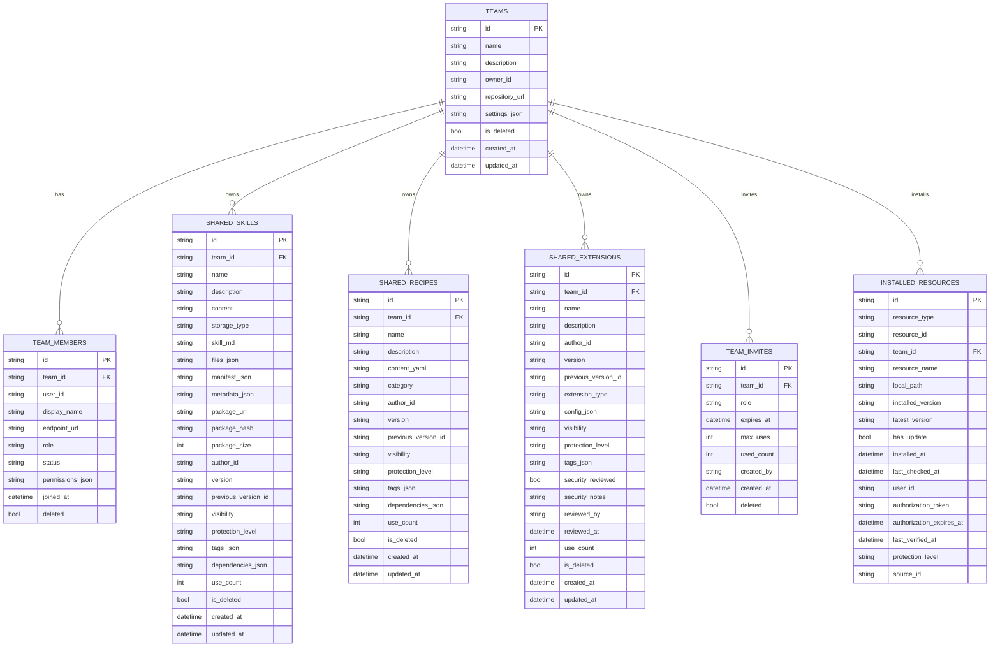
```mermaid
erDiagram
  TEAMS ||--o{ TEAM_MEMBERS : has
  TEAMS ||--o{ SHARED_SKILLS : owns
  TEAMS ||--o{ SHARED_RECIPES : owns
  TEAMS ||--o{ SHARED_EXTENSIONS : owns
  TEAMS ||--o{ TEAM_INVITES : invites
  TEAMS ||--o{ INSTALLED_RESOURCES : installs

  TEAMS {
    string id PK
    string name
    string description
    string owner_id
    string repository_url
    string settings_json
    bool   is_deleted
    datetime created_at
    datetime updated_at
  }

  TEAM_MEMBERS {
    string id PK
    string team_id FK
    string user_id
    string display_name
    string endpoint_url
    string role
    string status
    string permissions_json
    datetime joined_at
    bool deleted
  }

  SHARED_SKILLS {
    string id PK
    string team_id FK
    string name
    string description
    string content
    string storage_type
    string skill_md
    string files_json
    string manifest_json
    string metadata_json
    string package_url
    string package_hash
    int package_size
    string author_id
    string version
    string previous_version_id
    string visibility
    string protection_level
    string tags_json
    string dependencies_json
    int use_count
    bool is_deleted
    datetime created_at
    datetime updated_at
  }

  SHARED_RECIPES {
    string id PK
    string team_id FK
    string name
    string description
    string content_yaml
    string category
    string author_id
    string version
    string previous_version_id
    string visibility
    string protection_level
    string tags_json
    string dependencies_json
    int use_count
    bool is_deleted
    datetime created_at
    datetime updated_at
  }

  SHARED_EXTENSIONS {
    string id PK
    string team_id FK
    string name
    string description
    string author_id
    string version
    string previous_version_id
    string extension_type
    string config_json
    string visibility
    string protection_level
    string tags_json
    bool security_reviewed
    string security_notes
    string reviewed_by
    datetime reviewed_at
    int use_count
    bool is_deleted
    datetime created_at
    datetime updated_at
  }

  TEAM_INVITES {
    string id PK
    string team_id FK
    string role
    datetime expires_at
    int max_uses
    int used_count
    string created_by
    datetime created_at
    bool deleted
  }

  INSTALLED_RESOURCES {
    string id PK
    string resource_type
    string resource_id
    string team_id FK
    string resource_name
    string local_path
    string installed_version
    string latest_version
    bool has_update
    datetime installed_at
    datetime last_checked_at
    string user_id
    string authorization_token
    datetime authorization_expires_at
    datetime last_verified_at
    string protection_level
    string source_id
  }
```

### 7.2 使用统计与审计（扩展表）
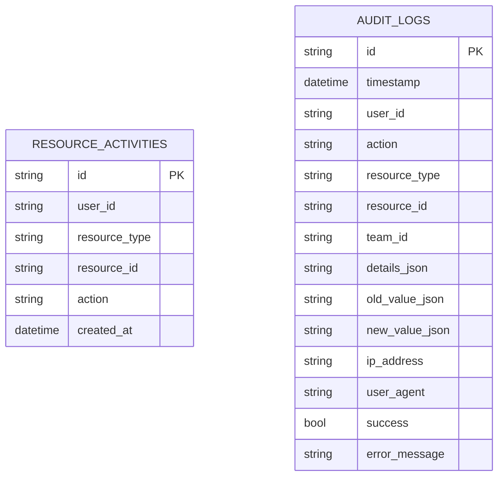
```mermaid
erDiagram
  RESOURCE_ACTIVITIES {
    string id PK
    string user_id
    string resource_type
    string resource_id
    string action
    datetime created_at
  }

  AUDIT_LOGS {
    string id PK
    datetime timestamp
    string user_id
    string action
    string resource_type
    string resource_id
    string team_id
    string details_json
    string old_value_json
    string new_value_json
    string ip_address
    string user_agent
    bool success
    string error_message
  }
```

### 7.3 统一数据源与缓存（本地聚合）
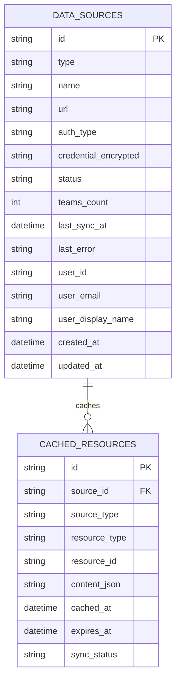
```mermaid
erDiagram
  DATA_SOURCES ||--o{ CACHED_RESOURCES : caches

  DATA_SOURCES {
    string id PK
    string type
    string name
    string url
    string auth_type
    string credential_encrypted
    string status
    int teams_count
    datetime last_sync_at
    string last_error
    string user_id
    string user_email
    string user_display_name
    datetime created_at
    datetime updated_at
  }

  CACHED_RESOURCES {
    string id PK
    string source_id FK
    string source_type
    string resource_type
    string resource_id
    string content_json
    datetime cached_at
    datetime expires_at
    string sync_status
  }
```

### 7.4 Team Server 认证表（云端）
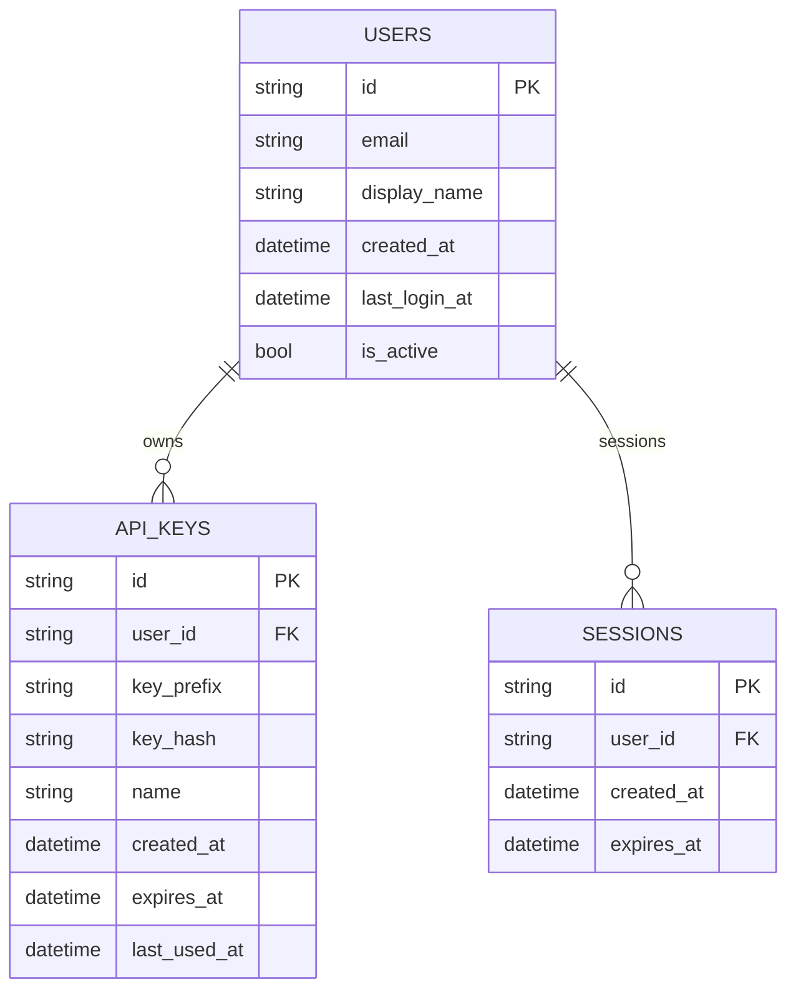
```mermaid
erDiagram
  USERS ||--o{ API_KEYS : owns
  USERS ||--o{ SESSIONS : sessions

  USERS {
    string id PK
    string email
    string display_name
    datetime created_at
    datetime last_login_at
    bool is_active
  }

  API_KEYS {
    string id PK
    string user_id FK
    string key_prefix
    string key_hash
    string name
    datetime created_at
    datetime expires_at
    datetime last_used_at
  }

  SESSIONS {
    string id PK
    string user_id FK
    datetime created_at
    datetime expires_at
  }
```

### 7.5 同步与锁（辅助表）
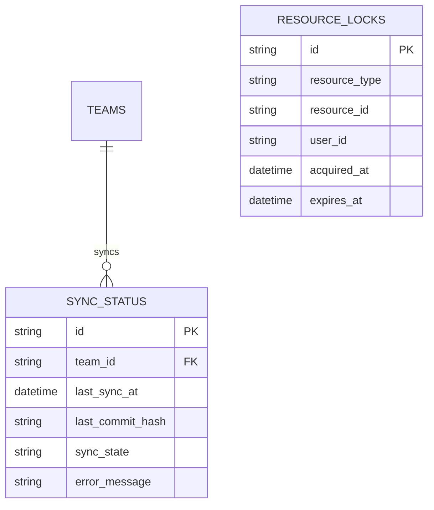
```mermaid
erDiagram
  TEAMS ||--o{ SYNC_STATUS : syncs

  SYNC_STATUS {
    string id PK
    string team_id FK
    datetime last_sync_at
    string last_commit_hash
    string sync_state
    string error_message
  }

  RESOURCE_LOCKS {
    string id PK
    string resource_type
    string resource_id
    string user_id
    datetime acquired_at
    datetime expires_at
  }
```

> 注：字段来自 models 与 SQL 查询推断；以 migrations 为最终准。

---

## 8. 关键流程图

### 8.1 邀请加入团队
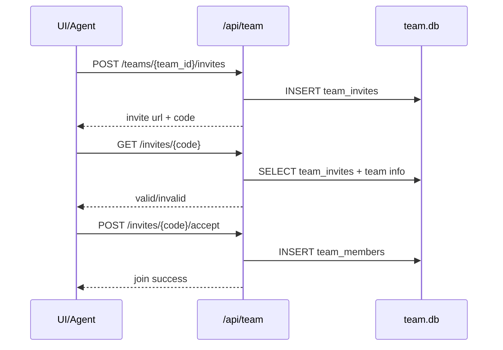
```mermaid
sequenceDiagram
  participant UI as UI/Agent
  participant API as /api/team
  participant DB as team.db

  UI->>API: POST /teams/{team_id}/invites
  API->>DB: INSERT team_invites
  API-->>UI: invite url + code

  UI->>API: GET /invites/{code}
  API->>DB: SELECT team_invites + team info
  API-->>UI: valid/invalid

  UI->>API: POST /invites/{code}/accept
  API->>DB: INSERT team_members
  API-->>UI: join success
```
> UI 侧 `JoinTeamDialog` 支持直接粘贴 `.../join/{code}` 或纯 code，并在预览页输入 display_name。  

### 8.2 资源分享（Skill/Recipe/Extension）
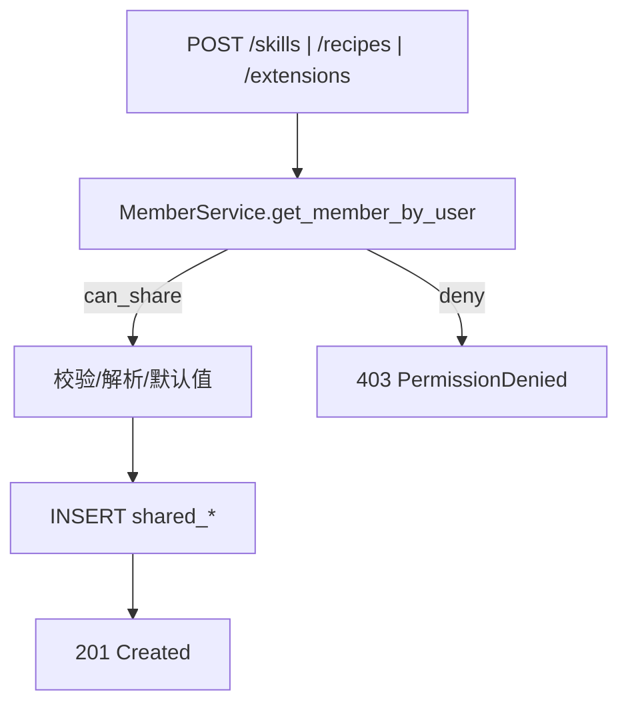
```mermaid
flowchart TD
  Req["POST /skills | /recipes | /extensions"] --> CheckMember["MemberService.get_member_by_user"]
  CheckMember -->|can_share| Validate["校验/解析/默认值"]
  CheckMember -->|deny| Err["403 PermissionDenied"]
  Validate --> Insert["INSERT shared_*"]
  Insert --> OK["201 Created"]
```

### 8.3 本地安装（Skill，含授权）
```mermaid
sequenceDiagram
  participant MCP as Agent team_install
  participant API as /api/team
  participant FS as Local FS

  MCP->>API: GET /skills/{id}
  MCP->>API: POST /skills/{id}/verify-access
  MCP->>FS: write SKILL.md + .skill-meta.json
  MCP->>API: POST /skills/{id}/install
  API-->>MCP: InstallResult
```

### 8.4 批量更新与安装
```mermaid
flowchart TD
  UI["UI UpdateNotification"] --> Check["POST /resources/check-updates"]
  Check --> Updates["返回更新列表"]
  Updates --> Batch["POST /resources/batch-install"]
  Batch --> Result["InstallResponse[]"]
```

### 8.5 Git 同步
```mermaid
flowchart TD
  UI["POST /teams/{id}/sync"] --> Init["GitSync.init_repo_async"]
  Init --> Pull["GitSync.pull_async"]
  Pull --> Status["SyncStatus"]
```
```mermaid
flowchart TD
  Start["GitSync.pull()"] --> Repo{"repo exists?"}
  Repo -->|no| Err["SyncFailed: not initialized"]
  Repo -->|yes| Remote{"origin exists?"}
  Remote -->|no| LocalOnly["local-only repo -> Idle + last_commit"]
  Remote -->|yes| Fetch["fetch main"]
  Fetch --> Analysis{"merge analysis"}
  Analysis -->|fast-forward| FF["update refs + checkout"]
  Analysis -->|up-to-date| UpToDate["keep head"]
  Analysis -->|normal| Merge["auto merge"]
  Merge -->|conflicts| Resolve["resolve: 'theirs' wins; local additions keep"]
  Resolve --> Commit["merge commit + cleanup_state"]
  FF --> Status
  UpToDate --> Status
  Commit --> Status
```
> 默认 repo 路径：`data_local_dir/agime/team-repos/{team_id}`，初始化会创建 `skills/ recipes/ extensions/` 与 README。  

### 8.6 Skill 包上传/验证/导出（Agent Skills）
```mermaid
flowchart TD
  Uploader["UI SkillPackageUploader"] --> Validate["POST /skills/validate-package"]
  Validate --> Parse["PackageService.parse_zip + validate_package"]
  Parse -->|OK| Import["POST /skills/import (multipart)"]
  Import --> DB["shared_skills (storage_type=package, files_json, manifest_json, metadata_json)"]
  DB --> Export["GET /skills/{id}/export -> ZIP"]
```
- ZIP 必须包含 `SKILL.md`（YAML frontmatter），最大 10MB。

### 8.7 本地技能扫描与分享
```mermaid
flowchart TD
  UI["ShareResourceDialog"] --> LocalList["GET /skills/local"]
  LocalList --> Scan["discover_local_skills() 扫描 ~/.claude/.agime/.goose + team-resources"]
  Scan --> Parse["解析 SKILL.md -> inline/package"]
  Parse --> UI
  UI --> Share["POST /skills (share_skill)"]
```

### 8.8 授权与自动清理（本地安装）
```mermaid
sequenceDiagram
  participant UI as UI/Agent
  participant API as /api/team
  participant FS as Local FS
  participant SkillsExt as SkillsExtension
  participant Cleanup as CleanupService

  UI->>API: POST /skills/{id}/verify-access
  API-->>UI: token + expires_at (24h)
  UI->>FS: write SKILL.md + .skill-meta.json
  UI->>API: POST /skills/{id}/install
  SkillsExt->>FS: read .skill-meta.json
  SkillsExt->>SkillsExt: check expiry (72h grace)
  Cleanup->>FS: remove expired resources (periodic / leave team)
```

### 8.9 Web Admin 访问路径
```mermaid
sequenceDiagram
  participant Browser as Web Admin
  participant Server as agime-team-server
  Browser->>Server: GET /admin
  Browser->>Server: POST /api/auth/login (apiKey)
  Server-->>Browser: Set-Cookie agime_session
  Browser->>Server: GET /api/team/teams (cookie)
```

### 8.10 成员移除/离开 + 资源清理（事务 + 文件）
```mermaid
sequenceDiagram
  participant UI as UI
  participant API as /api/team
  participant DB as team.db
  participant FS as Local FS
  participant Audit as AuditService

  UI->>API: DELETE /members/{id} or POST /teams/{id}/leave
  API->>DB: BEGIN TX
  API->>DB: DELETE installed_resources (team_id+user_id)
  API->>DB: DELETE team_members
  API->>DB: COMMIT
  API->>FS: remove local resource dirs
  API->>Audit: log(MemberRemove + cleanup stats)
```
> 预估清理数量：`GET /teams/{team_id}/members/cleanup-count?userId=...`（非本人需 Owner/Admin 权限）。  

### 8.11 扩展安全审核
```mermaid
flowchart TD
  Share["POST /extensions"] --> Unreviewed["security_reviewed = false"]
  Reviewer["POST /extensions/{id}/review"] --> Decision{"approved?"}
  Decision -->|yes| Approved["mark_reviewed(reviewer_id, notes)"]
  Decision -->|no| Rejected["security_reviewed=false + notes"]
  Update["PUT /extensions/{id} (config change)"] --> Reset["reset review + clear reviewer"]
  Reset --> Unreviewed
```
> 说明：列表可用 `reviewedOnly=true` 过滤，仅显示已审核扩展；配置变更会重置审核标记。  

### 8.12 UI 更新提示（UpdateNotification）
```mermaid
flowchart TD
  UI["UpdateNotification"] --> Installed["GET /resources/installed"]
  Installed --> Check["POST /resources/check-updates"]
  Check --> Updates["updates[]"]
  Updates -->|single| InstallOne["POST /{type}s/{id}/install"]
  Updates -->|batch| InstallAll["POST /resources/batch-install"]
```

### 8.13 分享资源（UI 三模式）
```mermaid
flowchart TD
  UI["ShareResourceDialog"] --> Mode{"skill: local / inline / package"}
  Mode -->|local| Local["GET /skills/local -> shareSkill"]
  Mode -->|inline| Inline["shareSkill(content)"]
  Mode -->|package| Validate["POST /skills/validate-package"]
  Validate --> Upload["POST /skills/import (ZIP)"]
```

### 8.14 Recipe 创建/更新校验
```mermaid
flowchart TD
  Create["POST /recipes"] --> Name["validate_resource_name"]
  Name --> Content["validate_recipe_content (YAML + danger patterns)"]
  Content --> Insert["INSERT shared_recipes"]
  Update["PUT /recipes/{id}"] --> IfContent{"content_yaml provided?"}
  IfContent -->|yes| Check["validate_recipe_content"]
  IfContent -->|no| Skip["skip content validation"]
  Check --> Version["increment_version + insert new row"]
  Skip --> Version
```
> 更新采用“新行写入 + previous_version_id”策略。  

### 8.15 扩展安装后注册到本地配置（UI）
```mermaid
flowchart TD
  UI["TeamDetail install extension"] --> Install["POST /extensions/{id}/install"]
  Install --> Fetch["GET /extensions/{id}"]
  Fetch --> Convert["convertToAgimeExtensionConfig()"]
  Convert -->|ok| Register["useConfig.addExtension(name, config, true)"]
  Convert -->|fail| Ignore["log error, keep install success"]
```

### 8.16 资源安装（InstallService）
```mermaid
flowchart TD
  Req["POST /{skills|recipes|extensions}/{id}/install"] --> Load["Service.get_* + member.can_install"]
  Load --> Protect{"ProtectionLevel allows local?"}
  Protect -->|no| Deny["Validation error"]
  Protect -->|yes| ValidateName["validate_resource_name"]
  ValidateName --> Write["write SKILL.md/recipe.yaml/extension.json"]
  Write --> Meta["write .skill-meta.json (team/source/auth)"]
  Meta --> Upsert["UPSERT installed_resources (user_id, auth, protection_level)"]
  Upsert --> Count["increment use_count"]
  Count --> OK["InstallResult"]
```

### 8.17 资源卸载（InstallService）
```mermaid
flowchart TD
  Req["DELETE /{skills|recipes|extensions}/{id}/uninstall"] --> Lookup["installed_resources lookup"]
  Lookup -->|exists| Remove["remove local dir"]
  Remove --> Delete["DELETE installed_resources"]
  Delete --> OK["UninstallResult.success=true"]
  Lookup -->|missing| Err["UninstallResult.success=false"]
```

### 8.18 更新检查（InstallService）
```mermaid
flowchart TD
  UI["POST /resources/check-updates"] --> Each["for each resource_id"]
  Each --> Installed["installed_resources by resource_id"]
  Installed --> Latest["latest version by (team_id + name) in shared_*"]
  Latest --> Flag["update latest_version + has_update + last_checked_at"]
  Flag --> Resp["updates[]"]
```
> 需要 `resource_ids[]`；否则请求会因缺参反序列化失败。  

### 8.19 推荐生成（RecommendationService）
```mermaid
flowchart TD
  Req["GET /recommendations"] --> Pop["popular (use_count)"]
  Pop --> Trend["trending (StatsService.get_trending)"]
  Trend --> New["new resources (last 7 days)"]
  New --> Personal["personal history (tags)"]
  Personal --> Content["content-based match"]
  Content --> Dedup["dedupe + sort by score"]
  Dedup --> Limit["limit N"]
```

### 8.20 活动统计（StatsService）
```mermaid
flowchart TD
  Activity["record_activity(user, resource, action)"] --> Log["INSERT resource_activities"]
  Log --> Counter{"action?"}
  Counter -->|view| View["increment view_count (if exists)"]
  Counter -->|install/use| Use["increment use_count"]
```

---

## 9. 保护级别与权限

### 9.1 保护级别决策（安装）
```mermaid
flowchart TD
  Start["Install request"] --> Level{"ProtectionLevel"}
  Level -->|public| Allow["允许本地安装"]
  Level -->|team_installable| AllowAuth["允许安装 + 授权token"]
  Level -->|team_online_only| Deny["禁止本地安装"]
  Level -->|controlled| Deny
```

### 9.2 RBAC（MemberRole + MemberPermissions）
```mermaid
flowchart LR
  Owner --> Admin
  Admin --> Member
  Owner -->|can_manage_members| Ops1["add/remove/change roles"]
  Admin -->|can_manage_members| Ops1
  Member -->|can_share / can_install| Ops2["share/install"]
```
**权限动作字符串（permission.rs）**：`delete_team`、`update_team`、`manage_members`、`change_roles`、`share_resources`、`install_resources`、`review_extensions`。  

### 9.3 乐观锁与资源锁（可选/未强制）
```mermaid
flowchart LR
  Client["Client"] --> Read["GET resource -> updated_at"]
  Read --> ETag["ETag = W/\"timestamp\""]
  Client -->|expected ETag| Update["ConcurrencyService.optimistic_update"]
  Update -->|mismatch| Conflict["ConflictError"]
  Client -->|optional| Lock["try_acquire_lock -> resource_locks"]
  Lock --> Release["release_lock"]
```

### 9.4 内容校验与安全策略
- `validate_resource_name`: 防路径穿越、空值、保留名、特殊字符、长度上限（200）。  
- `validate_recipe_content`: YAML 语法校验 + 危险命令/SQL/网络反弹等正则拦截。  
- `validate_extension_config`: JSON 结构校验（当前未在 routes 强制调用）。  
- `needs_security_review`: stdio 扩展且存在 `cmd` 时建议审查。  
- 技能/扩展的 `validate_resource_name`、`validate_skill_content`、`validate_extension_config` 目前未在 share/update 路由强制执行。  

---

## 10. MCP Team 扩展 → API 映射

```
team_search            -> GET  /skills|/recipes|/extensions
team_load_skill        -> GET  /skills/{id}
team_share_skill       -> POST /skills
team_share_recipe      -> POST /recipes
team_share_extension   -> POST /extensions
team_install           -> POST /skills/{id}/install (skills) /recipes/{id}/install /extensions/{id}/install
team_list_installed    -> GET  /resources/installed
team_check_updates     -> POST /resources/check-updates
team_uninstall_local   -> DELETE /{skills|recipes|extensions}/{id}/uninstall
team_get_recommendations -> GET /recommendations
team_list              -> GET /teams
team_get_stats         -> GET /teams/{id}/stats   (⚠️目前路由未实现)
```

---

## 11. 统一数据源与缓存（UI + Server）
```mermaid
flowchart LR
  CloudSrc["Cloud Server"] --> Cache["LocalCacheManager"]
  LANSource["LAN Server"] --> Cache
  Cache --> CachedDB["cached_resources"]
  UnifiedAPI["/unified/sources"] --> DataSourcesDB["data_sources"]
```

> UI 侧 SourceManager/Adapters 与本地存储见 **2.5-2.7**，目前与 legacy 连接配置并存。  
> Server 侧仅暴露 `/unified/sources`（读取 `data_sources`）；`cached_resources` 目前无路由/服务使用。  

---

## 12. 重要注意事项 / 待补齐点
- `team_get_stats` 在 MCP 扩展中调用 `/teams/{id}/stats`，但当前路由未在 `agime-team` 中实现。  
- `agime-team/src/services/mod.rs` 的注释仍称“placeholder”，但实际已有实现；建议更新文档注释以免误导。  
- 邀请链接依赖 `AGIME_TEAM_API_URL`（未设置时默认 `localhost:7778`，实际局域网/公网使用需显式配置）。  
- `TeamConfig` 目前仅提供结构体/默认值，尚未在路由或服务层强制启用/限制。  
- `ConcurrencyService` 与 `ConflictResolver` 已存在但未在路由层强制使用（后续可补齐 If-Match/锁定语义）。  
- 技能包文件的“增删改”在 `skills.rs` 中存在 TODO（服务层尚未完整支持）。  
- 安装授权 token 生成存在两条实现（HMAC 与 hash）；目前客户端仅校验过期时间，若需强校验需统一策略。  
- `InstallService::generate_access_token` 仍使用 `DefaultHasher` + 固定字符串 `agime-skill-access-secret`（与 `skills.rs` 的 HMAC 实现不一致，且强度不足）。  
- `SkillService.share_skill` 未调用 `validate_resource_name/validate_skill_content`；`skills.rs` 分享路径仅传 inline 字段（`protection_level: None`），`storage_type`/`skill_md`/`files_json`/`manifest_json`/`metadata_json` 不会持久化（除非走 `uploadSkillPackage`）。  
- `update_skill/recipe/extension` 仅更新部分字段；`protection_level`/`storage_type`/`skill_md`/`files`/`metadata` 在服务层未落库，前端更新可能被静默忽略。  
- `ExtensionService.share_extension` 未显式校验配置/名称，也未自动标记 `needs_security_review`。  
- `allow_unreviewed_extensions` 只在 `TeamConfig` 定义，安装流程未检查 `security_reviewed`（审核主要用于标记/过滤）。  
- `update_skill/recipe/extension` 采用“插入新版本行”策略，但旧版本未标记删除；列表接口可能出现多版本重复。  
- `TeamService.delete_team` 仅软删 team 与 shared_*，未处理 `team_members`/`team_invites`。  
- `team_members` 表含 `deleted` 字段，但成员移除/离开使用 `DELETE`。  
- `StatsService.record_activity` 未被调用；`view_count` 字段在迁移中不存在，相关统计字段目前仅用 `use_count` 近似。  
- 推荐系统对 **extensions** 支持不完整：popular/new/content-based 仅覆盖 skills/recipes，trending 使用 `use_count` fallback。  
- Git 同步仅暴露 init/pull/status 路由；`push`/`set_remote`/`export_*` 未接入 API。  
- 同步与更新类路由未做成员权限检查（`/teams/{id}/sync`、`/resources/check-updates`、`/resources/installed`）。  
- 卸载接口未做成员权限检查：`DELETE /skills|recipes|extensions/{id}/uninstall` 直接删除本地资源与 `installed_resources`。  
- MCP Team 工具与 API 存在不一致：  
  - `team_get_recommendations` 走 **POST /recommendations**，但服务端仅提供 **GET /recommendations**。  
  - `team_list_installed` 访问 **/installed**，实际为 **/resources/installed**。  
  - `team_check_updates` 发送 `{}`，服务端要求 `resource_ids[]`。  
  - `team_list` 传 `includeStats` 参数，但后端未实现该查询。  
- SourceManager 与 legacy 存储并行存在：新增数据源不会写入 `serverStore/lanStore`，也未从旧结构迁移。  
- `UnifiedAuthAdapter` 依赖 `AGIME_CRED_{credentialRef}`，但当前 UI 未见 `storeCredential` 入口；旧连接仍将明文 key 存在 `serverStore/lanStore`。  
- ~~`EnhancedDashboard`/`UnifiedResourceView` 未接入 `TeamView` 主路径~~ **[已修复]** `UnifiedResourceView` 已集成到 `TeamView`，可通过 Dashboard 的 "Browse Resources" 入口访问。  
- `agime-team` 内置 `TeamMcpClient` 仅返回 `not_implemented`，工具名与 `agime` 侧 MCP 扩展不一致（`team_search_skills` vs `team_search` 等）。  
- **云端两步安装缺陷**：`/skills|recipes|extensions/install-local` 仅写本地文件与 `*.meta.json`，不写 `installed_resources`、不检查 `ProtectionLevel`、不生成/刷新授权 token，且不会递增 `use_count`（导致更新检测/统计失真）。  
- `InstallService.install_resource` 对 **package skill** 仅写 `SKILL.md`，不会落地 `files/manifest/metadata`，包式技能本地安装不完整。  
- 本地安装目录以 `resource_name` 作为路径（`base_path/{type}/{name}`），多 team 同名资源会互相覆盖。  
- `verify-access` 使用 `state.user_id`（而非 `AuthenticatedUserId`），云端多用户场景下 token 可能绑定错误用户。  
- `agime-team-server` 将 TeamState.user_id 设为 `"anonymous"`，而 `verify-access` 固定用该值生成 token；本地 agime-server 则默认 `"local-user"`。  
- UI `batchInstall()` 发送 `{ resourceIds }`，但后端 `POST /resources/batch-install` 需要 `{ resources: [{resourceType,id}] }`。  
- `AddServerDialog` / `ConnectLANDialog` 在保存后仅修改内存对象，未持久化 `status`/`teamsCount`（需 `updateServer`/`updateConnection`）。  
- `LANTeamView` 将 `AGIME_TEAM_LAN_SERVER_URL` 写成 `http://host:port/api/team`，`api.ts` 还会追加 `/api/team`，导致双重路径。  
- `getRecommendations` 传 `userId` 参数但后端未解析该字段；仅使用当前会话用户。  
- `InstallService.list_installed` 未读取 `user_id`/`authorization_*`/`protection_level` 字段（结果中这些字段为空或默认）。  
- `installed_resources` 唯一约束是 `(resource_type, resource_id)`，多用户安装同一资源会互相覆盖 `user_id`/版本/授权信息。  
- `install_service` 为全部资源写 `.skill-meta.json`，而 `install-local` 为 recipe/extension 写 `.recipe-meta.json`/`.extension-meta.json`，元数据文件名不一致且读取逻辑缺失。  
- `agime-server` 的鉴权中间件对 `/api/team` 全部放行（无需 `X-Secret-Key`），若本地服务对外可访问则等同于公开 Team API。  
- `agime-team-server` 对 `/api/team/*` 全量加鉴权中间件，导致 `invites` 里声明“public”的 `GET /invites/{code}` 与 `POST /invites/{code}/accept` 实际不可匿名访问。  
- 目前邀请接受在无鉴权场景下会回退 `state.user_id`（如 `"anonymous"`），存在“不同用户合并为同一 user_id”的风险。  
- `/health` 返回 `database: "connected"`，而 UI 适配器仅识别 `database === "ok"`，会误判为数据库异常。  
- `team_uninstall_local` 仅支持 `skill`，recipe/extension 的本地卸载在 MCP 扩展中仍是 TODO。  
- `InviteListDialog` 期望 `code/url` 字段，但 `GET /teams/{id}/invites` 返回的是 `TeamInvite{id,...}`（无 URL），需要映射或扩展 API。  
- `UpdateNotification` 使用相对路径 `/api/team/...` 且不加鉴权头；在云端/局域网远程模式下可能失效。  
- 产品文档称 LAN 模式使用 mDNS/P2P 自动发现，但当前实现为手动输入 `host:port + secretKey` 的直连（无自动发现代码）。  
- 产品文档权限矩阵（Public/Team/Admin/Owner）与代码中的 `visibility + ProtectionLevel`/RBAC 不一致，需确认最终规范。  
- 产品文档称邀请链接“加密签名”，当前实现为随机 code（base62）生成，未见签名校验。  
- ER 图字段依据 models/SQL 查询推断，最终以 migrations 为准。 

---

## 13. 推荐开发阅读顺序（定位问题用）
1. `crates/agime-team/src/routes/*`（接口与参数）
2. `crates/agime-team/src/services/*`（业务规则/安装/推荐/清理/并发）
3. `crates/agime-team/src/models/*`（数据结构）
4. `crates/agime-team/src/migrations/mod.rs`（数据库 schema 事实来源）
5. `crates/agime/src/agents/team_extension.rs`（MCP 工具调用）
6. `crates/agime/src/agents/skills_extension.rs`（本地技能授权与校验）
7. `ui/desktop/src/components/team/api.ts` + `servers/*` + `lan/*` + `skill-package/*` + `sources/*`
8. `ui/desktop/src/components/team/auth/authAdapter.ts` + `sources/adapters/*` + `EnhancedDashboard/UnifiedResourceView`
8. `crates/agime-team-server/src/*`（云端鉴权与部署）
9. `crates/agime-team-server/web-admin/src/*`（Web Admin 控制台）

---

## 14. 统一多源架构（v2.6.0+）

### 14.1 架构概述

从 v2.6.0 开始，Team 模块采用"本地优先 + 多源聚合"架构，支持同时连接多个数据源：

```
┌─────────────────────────────────────────────────────────┐
│                    前端统一视图层                        │
│  ┌─────────────────────────────────────────────────┐   │
│  │           UnifiedDashboard / TeamView            │   │
│  │  ┌────────┐ ┌────────┐ ┌────────┐ ┌────────┐   │   │
│  │  │ Local  │ │Cloud-1 │ │Cloud-2 │ │  LAN   │   │   │
│  │  └───┬────┘ └───┬────┘ └───┬────┘ └───┬────┘   │   │
│  └──────┼──────────┼──────────┼──────────┼────────┘   │
└─────────┼──────────┼──────────┼──────────┼────────────┘
          │          │          │          │
┌─────────▼──────────▼──────────▼──────────▼────────────┐
│              SourceManager (核心管理器)                 │
│  - 管理所有数据源连接                                   │
│  - 统一认证适配                                         │
│  - 健康检查和自动重连                                   │
│  - 聚合查询 (aggregateSkills/Recipes/Extensions)       │
└─────────┬──────────┬──────────┬──────────┬────────────┘
          │          │          │          │
┌─────────▼────┐ ┌───▼────┐ ┌───▼────┐ ┌───▼────┐
│   agimed     │ │ Cloud  │ │ Cloud  │ │  LAN   │
│   (本地)     │ │Server-1│ │Server-2│ │ Peers  │
└──────────────┘ └────────┘ └────────┘ └────────┘
```

### 14.2 核心组件

| 组件 | 路径 | 职责 |
|------|------|------|
| SourceManager | `sources/sourceManager.ts` | 数据源生命周期管理、聚合查询 |
| DataSourceAdapter | `sources/adapters/*.ts` | 适配不同数据源的 API 调用 |
| UnifiedAuthAdapter | `auth/authAdapter.ts` | 统一认证头生成 |
| UnifiedResourceView | `UnifiedResourceView.tsx` | 跨源资源聚合显示 |
| SourceFilter | `SourceFilter.tsx` | 数据源筛选 UI |

### 14.3 数据源类型

```typescript
type DataSourceType = 'local' | 'cloud' | 'lan';

interface DataSource {
  id: string;
  type: DataSourceType;
  name: string;
  status: 'online' | 'offline' | 'connecting' | 'error';
  connection: {
    url: string;
    authType: 'secret-key' | 'api-key';
    credentialRef: string;
  };
  capabilities: {
    canCreate: boolean;
    canSync: boolean;
    supportsOffline: boolean;
  };
}
```

### 14.4 存储迁移

前端自动迁移旧存储格式：
- `AGIME_TEAM_CLOUD_SERVERS` → `AGIME_TEAM_DATA_SOURCES`
- `AGIME_TEAM_LAN_CONNECTIONS` → `AGIME_TEAM_DATA_SOURCES`
- 迁移状态标记：`AGIME_TEAM_STORAGE_MIGRATED`

后端数据库迁移（v13）：
- 新增 `data_sources` 表
- 新增 `cached_resources` 表
- `installed_resources` 添加 `source_id` 字段

