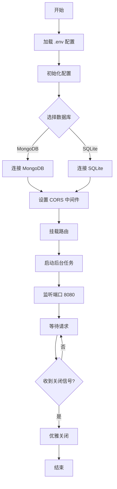

# AGIME Team Server 后端文档

## 概述

agime-team-server 是独立的 Rust/Axum 后端服务，提供团队协作、代理执行、文档管理和实时任务流式传输。支持 MongoDB (主) 和 SQLite (基础) 双数据库。

## 架构概览

```mermaid
graph LR
    subgraph HTTP["HTTP层"]
        Auth[Auth]
        Brand[Brand]
        Agent[Agent]
        Channel[Channel]
    end

    subgraph Service["服务层"]
        AgentService[AgentService]
        AuthService[AuthService]
        PortalService[PortalService]
    end

    subgraph Execution["执行层"]
        DirectHarness[DirectHarness V4<br/>Chat/Channel/Document/Scheduled/AgentTask/Subagent]
        AgentTask[AgentTaskV4Runner]
    end

    subgraph Extension["扩展层"]
        McpConnector[MCP客户端]
        PlatformRunner[平台扩展]
        DocumentTools[文档工具]
    end

    subgraph Data["数据层"]
        MongoDB[(MongoDB)]
        SQLite[(SQLite)]
    end

    HTTP --> Service --> Execution --> Extension --> Data

    style HTTP fill:#667eea,stroke:#667eea,color:#ffffff
    style Service fill:#764ba2,stroke:#764ba2,color:#ffffff
    style Execution fill:#f093fb,stroke:#f093fb,color:#ffffff
    style Extension fill:#4facfe,stroke:#4facfe,color:#ffffff
    style Data fill:#43e97b,stroke:#43e97b,color:#ffffff
```



## 核心模块

### 当前执行主线与上下文主线

`agime server` 当前不要再按旧任务桥接主线理解。服务器执行面已经收口到 DirectHarness V4，压缩主线是 `context_runtime`。

**当前主线：**

1. `chat_executor.rs` / `chat_channel_executor.rs` / `agent_task_v4_runner.rs`
2. `server_harness_host.rs` 的 `DirectHarness`
3. `agime` harness
4. `crates/agime/src/context_runtime/*`

**当前上下文系统：**

- 主内核是 `context_runtime`
- 主行为是 provider 前投影、staged collapse、committed collapse、session memory、overflow recovery
- 逻辑会话通过 `context_runtime_state` 持久化运行时状态

**维护判断原则：**

- 修改上下文行为时，优先看 `crates/agime/src/context_runtime/*`
- 看 direct-host chat 时，优先看 `server_harness_host.rs`
- 看 AgentTask 路径时，优先看 `execution_admission.rs` 和 `agent_task_v4_runner.rs`
- 看 subagent/swarm 时，优先看 `crates/agime` harness 的 `TaskRuntime`

### 1. main.rs — 服务器启动 (977 行)

**启动流程：**



**CLI 子命令：**
```rust
enum Commands {
    Serve,                              // 启动服务器 (默认)
    Mcp { server: String },             // 运行 MCP server
    GenerateLicense { /* ... */ },      // 生成许可证
    GenerateKeypair,                    // 生成 Ed25519 密钥对
    MachineId,                          // 打印机器指纹
}
```

**后台任务：**
- Chat 清理: 每 60 秒，移除 4 小时不活动会话
- Chat/运行时清理: 移除不活动会话和过期运行态
- Scheduled Task 调度: missed recovery、run ledger、delivery 结算
- Auth Session 清理: 每 600 秒，移除过期会话
- 分析清理: 每 300 秒，取消待处理分析

### 2. config.rs — 配置管理 (356 行)

**环境变量：**
```rust
pub struct Config {
    // 数据库
    pub database_type: String,          // "mongodb" | "sqlite"
    pub database_url: String,           // mongodb://localhost:27017
    pub database_name: String,          // agime_team

    // 服务器
    pub host: String,                   // 0.0.0.0
    pub port: u16,                      // 8080
    pub base_url: String,               // 公开 URL

    // 认证
    pub registration_mode: String,      // "open" | "approval" | "disabled"
    pub login_max_failures: u32,        // 5
    pub login_lockout_minutes: u32,     // 15

    // 工作区
    pub workspace_root: String,         // ./data/workspaces

    // 代理配置
    pub team_agent_resource_mode: String,  // "explicit" | "auto"
    pub team_agent_skill_mode: String,     // "assigned" | "on_demand"

    // AI 描述
    pub ai_describe_api_key: Option<String>,
    pub ai_describe_model: Option<String>,
    pub ai_describe_url: Option<String>,
    pub ai_describe_format: Option<String>,
}
```

### 3. auth/ — 认证模块 (1000+ 行)

**实体：**

**User:**
```rust
pub struct User {
    pub user_id: String,
    pub email: String,
    pub display_name: String,
    pub password_hash: String,          // Argon2
    pub role: String,                   // "user" | "admin"
    pub is_active: bool,
    pub created_at: DateTime,
    pub last_login_at: Option<DateTime>,
}
```

**ApiKeyDoc:**
```rust
pub struct ApiKeyDoc {
    pub key_id: String,
    pub user_id: String,
    pub key_prefix: String,             // 前 8 字符
    pub key_hash: String,               // Argon2 哈希
    pub expires_at: Option<DateTime>,
    pub last_used_at: Option<DateTime>,
}
```

**Session:**
- HttpOnly Cookie
- SameSite=Lax
- 可选 Secure flag
- 7 天 TTL
- Sliding window (< 2 小时自动续期)

**路由：**
- `POST /api/auth/register` (public, rate 5/3600s)
- `POST /api/auth/login` (public)
- `POST /api/auth/login/password` (public)
- `GET /api/auth/session` (public)
- `POST /api/auth/logout` (public)
- `GET /api/auth/me` (protected)
- `GET /api/auth/keys` (protected)
- `POST /api/auth/keys` (protected)
- `DELETE /api/auth/keys/{key_id}` (protected)
- `POST /api/auth/change-password` (protected)
- `POST /api/auth/deactivate` (protected)

**中间件：**
- 提取 session cookie 或 X-Authorization header
- 创建 UserContext
- 注入到 Extension

### 4. agent/server_harness_host.rs — DirectHarness V4 host

`server_harness_host.rs` 是当前 chat/channel/document/scheduled-task/AgentTask 的统一执行入口。AgentTask 由 `agent_task_v4_runner.rs` 负责队列和状态结算，再进入同一个 host。

**核心执行管道：**

1. **加载代理配置**
   - API key, model, extensions, skills
   - Provider 选择 (Anthropic/OpenAI/Volcengine)

2. **初始化扩展**
   - MCP servers (child process stdio 或 HTTP)
   - Platform extensions (in-process)

3. **收集工具定义**
   - 从所有扩展源收集
   - 工具名称前缀: `extension_name__tool_name`

4. **创建/恢复 Agent Session**
   - 加载对话历史
   - Context 管理

5. **多轮 LLM 对话**
   - 流式响应
   - Tool 调用处理

6. **Tool 执行**
   - 通过 McpConnector 或 PlatformExtensionRunner
   - 支持并发 tool 调用
   - 超时控制

7. **Token 追踪**
   - 输入/输出 token 计数
   - Context 压缩触发

8. **实时事件流**
   - SSE 流式传输
   - 事件持久化

9. **返回最终结果**

**Workspace 集成：**
- 每个 session/task 独立文件系统
- 自动创建目录结构
- 环境变量设置 (.bash_env)

### 5. agent/service_mongo.rs — AgentService (2000 行)

**Agent CRUD:**
- `create_agent()`: 创建并验证
- `get_agent()`, `update_agent()`, `delete_agent()`
- `list_agents()`: 分页列表

**Task 管理:**
- `submit_task()`, `approve_task()`, `reject_task()`, `cancel_task()`
- `list_tasks()`, `get_task()`, `get_task_results()`

**Session 管理:**
- `create_session()`, `get_session()`, `list_sessions()`, `archive_session()`
- `save_chat_stream_events()`: 批量持久化 (128 事件, 25ms flush)
- `reset_stuck_processing()`: 恢复卡住的会话

**AgentTask 管理:**
- `/api/team/agent/tasks` 保留创建、审批、取消、结果和 SSE stream API
- `execution_admission.rs` 负责队列和并发 slot
- `agent_task_v4_runner.rs` 负责 V4 执行和结果结算

**Admin 工具:**
- `is_team_admin(user_id, team_id)`
- `backfill_session_source_and_visibility()`: 数据迁移
- `ensure_*_indexes()`: 索引创建

### 6. DirectHarness V4 执行系统

**Direct Chat / Channel** (chat_manager.rs, chat_executor.rs, chat_channel_executor.rs, chat_routes.rs)

**特点:**
- 直接多轮对话，绕过 AgentTask HTTP API
- 流程: 用户 → Chat Session → Agent → 多轮对话 → 归档
- ChatManager 追踪活动会话，事件广播
- 入口固定进入 `DirectHarness`
- DirectHarness 主线进入 `server_harness_host.rs`，由 `agime` harness 接管对话、工具、排队恢复和压缩
- 不通过临时任务桥接执行 chat/channel/document/scheduled-task/AgentTask/subagent
- 实时 SSE 流式传输，事件历史持久化
- 过期会话清理 (默认 4 小时不活动)

**ActiveChat 结构:**
```rust
pub struct ActiveChat {
    pub cancel_token: CancellationToken,
    pub stream_tx: broadcast::Sender<ChatStreamEvent>,
    pub run_id: String,
    buffer: Arc<Mutex<EventBuffer>>,
    pub started_at: Instant,
}
```

**AgentTask 后台执行** (routes_mongo.rs, execution_admission.rs, agent_task_v4_runner.rs)

**特点:**
- 保留 `/api/team/agent/tasks` 对外 API、审批、取消、结果集合和 SSE surface
- 生命周期: Approved/Queued → Running → Completed/Failed/Cancelled
- `execution_admission.rs` 获取 agent execution slot；饱和时进入 queued
- `agent_task_v4_runner.rs` 复用/创建 hidden session，然后进入 `ServerHarnessHost`
- 不再创建临时 Mongo task 作为 chat/channel/subagent 执行桥

**AgentTask content 兼容字段:**
- `messages`
- `session_id`
- `workspace_path`
- `turn_system_instruction`
- `llm_overrides`
- `target_artifacts`
- `result_contract`
- `allowed_extensions`
- `allowed_skill_ids`

**执行流程:**
1. 解析 AgentTask content 为用户消息、上下文、workspace 和 contract
2. 加载 agent 配置和 V4 execution policy
3. 创建或复用 hidden session，写入 `session_source = "agent_task"`
4. 调用 `ServerHarnessHost`
5. 将 final summary、completion report、artifact truth 写入 `agent_task_results`
6. 释放 slot，并唤醒同 agent 的下一条 queued task

### 7. agent/mcp_connector.rs — MCP 客户端 (1000 行)

**功能:**
- Tool 定义收集和缓存 (TTL-based)
- Tool 调用执行，带超时
- 多内容结果支持 (text + images)
- 长时间运行任务轮询
- MCP Sampling (通过 agent API 的 LLM 调用)
- Elicitation bridge (用户提示)
- 错误恢复和重连

**Tool 执行流程:**
1. 从所有 MCP servers 收集工具
2. Agent 调用工具 (例如 "developer__text_editor")
3. McpConnector 路由到正确 server
4. Server 执行并返回结果
5. Agent 将结果整合到对话

### 8. agent/platform_runner.rs — 内置扩展

**支持的扩展:**

1. **DocumentTools**: create, read, search, list, update, delete documents
2. **PortalTools**: create, update, publish portals
3. **DeveloperTools**: shell commands, text editor
4. **TeamSkillTools**: 动态技能加载
5. **ChatDeliveryTools**: 普通对话文件预览与下载交付

**实现:**
- 每个扩展实现 McpClientTrait
- Tool 定义收集并加前缀
- Tool 调用路由到正确扩展

### 9. agent/task_manager.rs — 任务追踪

**StreamEvent 枚举 (14+ 变体):**
```rust
pub enum StreamEvent {
    Status { status: String },
    Text { content: String },
    Thinking { content: String },
    ToolCall { name: String, id: String },
    ToolResult { id: String, success: bool, content: String },
    WorkspaceChanged { tool_name: String },
    Turn { current: usize, max: usize },
    Compaction { strategy, before_tokens, after_tokens },
    SessionId { session_id: String },
    Done { status: String, error: Option<String> },
    PermissionRequested { request_id, tool_name },
    PermissionResolved { request_id, decision },
}
```

**事件持久化:**
- 批量写入 MongoDB (128 事件, 25ms flush)
- SSE 流式传输，带 last_event_id 恢复
- TaskManager/ChatManager 维护事件历史

## API 路由总览

### 认证 API
- POST /api/auth/register, login, logout
- GET /api/auth/session, me, keys
- POST /api/auth/keys, change-password

### 品牌与许可证
- GET /api/brand/config
- POST /api/brand/activate
- GET/PUT /api/brand/overrides

### 代理 API
- POST /api/team/agent/agents (create)
- GET /api/team/agent/agents (list)
- GET/PUT/DELETE /api/team/agent/agents/{id}

### 任务 API
- POST /api/team/agent/tasks (submit)
- GET /api/team/agent/tasks (list)
- GET /api/team/agent/tasks/{id}
- POST /api/team/agent/tasks/{id}/approve|reject
- GET /api/team/agent/tasks/{id}/stream (SSE)

### 聊天会话 API
- POST /api/team/agent/chat/sessions
- GET /api/team/agent/chat/sessions (list)
- GET /api/team/agent/chat/sessions/{id}
- POST /api/team/agent/chat/sessions/{id}/send
- GET /api/team/agent/chat/sessions/{id}/stream (SSE)
- POST /api/team/agent/chat/sessions/{id}/archive

### Portal API (公开)
- GET /api/portal/{slug}
- POST /api/portal/{slug}/chat/sessions
- GET /api/portal/{slug}/chat/stream (SSE)

## Workspace 隔离

**结构:**
```
./data/workspaces/
├── teams/
│   └── {team_id}/
│       ├── chat_sessions/
│       │   └── {session_id}/
│       │       ├── files/
│       │       └── artifacts/
│       ├── tasks/
│       │   └── {task_id}/
│       │       ├── runs/
│       │       └── artifacts/
│       └── portals/
│           └── {portal_id}/
│               └── project/
```

**优势:**
- 防止跨会话文件访问
- 支持并发执行
- 会话/任务结束时易于清理
- 每个 workspace 独立 .bash_env

## 后台清理任务

1. **Chat 清理** (每 60 秒): 移除过期会话 (>4 小时不活动)，可配置 TEAM_CHAT_STALE_MAX_AGE_SECS, 最小间隔 15 秒
2. **DirectHarness/AgentTask 队列恢复**: V4 run 释放 slot 后唤醒同 agent 的 queued task
3. **Scheduled Task 调度**: missed recovery、backoff、run ledger 和 delivery 结算
4. **Auth Session 清理** (每 600 秒): 移除过期会话，sliding window 续期
5. **分析清理** (每 300 秒): 取消待处理 AI 分析

## 限速与安全

**限速器:**
- 注册: 5 请求/3600 秒 (per IP)
- 登录: 10 请求/60 秒 (per IP)
- 任务执行: 10 请求/60 秒 (可配置)

**登录防护:**
- 追踪每账户失败次数
- N 次失败后锁定 (默认 5)
- 锁定时长可配置 (默认 15 分钟)

**CORS:**
- 可配置白名单或 mirror_request (dev 模式)
- 允许 GET, POST, PUT, DELETE, OPTIONS
- 允许 credentials (cookies)

**密钥管理:**
- API keys: Argon2 哈希 + 前缀
- UI 仅显示前缀
- 许可证密钥验证
- 日志中环境变量脱敏

## 关键设计模式

1. **Service Layer Architecture**: Routes → Service → DB/Extensions
2. **DirectHarness V4 Runtime**: 统一 chat/channel/document/scheduled-task/AgentTask/subagent 执行面
3. **Factory Pattern**: provider_factory 用于 LLM 选择
4. **Event Sourcing**: StreamEvent + MongoDB 持久化
5. **Async Streaming**: SSE 带事件历史
6. **In-Process Extension**: McpClientTrait 实现
7. **Tool Prefixing**: 避免冲突 ("ext__tool_name")

## 依赖项

**Web**: axum 0.8.1, tower 0.5, tokio 1
**Database**: mongodb 2.8, sqlx 0.7, bson 2.9
**Security**: argon2 0.5, ed25519-dalek 2, sha2 0.10
**Async**: futures 0.3, tokio-util 0.7
**Serialization**: serde 1, serde_json 1
**MCP**: rmcp (client, transports)
**Utilities**: uuid 1, chrono 0.4, tracing 0.1, anyhow 1, clap 4, reqwest 0.12

## 部署建议

**生产环境:**
- 使用 MongoDB (完整功能)
- 配置 BASE_URL 用于邀请链接
- 设置 REGISTRATION_MODE=approval
- 启用 HTTPS (反向代理)
- 配置 CORS 白名单
- 定期备份 MongoDB

**开发环境:**
- SQLite 快速启动
- REGISTRATION_MODE=open
- CORS mirror_request
- 本地 MongoDB 实例

**Docker 部署:**
```yaml
services:
  mongodb:
    image: mongo:6.0
    volumes:
      - mongo-data:/data/db

  team-server:
    image: ghcr.io/agime/team-server:latest
    ports: ["8080:8080"]
    environment:
      DATABASE_URL: mongodb://mongodb:27017
      DATABASE_NAME: agime_team
      REGISTRATION_MODE: approval
      BASE_URL: https://your-domain.com
    volumes:
      - ./data:/app/data
```

## 高级特性

### Portal 系统

**功能:** 创建公开访问的 AI 门户，支持匿名访客与 Agent 交互

**Portal 类型:**
- **Website**: 完整网站门户
- **Widget**: 嵌入式小部件
- **AgentOnly**: 仅 Agent 访问

**配置项:**
- `slug`: URL 唯一标识 (例如: `/portal/my-portal`)
- `coding_agent_id`: Lab 环境使用的 Agent
- `service_agent_id`: 公开服务使用的 Agent
- `allowed_extensions`: 允许的扩展白名单
- `allowed_skill_ids`: 允许的技能白名单
- `document_access_mode`: ReadOnly | CoEditDraft | ControlledWrite
- `bound_documents`: 绑定的文档 ID 列表 (提供上下文)

**访客限制:**
- IP 限速
- 会话时长限制
- 消息数量限制

**使用场景:**
- 客户支持聊天机器人
- 产品演示
- 公开 API 文档助手
- 内部知识库查询

### Smart Log 系统

**功能:** 结构化日志记录系统，支持静态摘要生成

**日志类型:**
- 操作日志 (create, update, delete, install, access)
- 资源变更追踪
- 用户行为分析

**摘要生成:**
- `ai_summary`: 使用fallback模板生成静态摘要
- `ai_summary_status`: 自动标记为"complete"
- 深度AI分析由document_analysis.rs独立处理

**注意:** 当前版本smart_log不直接调用LLM API，使用build_fallback_summary()生成预定义格式的摘要

**数据保留:** 90 天 (MongoDB TTL 自动清理)

**查询 API:**
- `GET /api/team/logs/smart?team_id={id}&action=create&resource_type=skill`
- 支持分页、过滤、排序

### Rate Limiting 系统

**功能:** 多层限速保护

**限速策略:**
1. **IP-based**: 按 IP 地址限速
   - 注册: 5 请求/3600 秒
   - 登录: 10 请求/60 秒
2. **User-based**: 按用户限速
   - 任务提交: 10 请求/60 秒 (可配置)
3. **Global**: 全局限速 (可选)

**配置环境变量:**
- `RATE_LIMIT_REGISTRATION`: 注册限速 (默认 5/3600)
- `RATE_LIMIT_LOGIN`: 登录限速 (默认 10/60)
- `RATE_LIMIT_TASK_EXECUTION`: 任务执行限速 (默认 10/60)

**响应:**
- HTTP 429 Too Many Requests
- `Retry-After` header
- 错误消息: `{error: "Rate limit exceeded", retry_after: 60}`

**实现:** 使用 `rate_limit.rs` 模块，基于 Redis 或内存存储

**内存管理细节:**
- **存储结构**: HashMap<Key, (count, window_start)>
- **Key格式**: `{scope}:{identifier}` (例如: `ip:192.168.1.1`, `user:user-123`)
- **过期清理**: 定期清理过期窗口（每60秒）
- **内存占用**: 每条记录约32字节，1000个活跃限速器约32KB
- **并发安全**: 使用 RwLock 保护共享状态
- **无持久化**: 服务器重启后限速计数器重置

### Prompt Profiles 系统

**功能:** Portal 提示词覆盖系统

**实现方式:**
- 字符串 overlay 生成函数，非独立结构体
- 无 MongoDB 存储，运行时动态生成
- 专为 Portal 系统设计的提示词定制

**可用 Overlay 函数:**
- `build_portal_coding_overlay()`: 为 Portal Lab 环境生成编码优化提示词
- `build_portal_manager_overlay()`: 为 Portal 服务代理生成管理优化提示词

**使用场景:**
- Portal 创建时根据类型选择 overlay
- 运行时将 overlay 附加到 Agent 的基础系统提示词
- 提供 Portal 特定的行为约束和指导

**注意:** 这不是通用的 Prompt Profile 管理系统，而是 Portal 专用的提示词定制机制

## 数字分身系统

### 概述

数字分身（Digital Avatar）是基于 Portal 的高级抽象，提供完整的 AI 代理实例管理和治理能力。

### 数据模型

#### AvatarInstanceDoc

```rust
pub struct AvatarInstanceDoc {
    pub portal_id: String,
    pub team_id: String,
    pub slug: String,
    pub name: String,
    pub status: String,              // draft | published | active | paused
    pub avatar_type: String,         // dedicated | shared | managed
    pub manager_agent_id: Option<String>,
    pub service_agent_id: Option<String>,
    pub document_access_mode: String,
    pub governance_counts: AvatarGovernanceCounts,
    pub portal_updated_at: DateTime<Utc>,
    pub projected_at: DateTime<Utc>,
}
```

#### AvatarGovernanceStateDoc

```rust
pub struct AvatarGovernanceStateDoc {
    pub portal_id: String,
    pub team_id: String,
    pub state: serde_json::Value,
    pub config: serde_json::Value,
    pub updated_at: DateTime<Utc>,
}
```

#### AvatarGovernanceCounts

```rust
pub struct AvatarGovernanceCounts {
    pub pending_capability_requests: u32,
    pub pending_gap_proposals: u32,
    pub pending_optimization_tickets: u32,
    pub pending_runtime_logs: u32,
}
```

### Avatar API 路由

位于 `crates/agime-team/src/routes/mongo/portals.rs`

**Avatar 实例管理**:
- `GET /api/team/avatar/instances` - 列出 Avatar 实例
- `GET /api/team/avatar/instances/:portal_id` - 获取 Avatar 详情
- `POST /api/team/avatar/instances/:portal_id/publish` - 发布 Avatar

**Governance 管理**:
- `GET /api/team/avatar/governance/:portal_id/state` - 获取治理状态
- `GET /api/team/avatar/governance/:portal_id/events` - 获取治理事件
- `POST /api/team/avatar/governance/:portal_id/approve` - 审批治理操作

### Avatar Type 隔离机制

**Dedicated Avatar**:
- 独立的 Manager Agent 和 Service Agent
- 完全隔离的资源和配置
- 适用于高价值场景

**Shared Avatar**:
- 多个 Portal 共享同一 Service Agent
- 资源复用，降低成本
- 适用于标准化服务

**Managed Avatar**:
- 系统自动管理生命周期
- 最小化人工干预
- 适用于快速部署

## 总结

agime-team-server 提供完整的团队协作后端，核心特性：

1. **双数据库支持**: MongoDB (主) + SQLite (基础)
2. **DirectHarness V4 执行面**: Chat/Channel/Document/Scheduled Task/AgentTask/Subagent
3. **实时流式**: SSE 事件流，带恢复机制
4. **Workspace 隔离**: 每个会话/任务独立文件系统
5. **MCP 集成**: 完整 MCP 客户端，支持 stdio/HTTP
6. **Platform Extensions**: 内置 Document/Portal/Developer 工具
7. **AgentTask V4 Runner**: 保留任务 API，执行进入统一 V4 host
8. **认证系统**: Session Cookie + API Key + Bearer Token
9. **后台任务**: 自动清理、恢复、维护
10. **企业级**: 限速、审计、CORS、安全
11. **数字分身**: Avatar 实例管理、Governance 治理系统
