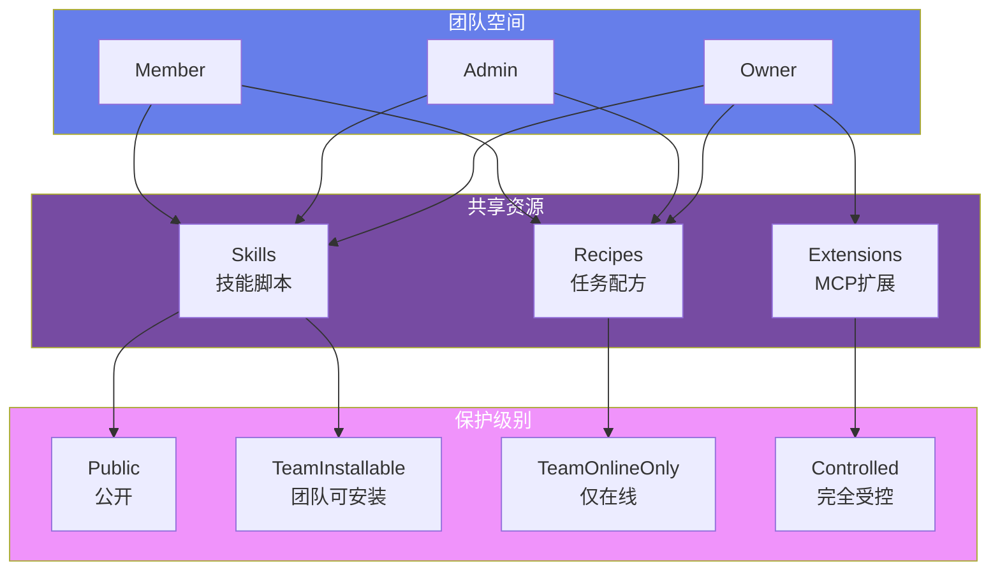
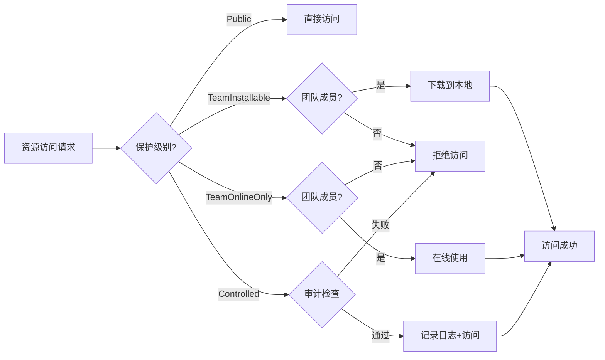

# AGIME 团队协作系统

## 概述

agime-team crate 提供完整的团队协作功能，支持 Skills、Recipes、Extensions 的共享与管理，包含版本控制、权限管理、Git 同步等企业级特性。

## 核心概念

**团队协作架构**：



**权限级别流程**：



### 资源类型

**三种可共享资源：**

1. **Skills (技能)**: Agent 可执行的技能脚本
   - 存储格式: Inline (简单文本) 或 Package (SKILL.md + 文件)
   - 支持依赖声明
   - 版本控制 (semver)

2. **Recipes (配方)**: 多轮任务定义
   - YAML 格式内容
   - 分类: automation, data-processing, development, documentation, testing, deployment, other
   - 参数化支持

3. **Extensions (扩展)**: MCP 扩展
   - 类型: Stdio (命令), SSE (服务器), Builtin
   - 安全审查机制
   - 环境变量配置

### 保护级别 (4 级)

**ProtectionLevel 控制资源访问模式：**

1. **Public**: 公开可用
   - 任何人可安装和复制
   - 无需授权

2. **TeamInstallable**: 团队可安装
   - 需要授权 token
   - 本地安装到用户机器
   - 成员离开团队时自动清理

3. **TeamOnlineOnly**: 仅在线访问
   - 内容永不下载到本地
   - 完整审计日志
   - 适合敏感资源

4. **Controlled**: 完全受控
   - 完整审计日志
   - 使用限制
   - 合规性追踪

## 数据模型

### Team (团队)

```rust
pub struct Team {
    pub team_id: String,
    pub name: String,
    pub owner_id: String,
    pub members: Vec<TeamMember>,
    pub settings: TeamSettings,
    pub created_at: DateTime,
}

pub struct TeamSettings {
    pub extension_review: bool,        // 扩展需要审查
    pub member_invites: bool,          // 成员可邀请
    pub visibility: Visibility,        // Team | Public
}
```

### TeamMember (成员)

```rust
pub struct TeamMember {
    pub user_id: String,
    pub role: MemberRole,              // Owner | Admin | Member
    pub status: MemberStatus,          // Active | Invited | Blocked
    pub permissions: MemberPermissions,
    pub joined_at: DateTime,
}

pub struct MemberPermissions {
    pub can_share: bool,               // 可共享资源
    pub can_install: bool,             // 可安装资源
    pub can_delete_own: bool,          // 可删除自己的资源
}
```

### Skill (技能)

```rust
pub struct Skill {
    pub skill_id: String,
    pub team_id: String,
    pub name: String,
    pub description: String,
    pub storage_type: SkillStorageType, // Inline | Package
    pub content: Option<String>,        // Inline 内容
    pub files: Vec<SkillFile>,          // Package 文件
    pub manifest: Option<SkillManifest>,
    pub metadata: SkillMetadata,
    pub version: String,                // Semver
    pub previous_version_id: Option<String>,
    pub protection_level: ProtectionLevel,
    pub visibility: Visibility,
    pub dependencies: Vec<Dependency>,
    pub tags: Vec<String>,
    pub author_id: String,
    pub created_at: DateTime,
}

pub struct SkillFile {
    pub path: String,
    pub content: String,                // Text or Base64
    pub mime_type: String,
    pub size: u64,
    pub is_binary: bool,
}

pub struct SkillMetadata {
    pub author: Option<String>,
    pub license: Option<String>,
    pub homepage: Option<String>,
    pub repository: Option<String>,
    pub keywords: Vec<String>,
    pub estimated_tokens: Option<u32>,
}
```

### Recipe (配方)

```rust
pub struct Recipe {
    pub recipe_id: String,
    pub team_id: String,
    pub name: String,
    pub description: String,
    pub content_yaml: String,           // YAML 内容
    pub category: RecipeCategory,
    pub version: String,
    pub previous_version_id: Option<String>,
    pub protection_level: ProtectionLevel,
    pub visibility: Visibility,
    pub dependencies: Vec<Dependency>,
    pub tags: Vec<String>,
    pub author_id: String,
    pub created_at: DateTime,
}
```

### Extension (扩展)

```rust
pub struct Extension {
    pub extension_id: String,
    pub team_id: String,
    pub name: String,
    pub description: String,
    pub extension_type: ExtensionType,  // Stdio | SSE | Builtin
    pub config: ExtensionConfig,
    pub security_reviewed: bool,
    pub reviewed_by: Option<String>,
    pub reviewed_at: Option<DateTime>,
    pub security_notes: Option<String>,
    pub version: String,
    pub protection_level: ProtectionLevel,
    pub visibility: Visibility,
    pub author_id: String,
    pub created_at: DateTime,
}

pub struct ExtensionConfig {
    pub cmd: Option<String>,            // Stdio 命令
    pub args: Vec<String>,
    pub uri: Option<String>,            // SSE URI
    pub url: Option<String>,
    pub envs: HashMap<String, String>,
    pub cwd: Option<String>,
    pub timeout: Option<u64>,
    pub bundled: bool,
    pub available_tools: Vec<String>,
}
```

## 安装与授权

### InstalledResource (已安装资源)

```rust
pub struct InstalledResource {
    pub user_id: String,
    pub resource_type: ResourceType,
    pub resource_id: String,
    pub resource_name: String,
    pub team_id: String,
    pub authorization_status: AuthorizationStatus,
    pub installed_at: DateTime,
}

pub enum AuthorizationStatus {
    NotRequired,
    Valid,
    NeedsRefresh,
    Expired,
    Missing,
}
```

### AuthorizationToken (授权令牌)

```rust
pub struct AuthorizationToken {
    pub token_id: String,
    pub user_id: String,
    pub resource_type: ResourceType,
    pub resource_id: String,
    pub team_id: String,
    pub expires_at: DateTime,
    pub created_at: DateTime,
}
```

**授权机制：**
- 默认有效期: 24 小时
- Grace period: 72 小时 (过期后宽限期)
- 自动刷新机制
- 成员离开团队时自动撤销

## 版本控制

### 语义化版本 (Semver)

**版本格式:** `major.minor.patch` (例如: 1.2.3)

**版本链：**
- `previous_version_id` 字段链接到上一版本
- 形成完整版本历史链
- 支持版本回滚

**自动版本递增：**
- 更新资源时自动 patch +1
- 可手动指定 major/minor 升级

### 依赖管理

```rust
pub struct Dependency {
    pub dep_type: ResourceType,
    pub name: String,
    pub version_requirement: String,    // 默认 "*" (任意版本)
}
```

**依赖解析：**
- 安装时自动检查依赖
- 循环依赖检测
- 依赖未找到时报错

## 服务层架构

### 核心服务 (11 个)

1. **TeamService**: 团队 CRUD，设置管理
2. **MemberService** (427 行): 角色管理，权限控制，成员生命周期
3. **SkillService** (673 行): 技能共享，列表，更新，删除
4. **RecipeService** (545 行): 配方操作
5. **ExtensionService** (639 行): 扩展管理，安全审查
6. **InstallService** (574 行): 安装追踪，依赖解析，清理
7. **InviteService**: 邀请码生成，验证
8. **DocumentService** (404 行): 文档存储
9. **AuditService** (485 行): 活动日志，合规追踪
10. **RecommendationService** (528 行): 智能推荐
11. **StatsService** (397 行): 统计分析，趋势

### MongoDB 专用服务

- **SkillServiceMongo** (397 行)
- **PortalServiceMongo** (1232 行)
- **DocumentServiceMongo** (1088 行)
- **FolderServiceMongo**, **DocumentVersionServiceMongo**

## Git 同步 (948 行)

### GitSync 功能

**初始化：**
```rust
pub struct GitSync {
    repo_path: PathBuf,
    config: GitSyncConfig,
}

pub struct GitSyncConfig {
    pub remote_url: Option<String>,
    pub branch: String,
    pub auto_commit: bool,
    pub ssh_key_path: Option<PathBuf>,
}
```

**操作：**
- `init()`: 初始化团队仓库
- `pull()`: 拉取远程更改
- `push()`: 推送本地更改
- `commit()`: 提交资源变更
- `resolve_conflicts()`: 冲突解决

**自动提交：**
- 资源创建/更新/删除时自动 commit
- Commit message 包含操作类型和资源信息
- SSH key + agent 支持

## 数据库架构

### MongoDB Collections

**核心集合：**
- `teams`: 团队信息
- `skills`: 技能资源
- `recipes`: 配方资源
- `extensions`: 扩展资源
- `documents`: 文档存储
- `document_versions`: 文档版本历史
- `document_locks`: 文档锁
- `folders`: 文件夹层次
- `audit_logs`: 审计日志 (180 天 TTL)
- `invites`: 邀请码
- `user_groups`: 用户组
- `team_agents`: 团队代理

**索引策略：**
```javascript
// Teams
{ owner_id: 1 }
{ "members.user_id": 1 }
{ created_at: -1 }

// Skills/Recipes/Extensions
{ team_id: 1 }
{ team_id: 1, name: 1 }  // Compound
{ created_at: -1 }
{ is_deleted: 1 }

// Documents
{ team_id: 1, folder_path: 1 }
{ uploaded_by: 1 }
{ is_deleted: 1 }

// TTL Indexes
{ created_at: 1 } expireAfterSeconds: 15552000  // 180 days (audit_logs)
{ created_at: 1 } expireAfterSeconds: 7776000   // 90 days (auth_audit_logs)
{ expires_at: 1 } expireAfterSeconds: 0         // document_locks
```

### SQLite Schema (Legacy)

**主要表：**
- `teams`: id, name, owner_id, created_at, settings_json
- `shared_skills`: team_id, name, content, version, protection_level
- `shared_recipes`: team_id, name, content_yaml, category
- `shared_extensions`: team_id, name, config_json, security_reviewed
- `installed_resources`: user_id, resource_type, resource_id, authorization_status
- `audit_logs`: team_id, user_id, action, resource_type, timestamp
- `invites`: code, team_id, role, expires_at, max_uses

**外键约束：**
- CASCADE DELETE on team deletion
- 唯一约束: team_id + name + version

## HTTP API 路由

### 路由组织

**顶级路由：**
```
/teams                  - 团队 CRUD
/teams/{id}/members     - 成员管理
/teams/{id}/invites     - 邀请管理
/skills                 - 技能共享
/recipes                - 配方操作
/extensions             - 扩展操作
/documents              - 文档存储
/folders                - 文件夹管理
/recommendations        - 推荐 API
/sync                   - Git 同步
/unified                - 统一资源 API
```

**关键路由文件：**
- `skills.rs` (1451 行): 最复杂，包含安装/本地安装/授权
- `documents.rs` (1038 行): 文档管理
- `teams.rs` (975 行): 团队操作
- `portals.rs` (845 行): Portal 管理

## 错误处理

### TeamError 枚举

```rust
pub enum TeamError {
    // Not Found
    TeamNotFound,
    MemberNotFound,
    InviteNotFound,
    ResourceNotFound,

    // Permission
    PermissionDenied,
    CannotRemoveOwner,
    OwnerCannotLeave,

    // Conflicts
    ResourceExists,
    TeamExists,
    MemberExists,

    // Validation
    InvalidContent,
    InvalidResourceName,
    InvalidVersion,

    // Dependencies
    DependencyNotFound,
    CircularDependency,

    // Operations
    SyncFailed,
    Database(String),
    Io(std::io::Error),
    Serialization(String),
    Internal(String),
}
```

**HTTP 状态映射：**
- 400: InvalidContent, InvalidResourceName, InvalidVersion
- 403: PermissionDenied, CannotRemoveOwner, OwnerCannotLeave
- 404: *NotFound errors
- 409: *Exists errors, CircularDependency
- 422: DependencyNotFound
- 500: Database, Io, Serialization, Internal, SyncFailed

## 安全特性

### 资源名称验证

**禁止模式：**
- 路径遍历: `../`, `..\\`
- 危险字符: `<script>`, `{{`, `}}`
- 空名称或纯空格

### 授权 Token 管理

**生命周期：**
1. 创建: 安装受保护资源时生成
2. 验证: 每次访问时检查有效性
3. 刷新: 过期前自动刷新
4. 撤销: 成员离开团队时撤销

**Grace Period (72 小时):**
- Token 过期后 72 小时内仍可使用
- 期间提示用户刷新
- 超过宽限期后强制重新授权

### 审计日志

**记录内容：**
- 操作类型 (create, update, delete, install, access)
- 资源类型和 ID
- 用户 ID 和名称
- 时间戳
- 内容快照 (可选)

**保留策略：**
- 标准审计日志: 180 天
- 认证审计日志: 90 天
- 自动清理 (MongoDB TTL index)

## MCP 集成

### Team Extension

**工具名称:** `team`

**暴露的工具：**
- 团队资源管理
- 技能/配方/扩展操作
- 成员管理
- 安装追踪

**集成模式：**
- Agent 可通过 MCP 协议访问团队功能
- 工具定义自动生成
- 参数验证与类型安全

## 配置选项

### TeamConfig

```rust
pub struct TeamConfig {
    pub enabled: bool,                          // 功能开关
    pub allow_unreviewed_extensions: bool,      // 允许未审查扩展
    pub auto_install_dependencies: bool,        // 自动安装依赖
    pub default_visibility: Visibility,         // 默认可见性
    pub max_teams_per_user: u32,               // 每用户最大团队数 (10)
    pub max_members_per_team: u32,             // 每团队最大成员数 (100)
    pub soft_delete_retention_days: u32,       // 软删除保留天数 (30)
    pub sync_interval_seconds: u64,            // 同步间隔 (0=手动)
}
```

## 设计模式

### Soft Deletion (软删除)

**实现：**
- `is_deleted` 标志位
- 保留期: 默认 30 天
- TTL 自动硬删除
- 恢复功能

### Package Format (包格式)

**Skill Package 结构：**
```
skill-name/
├── SKILL.md          # 主文件 (YAML frontmatter + 内容)
├── scripts/          # 脚本文件
├── references/       # 参考文档
└── assets/           # 资源文件
```

**SKILL.md Frontmatter:**
```yaml
---
name: skill-name
version: 1.0.0
description: Skill description
author: Author Name
license: MIT
dependencies:
  - type: skill
    name: dependency-skill
    version: "^1.0.0"
---
Skill content here...
```

### Hierarchical Organization (层次组织)

**文档文件夹：**
- 嵌套文件夹结构
- 路径索引
- 树形显示模型 (FolderTreeNode)
- 文档计数

### Concurrency Control (并发控制)

**乐观锁：**
- ETag/ConcurrencyService
- 版本号冲突检测

**悲观锁：**
- DocumentLock with TTL
- 自动过期释放

## 使用示例

### 创建并共享 Skill

```rust
// 1. 创建 Skill
let skill = Skill {
    name: "data-processor".to_string(),
    description: "Process CSV data".to_string(),
    storage_type: SkillStorageType::Inline,
    content: Some("#!/bin/bash\n...".to_string()),
    protection_level: ProtectionLevel::TeamInstallable,
    visibility: Visibility::Team,
    version: "1.0.0".to_string(),
    ...
};

// 2. 保存到团队
skill_service.create_skill(team_id, skill).await?;

// 3. 成员安装
install_service.install_skill(user_id, team_id, skill_id).await?;

// 4. 授权验证
let token = auth_service.create_authorization_token(
    user_id, ResourceType::Skill, skill_id, team_id
).await?;
```

### Git 同步工作流

```rust
// 1. 初始化 Git 仓库
let git_sync = GitSync::new(repo_path, config);
git_sync.init(remote_url).await?;

// 2. 资源变更时自动提交
skill_service.update_skill(skill_id, updates).await?;
// → 自动触发 git commit

// 3. 定期同步
git_sync.pull().await?;  // 拉取远程更改
git_sync.push().await?;  // 推送本地更改

// 4. 冲突解决
if let Err(ConflictError) = git_sync.pull().await {
    git_sync.resolve_conflicts(strategy).await?;
}
```

## 总结

agime-team crate 提供企业级团队协作功能，核心特性包括：

1. **资源共享**: Skills/Recipes/Extensions 统一管理
2. **4 级保护**: 灵活的访问控制
3. **版本控制**: Semver + 版本链
4. **授权机制**: Token-based with grace period
5. **Git 同步**: 完整版本历史
6. **审计日志**: 合规性追踪
7. **双数据库**: MongoDB (主) + SQLite (遗留)
8. **MCP 集成**: Agent 可编程访问
9. **安全特性**: 路径验证、审查机制、软删除
10. **可扩展**: 清晰的服务层架构
