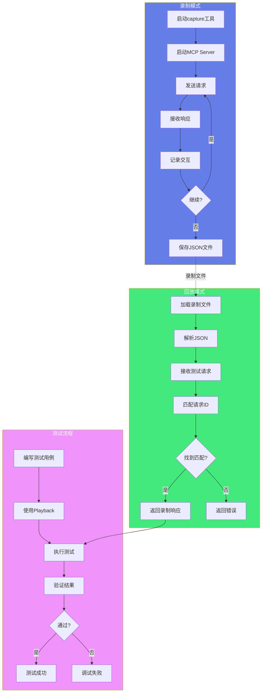

# AGIME 测试框架

## 概述

agime-test 提供 MCP 集成测试工具，支持录制和回放 MCP 交互，用于创建可重复的测试用例和调试 MCP 集成问题。

## 核心功能

**MCP录制回放架构**:



### MCP 交互录制

录制 MCP server 的 stdio 交互，用于：
- **创建可重复的测试用例**：确保测试结果一致
- **调试 MCP 集成问题**：重现和分析问题
- **验证 MCP 协议实现**：确保协议正确性
- **离线测试**：无需实际 MCP server
- **性能基准测试**：对比不同版本的性能

### 交互回放

回放录制的交互，实现：
- **确定性测试**：每次运行结果相同
- **快速测试执行**：无需等待实际 MCP server 响应
- **并行测试**：多个测试同时运行
- **回归测试**：验证代码变更不影响功能

## 录制工具使用

### 基本录制

```bash
# 录制 MCP server 交互
cargo run --bin capture -- \
  --command "npx -y @modelcontextprotocol/server-memory" \
  --output recordings/memory-server.json
```

### 高级录制选项

```bash
# 带超时的录制
cargo run --bin capture -- \
  --command "mcp-server" \
  --output recording.json \
  --timeout 60

# 录制特定场景
cargo run --bin capture -- \
  --command "mcp-server" \
  --output recording.json \
  --scenario "tool_list_and_call"

# 录制多个交互
cargo run --bin capture -- \
  --command "mcp-server" \
  --output recording.json \
  --interactions 10
```

### 录制文件格式

```json
{
  "version": "1.0",
  "server_command": "npx -y @modelcontextprotocol/server-memory",
  "recorded_at": "2024-01-01T10:00:00Z",
  "interactions": [
    {
      "request": {
        "jsonrpc": "2.0",
        "id": 1,
        "method": "tools/list",
        "params": {}
      },
      "response": {
        "jsonrpc": "2.0",
        "id": 1,
        "result": {
          "tools": [
            {
              "name": "store_memory",
              "description": "Store a memory",
              "inputSchema": {
                "type": "object",
                "properties": {
                  "key": {"type": "string"},
                  "value": {"type": "string"}
                }
              }
            }
          ]
        }
      },
      "timestamp": "2024-01-01T10:00:01Z",
      "duration_ms": 150
    }
  ]
}
```

### 回放录制

```rust
use agime_test::mcp::stdio::playback::Playback;

let playback = Playback::from_file("recording.json")?;
let response = playback.get_response(request_id)?;
```

### 回放模式

**精确回放**：
```rust
// 严格匹配请求ID和顺序
let playback = Playback::from_file("recording.json")?;
playback.set_strict_mode(true);
```

**灵活回放**：
```rust
// 允许请求顺序变化
let playback = Playback::from_file("recording.json")?;
playback.set_strict_mode(false);
```

**部分回放**：
```rust
// 只回放特定交互
let playback = Playback::from_file("recording.json")?;
let filtered = playback.filter_by_method("tools/list")?;
```

## 测试示例

### 集成测试

```rust
#[tokio::test]
async fn test_mcp_integration() {
    // 使用录制的交互
    let playback = Playback::from_file("tests/recordings/developer.json")?;

    // 验证响应
    let response = playback.get_response(1)?;
    assert!(response.result.is_some());
}
```

### 完整测试流程

```rust
use agime_test::mcp::stdio::{playback::Playback, record::Recorder};

#[tokio::test]
async fn test_memory_server_workflow() {
    // 1. 加载录制
    let playback = Playback::from_file("tests/recordings/memory-workflow.json")?;

    // 2. 测试工具列表
    let tools_response = playback.get_response_by_method("tools/list")?;
    assert_eq!(tools_response.result.tools.len(), 3);

    // 3. 测试存储操作
    let store_response = playback.get_response_by_method("tools/call")?;
    assert!(store_response.result.success);

    // 4. 测试检索操作
    let retrieve_response = playback.get_next_response()?;
    assert!(retrieve_response.result.content.is_some());
}
```

### 参数化测试

```rust
#[rstest]
#[case("anthropic", "weather_tool.json")]
#[case("openai", "weather_tool.json")]
#[case("google", "weather_tool.json")]
async fn test_provider_compatibility(
    #[case] provider: &str,
    #[case] recording: &str
) {
    let path = format!("tests/recordings/{}/{}", provider, recording);
    let playback = Playback::from_file(&path)?;

    // 验证所有provider的响应格式一致
    let response = playback.get_response(1)?;
    assert!(response.result.is_some());
}
```

### 错误处理测试

```rust
#[tokio::test]
async fn test_error_handling() {
    let playback = Playback::from_file("tests/recordings/error-cases.json")?;

    // 测试工具不存在错误
    let error_response = playback.get_response_by_method("tools/call")?;
    assert!(error_response.error.is_some());
    assert_eq!(error_response.error.unwrap().code, -32601);

    // 测试参数错误
    let param_error = playback.get_next_response()?;
    assert_eq!(param_error.error.unwrap().code, -32602);
}
```

### 性能测试

```rust
#[tokio::test]
async fn test_performance() {
    let playback = Playback::from_file("tests/recordings/performance.json")?;

    let start = Instant::now();
    for i in 1..=100 {
        let _ = playback.get_response(i)?;
    }
    let duration = start.elapsed();

    // 验证回放性能
    assert!(duration.as_millis() < 1000, "Playback too slow");
}
```

## 录制文件管理

**存储位置**：
- 测试录制：`crates/agime/tests/mcp_replays/`
- 场景测试：`crates/agime-cli/src/scenario_tests/recordings/`

**命名规范**：
- `{provider}-{scenario}.json`
- 例如：`anthropic-weather_tool.json`

**目录结构**：
```
tests/recordings/
├── anthropic/
│   ├── weather_tool.json
│   ├── image_analysis.json
│   └── context_length_exceeded.json
├── openai/
│   ├── weather_tool.json
│   └── image_analysis.json
└── google/
    └── what_is_your_name.json
```

### 录制文件版本控制

**提交录制文件**：
```bash
# 添加新录制
git add tests/recordings/new-scenario.json

# 更新现有录制
git add tests/recordings/updated-scenario.json
git commit -m "test: update MCP recording for scenario X"
```

**录制文件审查清单**：
- [ ] 移除敏感信息（API keys、个人数据）
- [ ] 验证录制完整性（请求-响应配对）
- [ ] 添加录制说明注释
- [ ] 测试回放功能
- [ ] 文件大小合理（< 1MB）

### 录制文件维护

**定期更新**：
```bash
# 批量重新录制
./scripts/update-recordings.sh

# 验证所有录制
./scripts/verify-recordings.sh
```

**清理过期录制**：
```bash
# 查找未使用的录制
find tests/recordings -name "*.json" -mtime +180

# 删除过期录制
./scripts/cleanup-old-recordings.sh
```

## 最佳实践

1. **录制真实场景**：使用实际的 MCP server 录制
2. **验证录制完整性**：确保请求和响应配对
3. **定期更新录制**：MCP server 更新后重新录制
4. **隔离测试**：每个测试使用独立的录制文件
5. **移除敏感信息**：录制前清理 API keys 和个人数据
6. **版本控制**：将录制文件纳入 Git 管理
7. **文档化场景**：为每个录制添加说明注释
8. **自动化验证**：在 CI 中运行录制验证

## 测试策略

### 单元测试策略

**测试 MCP 协议解析**：
```rust
#[test]
fn test_request_parsing() {
    let json = r#"{"jsonrpc":"2.0","id":1,"method":"tools/list"}"#;
    let request: MCPRequest = serde_json::from_str(json).unwrap();
    assert_eq!(request.method, "tools/list");
}
```

**测试响应序列化**：
```rust
#[test]
fn test_response_serialization() {
    let response = MCPResponse {
        jsonrpc: "2.0".to_string(),
        id: 1,
        result: Some(json!({"tools": []})),
        error: None,
    };
    let json = serde_json::to_string(&response).unwrap();
    assert!(json.contains("tools"));
}
```

### 集成测试策略

**测试完整工作流**：
```rust
#[tokio::test]
async fn test_complete_workflow() {
    // 1. 初始化
    let playback = Playback::from_file("workflow.json")?;

    // 2. 工具发现
    let tools = playback.get_tools_list()?;
    assert!(!tools.is_empty());

    // 3. 工具调用
    let result = playback.call_tool("store_memory", params)?;
    assert!(result.success);

    // 4. 结果验证
    let verification = playback.verify_result()?;
    assert!(verification.passed);
}
```

### 端到端测试策略

**测试真实场景**：
```rust
#[tokio::test]
#[ignore] // 需要实际 MCP server
async fn test_e2e_memory_server() {
    // 启动真实 MCP server
    let server = start_mcp_server("memory").await?;

    // 执行操作
    let client = MCPClient::connect(server.address()).await?;
    let tools = client.list_tools().await?;

    // 验证结果
    assert!(tools.iter().any(|t| t.name == "store_memory"));

    // 清理
    server.shutdown().await?;
}
```

## CI/CD 集成

### GitHub Actions 配置

```yaml
name: MCP Tests

on: [push, pull_request]

jobs:
  test:
    runs-on: ubuntu-latest
    steps:
      - uses: actions/checkout@v3

      - name: Setup Rust
        uses: actions-rs/toolchain@v1
        with:
          toolchain: stable

      - name: Run MCP Tests
        run: |
          cargo test --package agime-test
          cargo test --package agime -- mcp_integration

      - name: Verify Recordings
        run: |
          ./scripts/verify-recordings.sh

      - name: Upload Test Results
        if: failure()
        uses: actions/upload-artifact@v3
        with:
          name: test-results
          path: target/test-results/
```

### 录制更新自动化

```yaml
name: Update MCP Recordings

on:
  schedule:
    - cron: '0 0 * * 0' # 每周日运行
  workflow_dispatch:

jobs:
  update-recordings:
    runs-on: ubuntu-latest
    steps:
      - uses: actions/checkout@v3

      - name: Update Recordings
        run: |
          ./scripts/update-recordings.sh

      - name: Create Pull Request
        uses: peter-evans/create-pull-request@v5
        with:
          title: 'chore: update MCP recordings'
          body: 'Automated update of MCP test recordings'
          branch: update-mcp-recordings
```

## 故障排查

### 常见问题

**问题：录制文件损坏**
```bash
# 验证 JSON 格式
jq . tests/recordings/file.json

# 修复格式
jq . tests/recordings/file.json > fixed.json
```

**问题：回放不匹配**
```rust
// 启用调试模式
let mut playback = Playback::from_file("recording.json")?;
playback.set_debug(true);
playback.set_strict_mode(false);
```

**问题：录制超时**
```bash
# 增加超时时间
cargo run --bin capture -- \
  --command "mcp-server" \
  --timeout 300 \
  --output recording.json
```

## 性能优化

### 录制文件压缩

```bash
# 压缩大型录制
gzip tests/recordings/large-recording.json

# 使用时解压
gunzip -c tests/recordings/large-recording.json.gz | cargo test
```

### 并行测试

```rust
// 使用 tokio 并行运行测试
#[tokio::test(flavor = "multi_thread", worker_threads = 4)]
async fn test_parallel_playback() {
    let handles: Vec<_> = (0..10)
        .map(|i| {
            tokio::spawn(async move {
                let playback = Playback::from_file(&format!("test-{}.json", i))?;
                playback.run().await
            })
        })
        .collect();

    for handle in handles {
        handle.await??;
    }
}
```

## 相关文档

- [MCP 协议](MCP_PROTOCOL.md) - MCP 集成详情
- [性能测试](BENCHMARKING.md) - 性能测试框架
