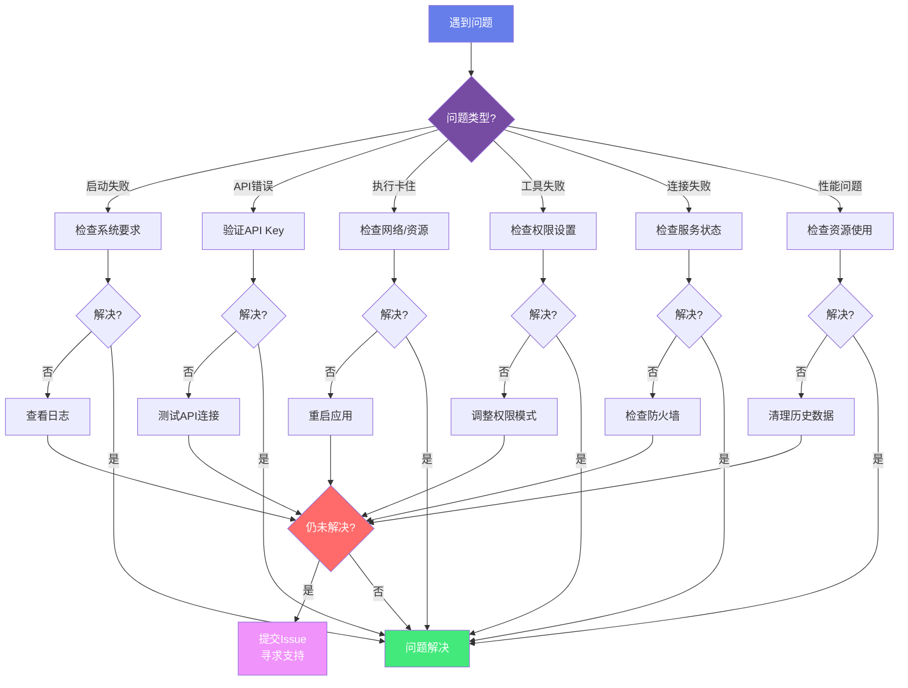

# AGIME 故障排查手册

**故障诊断流程**:



## 常见问题诊断

### 安装和启动问题

#### 问题：应用无法启动

**症状**：双击应用无响应或闪退

**排查步骤**：
1. 检查系统要求（Windows 10+, macOS 10.15+, Linux）
2. 查看日志文件：
   - Windows: `%APPDATA%\AGIME\logs\`
   - macOS: `~/Library/Logs/AGIME/`
   - Linux: `~/.config/AGIME/logs/`
3. 尝试从命令行启动查看错误信息

**解决方案**：
- 重新安装应用
- 检查防火墙/杀毒软件设置
- 确保有足够的磁盘空间

#### 问题：API Key 配置失败

**症状**：提示 API Key 无效

**排查步骤**：
1. 验证 API Key 格式正确
2. 检查 API Key 权限
3. 测试网络连接

**解决方案**：
```bash
# 测试 API 连接
curl -H "Authorization: Bearer YOUR_API_KEY" \
  https://api.anthropic.com/v1/messages
```

### 运行时问题

#### 问题：Agent 执行卡住

**症状**：任务长时间无响应

**排查步骤**：
1. 检查网络连接
2. 查看 CPU/内存使用
3. 检查日志中的错误

**解决方案**：
- 设置合理的超时时间
- 检查 MCP 扩展状态
- 重启应用

#### 问题：工具调用失败

**症状**：提示工具执行错误

**排查步骤**：
1. 检查工具权限设置
2. 验证工作目录路径
3. 查看工具日志

**解决方案**：
- 调整权限模式（自主/智能/手动）
- 检查文件系统权限
- 更新 MCP 扩展

### Team Server 问题

#### 问题：无法连接 Team Server

**症状**：连接超时或拒绝

**排查步骤**：
1. 检查服务器是否运行
2. 验证网络连接
3. 检查防火墙规则

**解决方案**：
```bash
# 检查服务状态
curl http://localhost:3000/api/status

# 查看服务日志
tail -f /var/log/agime-team-server.log
```

#### 问题：MongoDB 连接失败

**症状**：Team Server 启动失败

**排查步骤**：
1. 检查 MongoDB 服务状态
2. 验证连接字符串
3. 检查认证配置

**解决方案**：
```bash
# 测试 MongoDB 连接
mongosh "mongodb://localhost:27017/agime_team"

# 检查环境变量
echo $MONGODB_URI
```

### 性能问题

#### 问题：响应缓慢

**症状**：操作延迟明显

**排查步骤**：
1. 检查网络延迟
2. 查看系统资源使用
3. 检查上下文大小

**解决方案**：
- 使用更快的模型
- 启用上下文压缩
- 清理历史会话

#### 问题：内存占用过高

**症状**：系统变慢或崩溃

**排查步骤**：
1. 查看会话数量
2. 检查扩展加载
3. 监控内存使用

**解决方案**：
- 关闭不用的会话
- 禁用不必要的扩展
- 定期重启应用

## 日志分析

### 日志位置

**桌面应用**：
- Windows: `%APPDATA%\AGIME\logs\main.log`
- macOS: `~/Library/Logs/AGIME/main.log`
- Linux: `~/.config/AGIME/logs/main.log`

**Team Server**：
- 标准输出/错误
- 配置的日志文件路径

### 日志级别

- `ERROR`: 错误信息
- `WARN`: 警告信息
- `INFO`: 一般信息
- `DEBUG`: 调试信息

### 常见错误信息

**"Connection timeout"**
- 网络问题或服务不可达
- 检查网络和防火墙

**"Authentication failed"**
- API Key 无效或过期
- 重新配置认证信息

**"Tool execution failed"**
- 工具权限不足或参数错误
- 检查权限设置和参数

## 诊断工具

### 系统信息收集

```bash
# 收集系统信息
agime info

# 输出包括：
# - 版本信息
# - 系统环境
# - 配置状态
# - 扩展列表
```

### 网络诊断

```bash
# 测试 API 连接
curl -v https://api.anthropic.com/v1/messages

# 测试 Team Server
curl http://localhost:3000/api/status
```

### 数据库诊断

```bash
# MongoDB 状态
mongosh --eval "db.serverStatus()"

# SQLite 检查
sqlite3 agime_team.db ".schema"
```

## 数据恢复

### 会话恢复

会话数据位置：
- 桌面：`~/.agime/sessions/`
- Team Server：MongoDB/SQLite

**恢复步骤**：
1. 备份当前数据
2. 从备份恢复会话文件
3. 重启应用

### 配置恢复

配置文件位置：
- `~/.agime/config.yaml`
- `~/.agime/profiles/`

**重置配置**：
```bash
# 备份配置
cp ~/.agime/config.yaml ~/.agime/config.yaml.bak

# 删除配置（将使用默认值）
rm ~/.agime/config.yaml
```

## 获取支持

### 报告 Bug

1. 收集信息：
   - 版本号
   - 操作系统
   - 错误日志
   - 复现步骤

2. 提交 Issue：
   - GitHub: https://github.com/jsjm1986/AGIME/issues
   - 使用 Bug 报告模板

### 社区支持

- GitHub Discussions
- 微信：agimeme（企业服务）

## 预防措施

1. **定期备份**：备份会话和配置
2. **及时更新**：保持应用最新版本
3. **监控资源**：关注系统资源使用
4. **测试配置**：新配置先在测试环境验证
