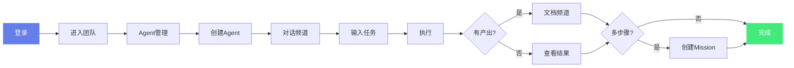

# AGIME 用户使用说明（小白版）

这份文档不是给工程师写的。  
目标是让第一次接触 AGIME 的用户，也能看懂每个频道是做什么、什么时候用、怎么用。

## 1. 先用一句话理解 AGIME

AGIME 不是只会聊天的 AI。  
它是“能执行任务、能管理文档、能团队协作、能对外服务”的 AI 工作系统。

你可以把它理解成：
- 对话频道 = 跟 AI 说需求
- Agent 频道 = 安排 AI 执行任务
- 文档频道 = 管理和交付结果
- 生态协作 = 对外发布可访问页面
- 数字分身 = 让一个“管理 Agent”持续治理多个“服务分身”

---

## 2. 功能地图（先看这个）

| 频道 | 你能做什么 | 适合什么时候用 |
|---|---|---|
| `对话` | 直接问问题、让 Agent 执行单次任务 | 临时问题、快速处理 |
| `Agent` | 管理 Agent、跑多步骤任务、看任务队列 | 复杂任务、流程化执行 |
| `文档` | 文件夹管理、AI 工作台、文档渊源、回收站 | 管理产出、版本追踪、归档 |
| `技能库` | 管理 Skills / Recipes / Extensions | 沉淀团队能力、减少重复工作 |
| `智能日志` | 看资源活动和 AI 洞察 | 复盘使用情况、发现优化点 |
| `生态协作` | 创建并发布 Portal，对外提供服务 | 给客户/合作方开放访问入口 |
| `数字分身` | 管理 Agent + 分身 Agent 协同治理 | 长期运营、自动优化、能力审批 |
| `团队管理` | 成员、分组、邀请、团队设置 | 权限治理和组织协作 |

---

## 3. 新手 10 分钟上手

**快速上手流程**：

### 第 1 步：进入团队
- 登录后进入某个团队空间。
- 左侧会看到频道导航（对话、Agent、文档等）。

### 第 2 步：先准备一个可用 Agent
- 打开 `Agent -> Agent 管理`。
- 选一个模型，保存一个可用 Agent。
- 不确定怎么配时，先用默认参数，后续再调。

### 第 3 步：先跑一个简单任务
- 打开 `对话` 频道，选择你刚才的 Agent。
- 直接输入目标，例如：  
  “帮我整理这份文档要点，生成一个可发给客户的摘要。”

### 第 4 步：查看产出
- 如果任务产出了文件，去 `文档` 频道查看。
- 需要进入文档体系管理时，先在 `AI 工作台` 接收，再归档到目标文件夹。

### 第 5 步：再升级到多步骤任务
- 打开 `Agent -> 任务看板` 创建 Mission（分步任务）。
- 适合“分析 + 生成 + 校验 + 交付”这种流程型工作。

---

## 4. 分频道详细说明

### 4.1 对话频道：最快的入口

你可以把它当成“即时执行入口”：
- 问答
- 临时任务
- 快速验证一个想法

建议做法：
- 一次只说一个目标，减少歧义。
- 复杂任务建议改到 `任务看板`，成功率更稳定。
- 先让 Agent 复述目标，再执行，可以明显减少跑偏。

---

### 4.2 Agent 频道：任务中枢

`Agent` 频道有 3 个核心子页：

1. `Agent 管理`
- 创建/编辑 Agent
- 配置扩展、技能、访问控制
- 区分常规 Agent 与数字分身专用 Agent（隔离区）

2. `任务看板`
- 面向多步骤 Mission（规划 -> 执行 -> 校验 -> 完成）
- 可查看 `输出 / 产出物 / 运行日志`
- 失败后可继续任务（按当前状态恢复）

3. `任务队列`
- 用于审批、排队和任务状态管理
- 适合多人协作时的可控执行

---

### 4.3 文档频道：结果管理中心

文档频道不是“文件列表”，而是“完整文档工作流”。

包含 4 个视图：

1. `文件夹`
- 上传、搜索、预览、下载、重命名、分类

2. `AI 工作台`
- 管理 AI/任务相关文档状态（如草稿、已接收、已归档）
- 适合处理“先审阅再入库”的场景

3. `文档渊源`
- 追踪文档来源与关系（谁生成、从哪里来、如何演进）

4. `回收站`
- 误删恢复

常见流程（推荐）：
1. 任务产出文档  
2. 在 `AI 工作台` 接收  
3. 确认命名/内容  
4. 归档到正式文件夹

---

### 4.4 技能库：团队能力沉淀

`技能库` 分为：
- `Skills`：能力模板（怎么做）
- `Recipes`：流程模板（按步骤做）
- `Extensions`：工具能力（能做什么）

推荐思路：
- 先把“高频重复任务”沉淀为 Recipe
- 再逐步沉淀成团队标准能力

---

### 4.5 智能日志：看清团队实际在发生什么

`智能日志` 可以看到：
- 资源活动（谁在用什么）
- AI 洞察（有哪些可优化点）

这不是审计负担，而是让你知道：
- 团队时间花在哪里
- 哪些能力值得继续投入
- 哪些流程需要收敛

---

### 4.6 生态协作：对外服务入口（Portal）

当你要把团队能力开放给客户/合作方时，用这个频道。

常见动作：
- 创建 Portal
- 绑定 `编程 Agent` 与 `服务 Agent`
- 配置文档范围、扩展白名单、技能白名单
- 发布后复制链接给外部用户访问

文档访问模式（简单理解）：
- `只读`：只能看，不能写
- `协作草稿`：可协作草稿，写入范围受限
- `受控写入`：允许写入，但按策略管控

建议：
- 对外默认从 `只读` 起步
- 只给最小必要权限，再按需求逐步放开

---

### 4.7 数字分身：长期运营模式（Manager-First）

数字分身不是“再建一个聊天机器人”。  
它是“管理 Agent + 分身 Agent”的治理体系。

核心机制：
- 管理 Agent：负责判断、治理、审批、优化
- 分身 Agent：负责执行具体服务

创建分身时：
- 你选择模板 Agent
- 系统会基于模板配置生成“专用 Agent”（与常规 Agent 隔离）

在分身工作台你可以：
- 直接与管理 Agent 对话创建/调整分身
- 查看能力缺口请求、缺口提案、优化工单
- 查看完整运行事件和治理决策审计

建议：
- 把管理 Agent 当“分身运营经理”
- 用户尽量通过管理对话驱动配置，不要手工到处改

---

### 4.8 团队管理：协作规则入口

这里是组织层面管理：
- 成员管理
- 用户分组
- 邀请机制
- 团队设置

推荐做法：
- 按部门/项目建立分组
- 用分组做权限而不是给个人逐一配置

---

## 5. 三种常见业务场景（照着用）

### 场景 A：个人先把任务做完
1. 对话频道提需求  
2. 让 Agent 生成结果  
3. 在文档频道整理并归档

### 场景 B：团队复用同一套流程
1. Agent 跑任务看板  
2. 产出进 AI 工作台  
3. 团队审核后归档  
4. 沉淀到 Skills/Recipes 供全员复用

### 场景 C：给外部客户提供服务
1. 在生态协作创建 Portal  
2. 配好服务 Agent 能力边界  
3. 发布链接  
4. 用数字分身持续运营和优化

---

## 6. 让系统更稳定的 6 个建议

1. 复杂任务尽量用 `任务看板`，不要硬塞到单轮对话里。  
2. 目标描述里加“成功标准”和“交付格式”。  
3. 先给最小权限，跑通后再增权。  
4. 高频任务优先模板化（Recipe）。  
5. 结果先接收再归档，避免文件散落。  
6. 定期看智能日志，持续清理低价值流程。  

---

## 7. 常见问题（小白版）

### Q1：我只会聊天，不会配系统，能用吗？
可以。先从 `对话` + `文档` 两个频道开始，其他功能按需要再开。

### Q2：为什么任务完成了，但我在文件夹里没看到？
先去 `文档 -> AI 工作台` 看是否还在“待接收/草稿”状态。接收后再归档到文件夹。

### Q3：什么时候该用“任务看板”？
当任务超过一个动作（例如“分析 + 生成 + 校验 + 交付”）就建议用任务看板。

### Q4：对外发布最怕什么？
权限开太大。建议先只读，再逐步开放。

### Q5：数字分身和普通 Agent 的区别？
普通 Agent 偏“执行”；数字分身是“可治理、可持续优化、可审计”的长期运营单元。

---

## 8. 推荐落地顺序（最稳）

1. 先跑通 `对话 -> 文档`  
2. 再引入 `任务看板`（流程化）  
3. 再建设 `技能库`（可复用）  
4. 最后做 `生态协作 + 数字分身`（对外与长期运营）

---

如果你是团队管理员，建议下一步同时阅读：
- `docs/TEAM_SERVER.md`（后端能力总览，偏技术）
- `docs/WEB_ADMIN.md`（前端模块说明，偏实施）
