# Web 管理前端 (web-admin)

本文档详细描述 AGIME Team Server 的 Web 管理前端，源码位于 `crates/agime-team-server/web-admin/src/`。

---

## 目录

- [技术栈](#技术栈)
- [开发配置](#开发配置)
- [页面结构](#页面结构)
- [组件架构](#组件架构)
- [API Client 架构](#api-client-架构)
- [状态管理](#状态管理)
- [国际化 (i18n)](#国际化-i18n)

---

## 技术栈

| 类别 | 技术 | 版本 |
|------|------|------|
| 框架 | React + TypeScript | 19.2.0 |
| 构建工具 | Vite | 7.2.6 |
| CSS 框架 | Tailwind CSS | 4.1.17 |
| 路由 | React Router | v7 |
| UI 组件库 | Radix UI | - |
| 代码编辑器 | Monaco Editor | - |
| Markdown 渲染 | React Markdown | - |
| 国际化 | i18next | 24.2.3 |

---

## 开发配置

- **Base path**: `/admin/`
- **开发端口**: `5180`
- 开发环境通过 Vite 的 proxy 配置将 `/api` 请求转发至后端 Rust 服务器

---

## 页面结构

前端包含以下页面，源码位于 `src/pages/`：

### 1. ChatPage — 智能体对话

**路由**: `/teams/:teamId/chat` 及 `/teams/:teamId/chat/:sessionId`

Phase 1 核心交互页面，用于直接与 Agent 对话。

**布局**:
- **左侧面板**: `AgentSelector`（智能体选择器）+ `ChatSessionList`（会话列表，支持按 Agent 过滤）
- **右侧面板**: `ChatConversation`（对话区域，支持 SSE 实时流式传输）

**功能特性**:
- 通过 URL 参数 `sessionId` 实现会话直链
- 支持 `location.state` 传递初始附件文档 ID (`attachedDocumentIds`)
- 新会话创建后自动导航至对应 URL
- 会话删除后回退至会话列表

### 2. TeamDetailPage — 团队管理中心

**路由**: `/teams/:teamId`

团队管理的核心枢纽页面，通过 Tab 标签组织各功能模块。

**Tab 模块**:
| Tab | 说明 |
|-----|------|
| chat | 团队对话面板 (ChatPanel) |
| agents | 智能体管理 (AgentSection, AgentManagePanel) |
| documents | 文档管理 (DocumentsTab) |
| extensions | 扩展/工具包管理 (ExtensionsTab, ToolkitSection) |
| recipes | Recipe 配置 (RecipesTab) |
| skills | 技能管理 (SkillsTab) |
| logs | 智能日志 (SmartLogTab) |
| lab | 实验室 (LaboratorySection) |
| digital-avatar | 数字化身 (DigitalAvatarSection) |
| members | 成员管理 (MembersTab) |
| invites | 邀请管理 (InvitesTab) |
| user-groups | 用户组 (UserGroupsTab) |
| settings | 团队设置 (SettingsTab) |
| admin | 管理员区域 (TeamAdminSection) |

**状态管理**:
- URL query 参数 `?section=` 控制当前激活的 Tab
- 侧边栏折叠状态持久化到 `localStorage`

### 3. MissionDetailPage — 任务执行详情

**路由**: `/teams/:teamId/missions/:missionId`

Phase 2 AGE (Adaptive Goal Execution) 系统的核心界面。

**功能特性**:
- 自适应任务执行可视化
- 实时 Goal 事件流：`goal_start`、`goal_complete`、`pivot`、`goal_abandoned`
- Step 审批面板 (`StepApprovalPanel`)
- Goal 树形视图 (`GoalTreeView`)
- Mission 事件列表 (`MissionEventList`)
- 制品（Artifact）预览与列表

**相关组件** (位于 `src/components/mission/`):
- `MissionCard` — 任务卡片
- `MissionStepList` / `MissionStepDetail` — 步骤列表与详情
- `GoalTreeView` — 目标树形展示
- `MissionEventList` — 事件时间线
- `StepApprovalPanel` — 步骤审批
- `ArtifactList` / `ArtifactPreview` — 制品管理
- `CreateMissionDialog` — 创建任务对话框

### 4. MissionBoardPage — 任务看板

**路由**: `/teams/:teamId/missions`

任务总览看板页面，展示团队所有 Mission 的状态与进度。

### 5. LoginPage — 登录

**功能特性**:
- 密码 / API Key 双模式登录
- 证书激活支持
- 品牌定制化显示（通过 BrandContext）

### 6. DashboardPage — 仪表盘

**功能特性**:
- 统计数据卡片展示
- 快捷操作入口
- 连接指南

### 7. RegisterPage — 用户注册

用户自助注册页面。

### 8. ApiKeysPage — API Key 管理

API Key 的创建、查看和撤销管理。

### 9. RegistrationsPage — 注册审核

管理员审核用户注册申请。

### 10. SettingsPage — 系统设置

系统级配置管理。

### 11. TeamsPage — 团队列表

所有团队的列表展示，包含 `TeamCard` 卡片组件和 `CreateTeamDialog` 创建对话框。

### 12. TeamAgentPage — 团队智能体

单个智能体的详细配置与管理页面。

---

## 组件架构

**前端组件层次结构**:

```mermaid
graph LR
    subgraph Pages["页面层"]
        P1[Login/Dashboard]
        P2[Teams/Chat]
        P3[Mission]
    end

    subgraph Components["组件层"]
        C1[Layout]
        C2[Chat]
        C3[Team]
        C4[Documents]
    end

    subgraph State["状态管理"]
        S1[Auth/Brand]
        S2[Team/Toast]
    end

    subgraph API["API层"]
        A1[Client]
        A2[APIs]
    end

    Pages --> Components --> State --> API

    style Pages fill:#667eea,stroke:#667eea,color:#ffffff
    style Components fill:#764ba2,stroke:#764ba2,color:#ffffff
    style State fill:#f093fb,stroke:#f093fb,color:#ffffff
    style API fill:#4facfe,stroke:#4facfe,color:#ffffff
```



### Chat 组件 (`src/components/chat/`)

#### ChatConversation

**文件**: `ChatConversation.tsx` (~1120 行)

核心对话组件，负责 SSE 流式通信和消息渲染。

**SSE连接流程**:

```mermaid
sequenceDiagram
    participant User as 用户
    participant Component as ChatConversation
    participant SSE as SSE连接
    participant Backend as 后端服务器
    participant State as 组件状态

    User->>Component: 发送消息
    Component->>Backend: POST /send_message
    Backend-->>Component: 返回run_id
    Component->>SSE: 建立SSE连接<br/>/stream?session_id=xxx

    loop 流式传输
        Backend->>SSE: 发送事件 (text/thinking/toolcall)
        SSE->>Component: onmessage回调
        Component->>State: 更新消息状态
        State->>User: 实时显示内容
    end

    alt 连接成功
        Backend->>SSE: done事件
        SSE->>Component: 流式结束
        Component->>State: 标记完成
    else 连接失败
        SSE->>Component: onerror回调
        Component->>Component: 指数退避重试<br/>(最多6次)
        alt 重试成功
            Component->>SSE: 重新连接
        else 重试失败
            Component->>User: 显示错误<br/>启用5秒轮询
        end
    end

    style Backend fill:#667eea,color:#fff
    style SSE fill:#43e97b,color:#fff
    style State fill:#f093fb,color:#fff
```

**SSE 连接管理**:
- 最多 6 次重试，采用指数退避策略（exponential backoff）
- 通过 `reconnectAttemptsRef` 跟踪重试次数
- 连接断开后自动尝试重连
- 5 秒轮询作为 fallback 机制

**SSE 事件类型**:
| 事件类型 | 说明 |
|----------|------|
| `text` | 文本内容流式输出 |
| `thinking` | Agent 思考过程 |
| `toolcall` | 工具调用开始 |
| `toolresult` | 工具调用结果 |
| `turn` | 对话轮次完成 |
| `compaction` | 上下文压缩事件 |
| `status` | Agent 状态变更 |
| `workspace_changed` | 工作区变更 |
| `goal_*` | Goal 相关事件（goal_start, goal_complete 等） |
| `done` | 流式传输结束 |

**自动滚动**: 当用户距底部不超过 150px 时自动滚动到最新消息

**Debug 模式**: 通过 `localStorage` key `chat:show_tool_debug_messages:v1` 持久化，控制工具调用详情的显示

**文档附件**:
- 支持拖拽上传（drag & drop）和文件选择
- 最大文件大小限制：50MB
- 支持格式：PDF、Word、Excel、PPT、文本、Markdown、CSV、JSON、XML、HTML、图片（PNG/JPG/GIF/WebP/SVG）等
- 集成 `DocumentPicker` 组件，支持从文档库选择已有文档

**工具名称映射**: 通过 `toolCallNamesRef` (Map<string, string>) 将 tool call ID 映射为可读的工具名称

**Runtime 事件回调**: 通过 `onRuntimeEvent` 回调向父组件传递流式事件，用于时间线/可观测性 UI

#### ChatInput

**文件**: `ChatInput.tsx`

消息输入组件，支持：
- Markdown 格式输入
- `ChatInputComposeRequest` 接口支持预填充和自动发送
- 与父组件的 `composeRequest` 属性联动

#### ChatMessageBubble

**文件**: `ChatMessageBubble.tsx`

消息气泡渲染组件：
- 角色检测（user / assistant / system / tool）
- Markdown 内容渲染
- 工具调用结果的折叠/展开

#### ChatSessionList

**文件**: `ChatSessionList.tsx`

会话列表组件：
- 会话过滤（按 Agent）
- 会话选择与删除
- 会话创建

#### AgentSelector

**文件**: `AgentSelector.tsx`

智能体选择器：
- 显示可用 Agent 列表
- Agent 状态指示器（running / error / paused 对应不同颜色圆点）
- Agent 选择回调

### Team 组件 (`src/components/team/`)

| 组件 | 说明 |
|------|------|
| `ChatPanel` | 团队内嵌对话面板 |
| `AgentSection` | 智能体列表与快捷操作 |
| `AgentManagePanel` | 智能体详细管理 |
| `DigitalAvatarSection` | 数字化身配置区域 |
| `SmartLogTab` | 智能日志查看与过滤 |
| `TaskQueuePanel` | 任务队列面板 |
| `DocumentsTab` | 文档管理 Tab |
| `ExtensionsTab` | 扩展管理 |
| `ToolkitSection` | 工具包区域 |
| `RecipesTab` | Recipe 管理 |
| `SkillsTab` | 技能管理 |
| `MembersTab` | 成员管理 |
| `InvitesTab` | 邀请管理 |
| `UserGroupsTab` | 用户组管理 |
| `LaboratorySection` | 实验室功能 |
| `SettingsTab` | 团队设置 |
| `TeamAdminSection` | 管理员功能 |
| `MissionsPanel` | Mission 面板 |
| `TeamCard` | 团队卡片 |

#### Portal 子组件 (`src/components/team/portal/`)

| 组件 | 说明 |
|------|------|
| `PortalListView` | Portal 列表 |
| `PortalDetailView` | Portal 详情，含文件管理与事件处理 |
| `CreatePortalDialog` | 创建 Portal 对话框 |

#### Digital Avatar 子组件 (`src/components/team/digital-avatar/`)

| 组件 | 说明 |
|------|------|
| `CreateAvatarDialog` | 创建数字化身对话框 |
| `DigitalAvatarGuide` | 数字化身使用指南 |
| `governance.ts` | 治理规则配置 |

### Document 组件 (`src/components/documents/`)

**完整的文档管理系统**：

| 组件 | 说明 |
|------|------|
| `DocumentEditor` | 文档编辑器（集成 Monaco Editor） |
| `DocumentPreview` | 文档预览路由 |
| `DocumentPicker` | 文档选择器（用于聊天附件等场景） |
| `DocumentLineage` | 文档血缘追踪（source → derived 关系链） |
| `VersionTimeline` | 版本时间线 |
| `VersionDiff` | 版本差异对比 |
| `AiWorkbench` | AI 工作台 |
| `QuickTaskMenu` | 快捷任务菜单 |
| `SupportedFormatsGuide` | 支持格式说明 |

**版本控制**: 完整 CRUD 操作，支持悲观锁（pessimistic locking），防止并发编辑冲突

**文档血缘**: 通过 `DocumentLineage` 组件追踪文档的来源（source）与派生（derived）关系

**AI 集成**: 支持按来源过滤（human / agent）、状态管理

#### 预览组件 (`src/components/documents/previews/`)

支持丰富的文件格式预览：

| 预览组件 | 支持格式 |
|----------|----------|
| `CsvPreview` | CSV |
| `ExcelPreview` | Excel (.xls, .xlsx) |
| `WordPreview` | Word (.doc, .docx) |
| `PptPreview` | PowerPoint (.ppt, .pptx) |
| `HtmlPreview` | HTML |
| `ImagePreview` | PNG, JPG, GIF, WebP |
| `SvgPreview` | SVG |
| `MarkdownPreview` | Markdown |
| `JsonPreview` | JSON |
| `TextPreview` | 纯文本 |
| `FontPreview` | 字体文件 |
| `MediaPreview` | 视频/音频 |
| `FallbackPreview` | 不支持格式的兜底预览 |

### Layout 组件 (`src/components/layout/`)

| 组件 | 说明 |
|------|------|
| `AppShell` | 应用外壳（顶部导航 + 侧边栏 + 内容区） |
| `Sidebar` | 侧边栏导航 |
| `PageHeader` | 页面头部 |

### 通用组件

| 组件 | 说明 |
|------|------|
| `LanguageSwitcher` | 语言切换器 |
| `ThemeToggle` | 主题切换（亮/暗） |
| `MarkdownContent` | Markdown 渲染组件 |

---

## API Client 架构

API 客户端代码位于 `src/api/`，采用模块化组织。

### 基础设施 (`client.ts`)

```typescript
// 核心 fetch 封装
export async function fetchApi<T>(url: string, options?: RequestInit): Promise<T>
```

**特性**:
- 统一的 `credentials: 'include'` 配置（Session-based 认证）
- 默认 `Content-Type: application/json`
- HTTP 204 No Content 特殊处理
- 统一错误处理：解析 JSON error 字段，回退到原始响应文本

**错误类**:
```typescript
export class ApiError extends Error {
  status: number;  // HTTP 状态码
  body: string;    // 原始响应体
}
```

### API 模块

| 模块 | 文件 | 职责 |
|------|------|------|
| Chat | `chat.ts` | 会话管理、消息发送、SSE 流连接 |
| Agent | `agent.ts` | 智能体 CRUD、状态管理 |
| Mission | `mission.ts` | Mission 创建、事件查询、步骤审批 |
| Documents | `documents.ts` | 文档 CRUD、版本管理、上传/下载 |
| Portal | `portal.ts` | Portal 管理、文件操作 |
| Brand | `brand.ts` | 品牌配置、License 管理 |
| Stats | `stats.ts` | 统计数据查询 |
| Types | `types.ts` | 共享类型定义 |
| User Groups | `userGroups.ts` | 用户组管理 |

### 分页响应

API 返回的列表数据遵循统一的分页格式：

```typescript
interface PaginatedResponse<T> {
  data: T[];
  total: number;
  limit: number;
  page: number;
}
```

---

## 状态管理

前端使用 React Context 进行全局状态管理，源码位于 `src/contexts/`。

### AuthContext

**文件**: `AuthContext.tsx`

```typescript
interface AuthContextValue {
  user: User | null;
  loading: boolean;
  login: (credentials) => Promise<void>;
  logout: () => Promise<void>;
  isAdmin: boolean;
}
```

管理用户认证状态，提供登录/登出方法，以及管理员权限判断。

### BrandContext

**文件**: `BrandContext.tsx`

管理品牌配置信息：
- 品牌配置（logo、名称、颜色等）
- License 信息
- 配置覆盖项（overrides）

### TeamContext

**文件**: `TeamContext.tsx`

管理当前团队相关状态：
- 当前团队信息
- 激活的功能区域 (`activeSection`)
- 权限判断 (`canManage`)

### ToastContext

**文件**: `ToastContext.tsx`

全局通知系统：
- 支持四种级别：`success` / `error` / `warning` / `info`
- 自动消失

### 其他状态策略

| 策略 | 实现方式 |
|------|----------|
| URL 状态 | React Router query params（如 `?section=agents`） |
| 侧边栏折叠 | `localStorage` 持久化 |
| Debug 模式 | `localStorage` key: `chat:show_tool_debug_messages:v1` |
| 文件上传进度 | 组件局部 state + ref |

---

## 国际化 (i18n)

**框架**: i18next 24.2.3 + react-i18next

**配置**:
- 默认语言：`zh`（中文）
- Fallback 语言：`en`（英文）
- 语言检测：浏览器语言自动检测（i18next-browser-languagedetector）

**Locale 文件**:
- `src/i18n/locales/zh.ts` — 中文翻译
- `src/i18n/locales/en.ts` — 英文翻译

**规模**: 500+ 翻译 key，覆盖所有页面和组件的文本内容

**使用方式**:
```typescript
const { t } = useTranslation();
// 在组件中
<span>{t('chat.sendMessage')}</span>
```

**语言切换**: 通过 `LanguageSwitcher` 组件实现运行时语言切换
