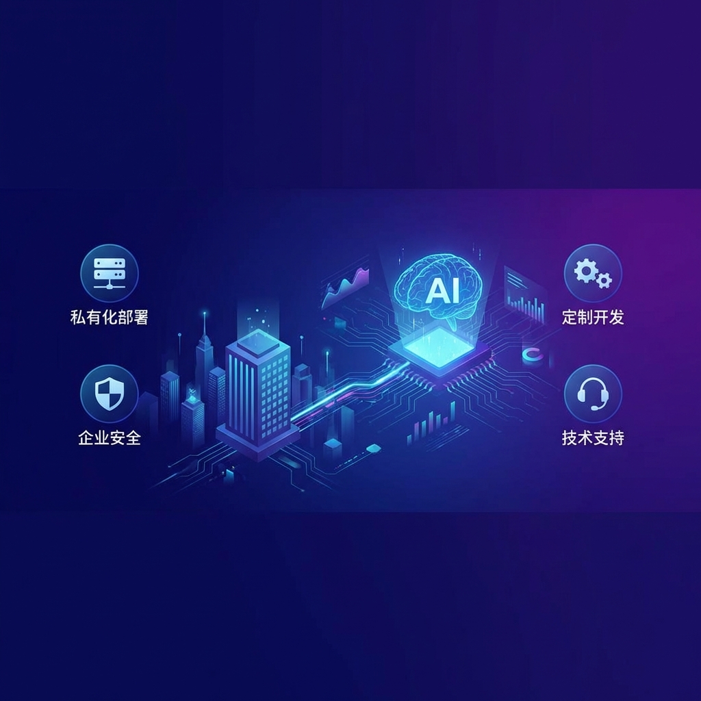
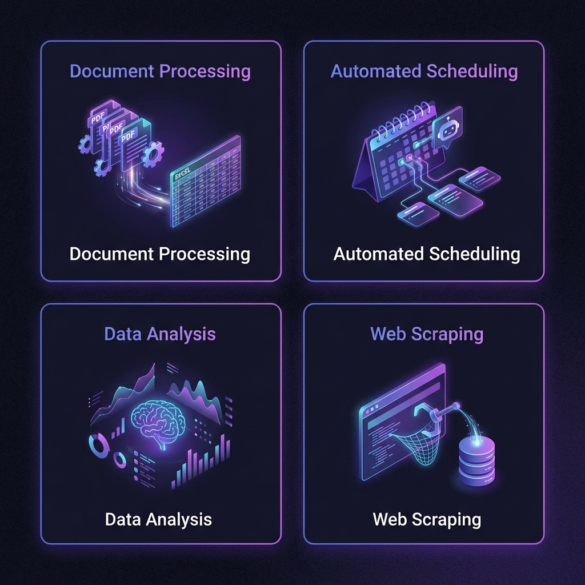

<p align="center">
  
</p>

<h1 align="center">AGIME 企业解决方案</h1>
<h3 align="center">为企业打造的本地化 AI 助理平台</h3>

<p align="center">
  
  
  
  
</p>

---

## 💡 企业为什么需要 AGIME？

### 企业面临的挑战

| 挑战 | 传统方案问题 | AGIME 解决方案 |
|:-----|:-------------|:---------------|
| 🔒 **数据安全** | 数据上传云端，合规风险 | ✅ 本地部署，数据不出内网 |
| 📚 **知识沉淀** | 知识分散在个人电脑，难以共享 | ✅ Team 模式，统一管理知识资产 |
| ⏰ **重复劳动** | 员工大量时间浪费在重复性工作 | ✅ AI 自动化执行，释放人力 |
| 🔗 **系统孤岛** | 各系统孤立，频繁切换 | ✅ MCP 扩展无缝集成 |
| 💰 **成本控制** | AI 服务订阅费用高昂 | ✅ 开源免费，自主部署 |

---

## 📊 ROI 分析 - 投资回报

### 效率提升可视化

<div class="mermaid">
gantt
    title 文档处理耗时对比
    dateFormat X
    axisFormat %s
    
    section 传统方式 (15人天)
    人工处理 :active, a1, 0, 120h
    
    section AGIME (0.25人天)
    AI 处理   :crit, a2, 0, 2h
</div>

<div class="mermaid">
graph LR
    A[周五 17:00] -->|传统方式| B(手动做报表)
    B -->|耗时4小时| C[周五 21:00 下班 😫]
    
    A -->|AGIME| E(AI 自动执行)
    E -->|耗时 0| F[周五 17:01 下班 😎]
    
    style E fill:#6366F1,stroke:#fff
    style F fill:#10B981,stroke:#fff
</div>

### 成本节省估算

| 企业规模 | 适用场景 | 预计年节省工时 | 按 ¥100/小时计算 |
|:--------:|----------|:--------------:|:----------------:|
| 10 人团队 | 文档处理+报表 | 500 小时 | ¥50,000 |
| 50 人团队 | 全面自动化 | 3,000 小时 | ¥300,000 |
| 100+ 人 | 企业级应用 | 10,000+ 小时 | ¥1,000,000+ |

> 💡 以上为保守估算，实际效益取决于使用深度和场景覆盖

---

## 🎯 行业解决方案

<p align="center">
  
</p>

### 🏛️ 金融/法务

| 应用场景 | 描述 | 效果 |
|----------|------|------|
| 合同审查 | AI 自动提取合同关键条款 | 审查效率提升 50 倍 |
| 尽职调查 | 批量处理企业资料 | 从数周缩短到数小时 |
| 合规检查 | 自动比对政策文件 | 零遗漏，100% 覆盖 |
| 风险预警 | 监控行业动态 | 实时预警 |

### 📈 市场/销售

| 应用场景 | 描述 | 效果 |
|----------|------|------|
| 竞品监控 | 自动抓取竞品信息 | 24/7 持续监控 |
| 客户分析 | 整理客户数据画像 | 洞察更精准 |
| 营销文案 | AI 辅助内容创作 | 产出效率 5 倍 |
| 销售周报 | 自动生成销售报告 | 每周节省 4 小时 |

### 💻 技术/研发

| 应用场景 | 描述 | 效果 |
|----------|------|------|
| 代码审查 | AI 辅助代码分析 | 发现潜在问题 |
| 文档生成 | 自动生成技术文档 | 节省 80% 时间 |
| 数据处理 | 批量数据清洗转换 | 全自动化 |
| API 集成 | 对接各类服务 | 灵活扩展 |

### 🏢 行政/人事

| 应用场景 | 描述 | 效果 |
|----------|------|------|
| 简历筛选 | 批量处理候选人简历 | 初筛效率 20 倍 |
| 入职办理 | 自动化入职流程 | 减少人工操作 |
| 考勤汇总 | 自动生成考勤报表 | 零错误 |
| 公文处理 | 文档格式化排版 | 标准统一 |

---

## 👥 团队协作功能

### 知识资产共享

<table>
<tr>
<td width="33%" align="center">

#### 🛠️ Skills（技能）

自定义 AI 能力

- 代码审查专家
- 文档生成助手
- 数据分析师

**一人创建，全员受益**

</td>
<td width="33%" align="center">

#### 📋 Recipes（食谱）

工作流模板

- 日报周报生成
- 客户跟进流程
- 项目汇报模板

**最佳实践沉淀**

</td>
<td width="33%" align="center">

#### 🔌 Extensions（扩展）

MCP 插件配置

- 数据库连接
- API 集成
- 工具链配置

**统一工具环境**

</td>
</tr>
</table>

### 权限管理体系

| 角色 | 标识 | 团队管理 | 成员管理 | 资源管理 |
|:----:|:----:|:--------:|:--------:|:--------:|
| **Owner** | 👑 | ✅ 完全控制 | ✅ 完全控制 | ✅ 完全控制 |
| **Admin** | 🛡️ | ✅ 修改信息 | ✅ 邀请/移除 | ✅ 管理所有 |
| **Member** | 👤 | ❌ | ❌ | ✅ 使用/分享自己的 |

### 资源保护级别

| 级别 | 图标 | 可见范围 | 适用场景 |
|:----:|:----:|----------|----------|
| **Public** | 🌍 | 所有成员 | 通用技能、公共模板 |
| **Team Only** | 👥 | 团队成员 | 团队专属资源 |
| **Admin Only** | 🔒 | 管理员 | 敏感配置、管理工具 |
| **Owner Only** | 👑 | 创建者 | 核心机密、灰度测试 |

---

## 🔐 企业级安全架构

<div class="mermaid">
graph LR
    subgraph INT[🏢 企业内网]
        U[员工] <-->|HTTPS| LB[负载均衡]
        LB <--> API[AGIME Server]
        API <--> DB[(数据库)]
        API <--> FS[文件存储]
        API <--> LLM[本地 LLM]
        
        style INT fill:#0f172a,stroke:#3b82f6
    end
    
    subgraph PUB[☁️ 公网/互联网]
        EXT[外部服务]
        API -.->|可选/MCP| EXT
    end
    
    style LB fill:#1e293b,stroke:#fff
    style API fill:#3b82f6,stroke:#fff
    style DB fill:#1e293b,stroke:#fff
</div>

### 🛡️ 数据安全流转图

<div class="mermaid">
sequenceDiagram
    participant U as 员工终端
    participant S as AGIME Server
    participant L as 本地 LLM
    participant C as 云端 LLM
    
    rect rgb(30, 40, 50)
        Note over U,L: 安全内网环境 (LAN)
        U->>S: 1. 发送敏感任务 (经加密)
        S->>S: 2. 权限校验 & PII 脱敏
        
        alt 使用本地模型 (100% 隐私)
            S->>L: 3. 本地推理
            L-->>S: 4. 返回结果
        else 使用云端模型
            S->>C: 3. 发送脱敏后数据
            C-->>S: 4. 返回结果
        end
        
        S->>S: 5. 结果审计记录
        S-->>U: 6. 返回执行结果
    end
</div>

### 🔐 访问控制与合规

> **访问控制**
> - ✅ **RBAC 权限** - 细粒度访问控制
> - ✅ **审计日志** - 完整操作记录
> - ✅ **邀请验证** - 可控成员加入
> - ✅ **会话管理** - 安全的认证机制


### 合规支持

| 合规要求 | AGIME 方案 |
|----------|------------|
| 数据本地化 | ✅ 完全本地部署，数据不出境 |
| 隐私保护 | ✅ 无第三方数据传输 |
| 访问审计 | ✅ 完整操作日志 |
| 权限隔离 | ✅ RBAC 多级权限 |

---

## 📦 部署方案

### 方案对比

| 方案 | 适用规模 | 部署位置 | 成本 | 技术要求 |
|:----:|:--------:|:--------:|:----:|:--------:|
| **LAN 模式** | 10-50 人 | 局域网 | 免费 | 低 |
| **Cloud 模式** | 50-500 人 | 内网服务器 | 服务器成本 | 中 |
| **定制部署** | 500+ 人 | 私有云/混合云 | 咨询 | 高 |

### 方案一：LAN 模式（推荐小团队）

```
✅ 无需服务器
✅ 即开即用
✅ 完全免费
```

**部署步骤**：
1. 团队负责人安装 AGIME 桌面版
2. 设置 → 团队 → 启用 LAN 模式
3. 生成邀请链接分享给团队成员
4. 成员安装 AGIME 并加入团队
5. 开始协作！

### 方案二：Cloud 模式（推荐中大型团队）

```
✅ 跨地域协作
✅ 统一管理
✅ 持久化存储
```

**部署步骤**：

```bash
# 1. 准备 Linux 服务器（Ubuntu 20.04+ 推荐）
# 2. 下载并部署
wget https://github.com/jsjm1986/AGIME/releases/latest/download/AGIME-linux-x64.tar.gz
tar -xzf AGIME-linux-x64.tar.gz
cd AGIME-linux-x64/resources/bin

# 3. 启动服务
./agimed agent

# 4. 配置为系统服务（推荐）
sudo tee /etc/systemd/system/agimed.service << EOF
[Unit]
Description=AGIME Team Server
After=network.target

[Service]
Type=simple
User=ubuntu
WorkingDirectory=/opt/agime
ExecStart=/opt/agime/bin/agimed agent
Restart=always

[Install]
WantedBy=multi-user.target
EOF

sudo systemctl enable agimed
sudo systemctl start agimed

# 5. 服务默认运行在 3000 端口
# 客户端配置服务器地址即可连接
```

### 方案三：定制部署

适用于特殊需求的企业：

- 🔧 定制功能开发
- 🔗 与现有系统集成
- 📊 定制仪表盘
- 🛡️ 增强安全方案
- 📚 员工培训服务

**咨询定制方案请联系：微信 agimeme**

---

## 💰 定价

| 版本 | 价格 | 功能范围 | 支持 |
|:----:|:----:|----------|:----:|
| **个人版** | 🆓 免费 | 完整功能，本地使用 | 社区 |
| **团队版** | 🆓 免费 | LAN 模式团队协作 | 社区 |
| **企业版** | 📞 咨询 | Cloud 部署 + 技术支持 | 专属 |
| **定制版** | 📞 咨询 | 定制开发 + 系统集成 | VIP |

### 为什么免费开源？

- 🎯 **降低门槛** - 让更多人受益于 AI 生产力工具
- 🔍 **透明可信** - 开源代码可审计，企业放心使用
- 🌱 **生态共建** - 社区贡献让产品更完善
- 💼 **增值服务** - 企业定制和支持服务创造价值

---

## 📞 企业服务

<table>
<tr>
<td width="50%">

### 🛠️ 服务内容

- 🏢 **私有化部署** - 完整部署支持和调优
- 🔧 **定制开发** - 根据业务需求定制功能
- 🔗 **系统集成** - 对接 OA、ERP、CRM 等系统
- 🛡️ **技术支持** - 专属响应通道，快速解决问题
- 📚 **培训服务** - 管理员和员工使用培训
- 📈 **效果评估** - 部署后效果跟踪和优化建议

</td>
<td width="50%">

### 📧 联系方式

| 渠道 | 方式 |
|------|------|
| 微信 | agimeme |
| 官网 | [aiatme.cn](https://aiatme.cn) |
| GitHub | [jsjm1986/AGIME](https://github.com/jsjm1986/AGIME) |
| 邮箱 | 通过官网联系 |

<br>

**扫码添加微信，获取企业方案** ⬇️

*一对一咨询，量身定制解决方案*

</td>
</tr>
</table>

---

## ❓ 企业常见问题

<details>
<summary><b>Q: 企业数据安全如何保障？</b></summary>

AGIME 采用本地优先架构：
- 所有数据处理在企业内网完成
- 不依赖任何外部云服务
- 代码开源，可自行审计
- 支持完全离线运行（使用本地 AI 模型）

</details>

<details>
<summary><b>Q: 需要专业IT人员部署吗？</b></summary>

- **LAN 模式**：无需IT支持，普通员工即可操作
- **Cloud 模式**：需要基础Linux运维能力，我们提供详细文档
- **定制部署**：我们提供专业部署支持服务

</details>

<details>
<summary><b>Q: 可以连接企业现有系统吗？</b></summary>

可以。通过 MCP 扩展协议，AGIME 可以连接：
- 数据库（MySQL、PostgreSQL、SQLite 等）
- API 服务（REST、GraphQL）
- 企业应用（OA、ERP、CRM）
- 自定义工具和脚本

</details>

<details>
<summary><b>Q: 支持哪些 AI 模型？</b></summary>

支持主流 AI 服务和本地模型：
- 云端：OpenAI、Anthropic、Google、百度、阿里、智谱等
- 本地：通过 Ollama 运行 Llama、Qwen、DeepSeek 等开源模型
- 企业可自建模型服务

</details>

<details>
<summary><b>Q: 如何衡量使用效果？</b></summary>

建议关注以下指标：
- 节省的工时（可量化）
- 任务完成效率提升
- 员工满意度
- 知识复用率

我们可以帮助企业建立效果评估体系。

</details>

---

<p align="center">
  <strong>AGIME 企业版</strong> - 让 AI 为企业创造价值
  <br><br>
  <a href="https://github.com/jsjm1986/AGIME">⭐ GitHub</a> · 
  <a href="https://github.com/jsjm1986/AGIME/releases">⬇️ 下载</a> · 
  <a href="PRODUCT_INTRO.md">📱 个人版介绍</a>
</p>
