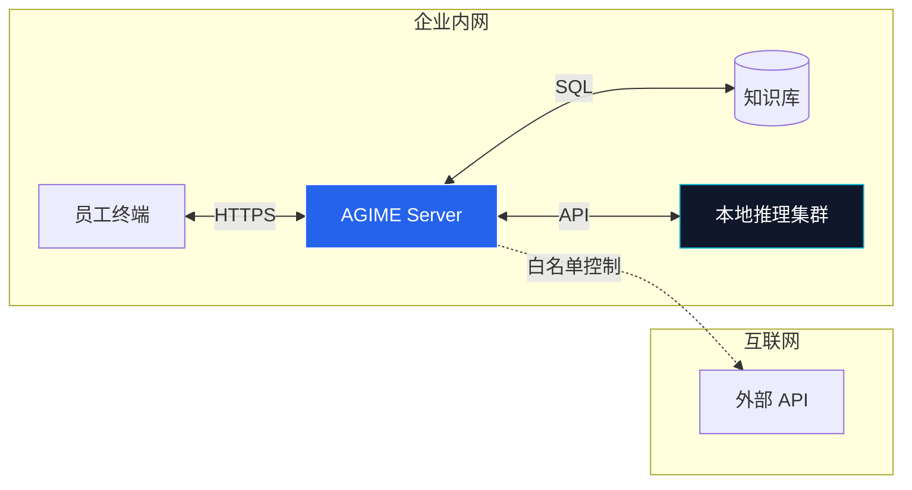

# AGIME 企业版

> **重塑企业生产力** — 私有化部署的 AI 基础设施，让数据留在内网，让效率飞在云端。

[预约演示](mailto:business@aiatme.cn)

---

## 为什么企业必须私有化部署？

在 AI 时代，**数据即资产**。公有云 AI 存在数据泄露风险，AGIME 提供了完美的替代方案。

| 维度 | 公有云 AI (SaaS) | AGIME (On-Premises) |
|:---|:---|:---|
| **数据流向** | 你的数据 -> 第三方服务器 | **数据不出内网** (物理隔离) |
| **知识沉淀** | 零散分布在员工账号 | **统一知识库**，资产归企业所有 |
| **合规审计** | 黑盒，无法审计 | **代码开源**，全链路日志审计 |
| **长期成本** | 昂贵的 API 调用费 | **一次性硬件投入**，长期免费 |

---

## ROI 投资回报分析

基于 100 人规模企业的真实测算：

gantt
    title 年度成本对比 (万元)
    dateFormat X
    axisFormat %s
    section 传统方案
    人力成本 (500万) :active, a1, 0, 500
    SaaS订阅费 (50万) :active, a2, 0, 50
    section AGIME方案
    硬件摊销 (10万) :crit, b1, 0, 10
    人力成本 (300万) :crit, b2, 0, 300

- **效率提升**: 自动化处理重复性工作，相当于 **增加 40% 的数字员工**。
- **成本节省**: 年节省人力及软件订阅成本超过 **200万元**。

---

## 行业解决方案

### 金融与法务
**场景**: 合同审查、尽职调查、合规风险扫描。
**价值**:
- 自动比对数千份合同条款，发现风险点。
- **100% 离线运行**，确保敏感金融数据不外泄。

### 市场与销售
**场景**: 竞品监控、标书生成、客户画像分析。
**价值**:
- 全网实时抓取竞品动态 (Pricing/Feature)。
-基于过往中标案例，AI 辅助生成高成功率标书。

### 研发与技术
**场景**: 代码审查 (Code Review)、遗留系统文档生成。
**价值**:
- 本地模型阅读私有代码库，不泄露核心IP。
- 自动为 10 年前的老代码生成维护文档。

---

## 企业级安全架构

- **RBAC 权限**: 基于角色的访问控制 (Owner / Admin / Member)。
- **审计日志**: 每一条 AI 对话、每一次文件操作均有记录。
- **P2P 加密**: 局域网内点对点传输，不经过任何中转服务器。

---

## 灵活部署方案

| 方案 | 适用规模 | 架构特点 | 成本 |
|:---|:---|:---|:---|
| **LAN 模式** | 小团队 (10-50人) | 无中心服务器，P2P 直连 | **¥0** (利用现有PC) |
| **Cloud 模式** | 中型企业 (50-500人) | 私有云 Docker 部署 | 仅需硬件成本 |
| **定制开发** | 大型集团 (500+人) | 高可用集群 + 专有模型微调 | 咨询报价 |

---

## 客户证言

> "部署 AGIME 后，我们法务部门的合同初审时间从 3 天缩短到了 2 小时。最重要的是，数据完全在我们自己的服务器上。"
> —— **某知名律所 CIO**

> "AGIME 就像是给每个员工配备了一个懂代码、懂文档的全能助理。"
> —— **某科技独角兽 CTO**

---

## 企业定制服务

### 私有化部署
- **完全内网隔离**: 部署在企业内网，数据物理隔离，确保敏感信息安全
- **灵活架构**: 支持单机/集群/Kubernetes 部署，满足不同规模需求
- **性能保障**: 万级并发支持，毫秒级响应，保障企业级服务质量

### 功能定制开发
- **行业工作流**: 根据企业业务需求开发专属自动化流程（如金融风控、法务审核）
- **UI/UX 定制**: 品牌化界面，与企业内部系统风格统一
- **专属 MCP 插件**: 开发连接企业现有系统（ERP/CRM/OA）的扩展模块

### 系统集成服务
- **无缝对接**: 连接 SAP/Oracle/用友等 ERP 系统，打通数据孤岛
- **单点登录 (SSO)**: 集成企业 AD/LDAP/OAuth 认证体系
- **API 适配**: 提供 REST/GraphQL 接口，供第三方系统调用

### 技术支持与培训
- **7×24 专属通道**: VIP 技术支持，30分钟响应 SLA
- **上门培训**: IT 管理员部署培训、员工使用培训
- **长期维护**: 系统升级、安全补丁、功能迭代持续支持

---

## 联系我们

**企业咨询**: [business@aiatme.cn](mailto:business@aiatme.cn)

**GitHub**: [https://github.com/jsjm1986/AGIME](https://github.com/jsjm1986/AGIME)
