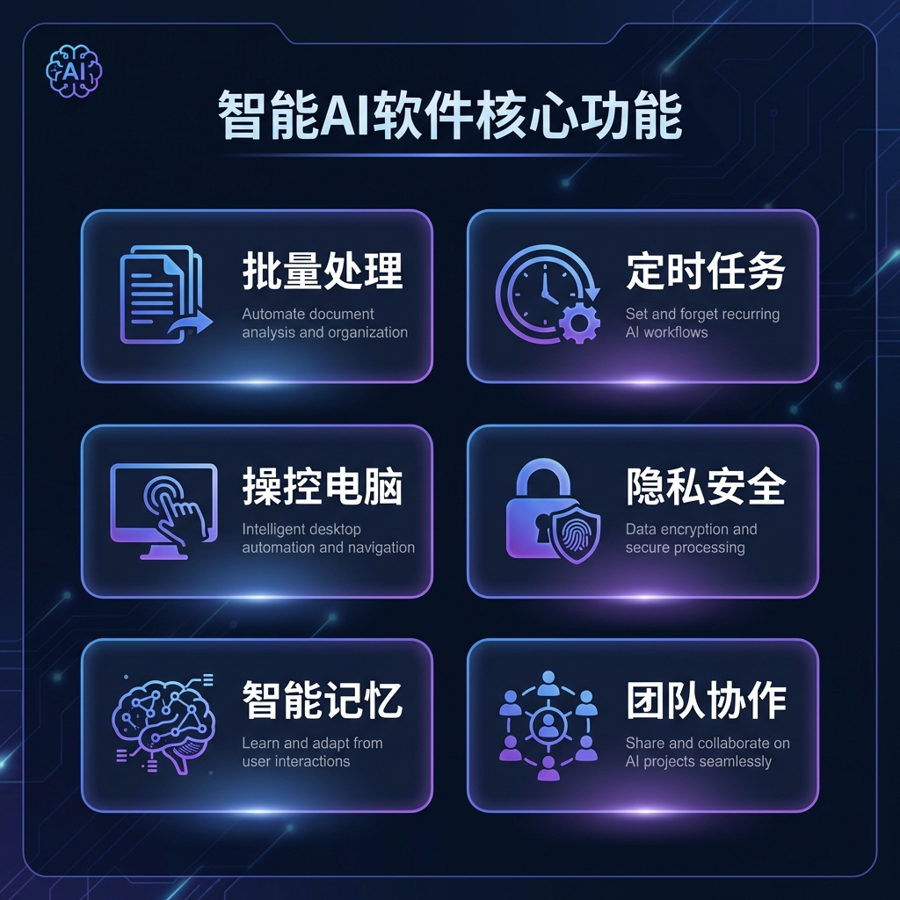

<p align="center">
  
</p>

<h1 align="center">AGIME</h1>
<h3 align="center">AI + Me，不只是聊天，而是帮你干活的 AI 伙伴</h3>

<p align="center">
  <a href="https://github.com/jsjm1986/AGIME/releases"></a>
  <a href="https://github.com/jsjm1986/AGIME/releases"></a>
</p>

---

## 🎯 产品定位

**AGIME** 是一款**本地优先**的 AI 助理软件，与传统 AI 聊天工具不同：

| &nbsp; | 传统 AI 服务 | AGIME |
|:------:|:------------:|:-----:|
| 执行任务 | ❌ 只能建议 | ✅ **直接帮你做** |
| 本地文件 | ❌ 无法访问 | ✅ **读写自如** |
| 定时任务 | ❌ 不支持 | ✅ **自动执行** |
| 数据隐私 | ☁️ 上传云端 | 🏠 **本地处理** |
| 团队协作 | ❌ 不支持 | ✅ **LAN/云端共享** |

---

## ✨ 核心功能

<p align="center">
  
</p>

### 📄 批量处理文档

> 💬 你说：把这个文件夹里所有合同 PDF 的签约日期、金额提取出来，生成 Excel
> 
> 🤖 AGIME：
> - ✓ 扫描文件夹，发现 47 个 PDF
> - ✓ 逐个解析合同内容
> - ✓ 提取关键信息
> - → 已保存到 `合同汇总.xlsx`

### ⏰ 定时自动化

> 💬 你说：每天早上 9 点，自动打开微信、钉钉，并打开常用的 5 个网站
>
> 🤖 AGIME：
> - ✓ 创建定时任务：每天 09:00
> - ✓ 配置启动程序列表
> - → 任务已启用，明天开始执行

### 🖥️ 操控电脑

- 打开/关闭应用程序
- 自动浏览网页、填表
- 截图、录屏
- 执行系统命令

### 🧠 智能记忆

AGIME 会**记住你的偏好**，越用越懂你：
- 记住你常用的文件夹位置
- 记住你的工作习惯
- 记住你的个性化设置

---

## 👥 团队协作（v2.5.0 新功能）

<p align="center">
  
</p>

### 两种协作模式

| 模式 | 说明 | 适用场景 |
|:----:|------|----------|
| 🏠 **LAN 模式** | 局域网内直接连接 | 办公室、家庭网络 |
| ☁️ **Cloud 模式** | 通过云服务器连接 | 远程团队、跨地域协作 |

### 可共享的资源

| 资源类型 | 说明 | 示例 |
|----------|------|------|
| 🛠️ **Skills** | 自定义 AI 技能 | 代码审查、文档生成 |
| 📋 **Recipes** | 工作流模板 | 日报生成、数据处理 |
| 🔌 **Extensions** | MCP 插件配置 | 数据库连接、API集成 |

### 权限管理

| 角色 | 权限范围 |
|------|----------|
| 👑 **Owner** | 完全控制权 |
| 🛡️ **Admin** | 管理成员和资源 |
| 👤 **Member** | 使用和分享资源 |

---

## 🔒 隐私安全

<table>
<tr>
<td width="50%">

### 本地优先

- ✅ 所有数据处理在**本地完成**
- ✅ 敏感信息**永不外传**
- ✅ 支持**完全离线运行**

</td>
<td width="50%">

### 你来掌控

- ✅ 选择使用云端或本地模型
- ✅ 四种工作模式灵活切换
- ✅ 详细的权限管理

</td>
</tr>
</table>

---

## ⬇️ 立即下载

<p align="center">
  <a href="https://github.com/jsjm1986/AGIME/releases">
    
  </a>
  &nbsp;
  <a href="https://github.com/jsjm1986/AGIME/releases">
    
  </a>
  &nbsp;
  <a href="https://github.com/jsjm1986/AGIME/releases">
    
  </a>
</p>

### 快速开始

```
1️⃣ 下载安装（1 分钟）
2️⃣ 配置 API Key（选一个模型服务商，填入密钥）
3️⃣ 开始使用（用自然语言告诉它你要做什么）
```

---

## 📞 联系我们

- 🌐 官网：[aiatme.cn](https://aiatme.cn)
- 📧 微信：agimeme
- 🐙 GitHub：[github.com/jsjm1986/AGIME](https://github.com/jsjm1986/AGIME)

---

<p align="center">
  <strong>AGIME</strong> - AI + Me，你的本地 AI 助理
</p>
